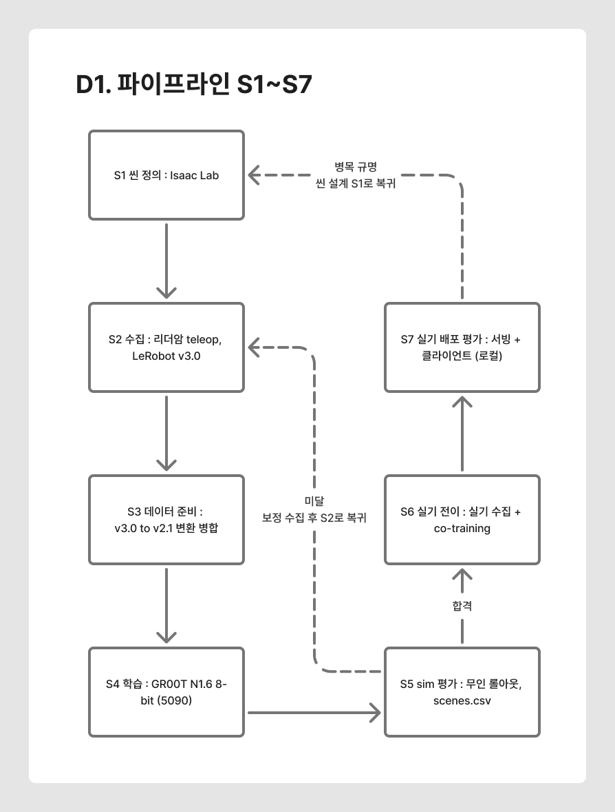
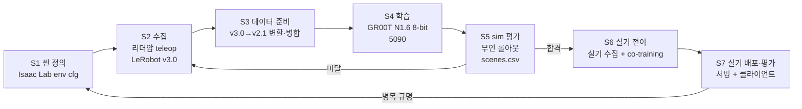
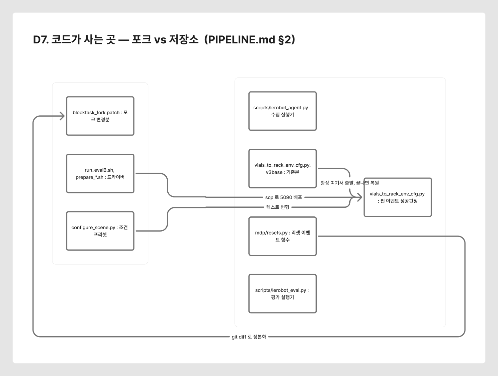

# PIPELINE — SO-ARM101 × GR00T N1.6 파이프라인 해부

> 이 문서는 **"무엇을 했나"가 아니라 "같은 파이프라인을 다른 태스크에 다시 돌리려면
> 무엇을, 어떤 순서로, 어떤 스크립트로 하는가"** 를 적는다.
> Phase 1(단일 큐브 pick-and-place)에서 완성된 기계를 그대로 들어 **table cleanup**에
> 얹는 것이 목적이므로, 각 단계마다 **태스크에 종속된 부분**과 **그대로 재사용되는 부분**을 갈라 둔다.
>
> 작성 2026-09-14 · 📐 **다이어그램 보드**: [Figma](https://www.figma.com/board/4iKjT0Ngfm8IKmiFttKaKc) (D1~D8 — [색인](README.md#다이어그램-figma))
> 관련: [프로젝트 개요](README.md) · [Phase 2 계획](manipulator_md/sim/cleanup_project_plan.md)
> · [sim2real 보고서](manipulator_md/sim/sim2real_generalization_report.md) · [Phase별 실행 기록](manipulator_md/sim2real/08_T1_sim2real/README.md)

---

## 0. 한 장 요약

<a href="docs/diagrams/D1_pipeline.png"></a>

<sub>클릭하면 원본 크기 · 📐 편집: [Figma — D1 파이프라인 S1~S7](https://www.figma.com/board/4iKjT0Ngfm8IKmiFttKaKc?node-id=16-341)</sub>



| 단계 | 머신 | 핵심 스크립트 | 소요(실측) |
|---|---|---|---|
| **S1** 씬 정의 | 로컬 | `t1_task/configure_scene.py` + 포크 env cfg | 코드 작업 |
| **S2** 수집 | **로컬**(리더암) | `blocktask_collect_*.sh` | sim **1.0분/ep** · 실기 **2.3분/ep** |
| **S3** 데이터 준비 | 로컬→5090 | `prepare_blocktask_*.sh` | 약 40분 |
| **S4** 학습 | **5090** | `train_gr00t_blocktask_*.sh` | **1,333 step/h** (48k≈36h, 86k≈65h) |
| **S5** sim 평가 | 5090 | `run_evalB.sh` → `blocktask_headless_scenes.sh` | 조건당 30ep ≈ **13분** |
| **S6** 실기 전이 | 로컬 수집 → 5090 학습 | `record_blocktask_real_v2.sh` + `launch_cotrain.py` | 수집 2.3분/ep + 학습 36h |
| **S7** 실기 배포 | 로컬(+서빙) | `serve_local.sh` / `run_eval_real.sh` | 시행당 수분 |

**머신 역할은 고정이다.** 리더암·실기 로봇이 로컬(5070 Ti)에 물려 있어 **수집과 실기 실행은 로컬에서만** 가능하고,
학습은 16GB로 불가능해 **5090 전용**이다. sim 평가는 Isaac + 정책 서버를 동시에 띄워야 해 5090이 편하다.

---

## 1. 무엇이 태스크에 종속되고, 무엇이 재사용되는가

**이 표가 이 문서의 핵심이다.** cleanup으로 확장할 때 손대야 할 곳이 왼쪽 열이다.

| | 태스크에 종속 (바꿔야 함) | 그대로 재사용 |
|---|---|---|
| **S1 씬** | 물체·목적지 정의, 리셋 이벤트, 성공 판정 경계 | 로봇·카메라·조명·물리 DR·라이트박스 |
| **S2 수집** | 지시문, 배치 규칙, 에피소드 수 | teleop 구조, 키 조작, LeRobot 녹화 경로 |
| **S3 준비** | 데이터셋 이름, 병합 구성 | 변환 스크립트, `modality.json`, stats 후처리 |
| **S4 학습** | 데이터셋 경로, 스텝 수 | **하이퍼파라미터 전부** (lr·batch·증강·옵티마이저) |
| **S5 평가** | 조건표, 판정 기준, 고정 패널 | 무인 실행기, `scenes.csv` 기록, 분석 스크립트 |
| **S6 전이** | 실기 프롭·배치표 | co-training 구조(`mix_ratio`), 카메라 정렬 절차 |
| **S7 배포** | 지시문 | 서빙·클라이언트·앙상블·기록(`run.json`) |

> **하이퍼파라미터를 재사용하는 것은 게으름이 아니라 통제다.** v3→v4에서 증강·lr·batch를
> 완전히 동일하게 두고 **데이터만** 바꿨기 때문에 성능 변화를 데이터 탓으로 돌릴 수 있었다.
> 태스크를 바꿀 때도 같은 규율을 지키면, 실패했을 때 원인 후보가 절반으로 준다.

---

## 2. S1 — 씬 정의 (Isaac Lab)

### 구조

씬은 **포크한 워크숍 repo**에 있고, 저장소에는 **패치와 설정 스크립트만** 둔다.

<a href="docs/diagrams/D7_code_layout.png"></a>

<sub>클릭하면 원본 크기 · 📐 편집: [Figma — D7 코드가 사는 곳](https://www.figma.com/board/4iKjT0Ngfm8IKmiFttKaKc?node-id=7-258)</sub>

```
~/blocktask_ws/Sim-to-Real-SO-101-Workshop/        # 실제 코드가 사는 곳(포크)
  source/sim_to_real_so101/
    tasks/vials_to_rack_env_cfg.py                 # 씬·이벤트·성공 판정
    tasks/vials_to_rack_env_cfg.py.v3base          # ★ 기준본(항상 여기서 출발)
    mdp/resets.py                                  # 리셋 이벤트 함수들
    scripts/lerobot_agent.py / lerobot_eval.py     # 수집 / 평가 실행기

manipulator_ws/setup/sim/t1_task/
  blocktask_fork.patch                             # ★ 포크 변경분의 정본(git diff로 재생성)
  configure_scene.py                               # 조건 프리셋으로 cfg를 변형
```

### 태스크를 정의하는 네 가지

| 요소 | 어디에 | Phase 1 값 |
|---|---|---|
| **물체** | `VialsToRackSceneCfg`의 `RigidObjectCfg` | 빨강 큐브 20mm 1개 |
| **목적지** | `basket_black` (USD 박스) | 검정 박스, 0.85배 |
| **배치 규칙** | `mdp/resets.py`의 리셋 이벤트 | 도달 annulus + 거부 표집 |
| **성공 판정** | `_block_place_params()`의 `rack_local_*` | 박스 로컬 경계 안 + 파지 이력 + 릴리스 |

### 조건 프리셋 — `configure_scene.py`

기준본 cfg를 **문자열 변형**해 조건을 만든다. `full+color_white`처럼 조합할 수 있다.

```bash
cp $CFG.v3base $CFG                       # 항상 기준본에서 출발
python3 configure_scene.py $CFG full+dist_blue_cube
```

> **왜 파일을 고쳐 쓰는가**: Isaac Lab의 cfg는 데코레이터 기반 클래스라 런타임 주입이 까다롭다.
> 텍스트 변형은 투박하지만 **생성물을 눈으로 확인할 수 있고** 조건이 파일로 남는다.
> 대신 **끝나면 반드시 기준본으로 복원**해야 다음 실행이 오염되지 않는다(스크립트의 `trap`).

### 함정 (전부 실측)

| 함정 | 증상 | 처방 |
|---|---|---|
| **이벤트 실행 순서** | 블록 리셋이 박스보다 먼저 돌아 "박스를 피해 놓기"가 불가능 | 두 리셋을 **한 term으로 합친다** |
| **리셋 이벤트 2회 호출** | 에피소드당 두 번 불려 인덱스가 0,2,4…로 건너뜀 | 같은 `common_step_counter`면 직전 인덱스 재사용 |
| **평가 cfg의 덮어쓰기** | `__post_init__`이 파일 뒤쪽에서 리셋을 다시 지정 | 플래그로 가드 |
| **5090 미배포** | 로컬에서 씬을 고치고 원격에 안 올려 **옛 씬에서 측정** | 평가 스크립트가 매번 `scp` + 검증 스크립트로 숫자 확인 |
| **성공 경계 방치** | 박스 크기를 바꾸고 `rack_local_*`를 안 바꿈 → **박스 밖도 성공** | 배율과 경계를 **같은 함수에서** 계산 |

---

## 3. S2 — 데이터 수집 (teleop)

### 구조

리더암을 사람이 움직이면 sim(또는 실기) 팔로워가 따라가고, 그 궤적과 카메라 2대를 녹화한다.

| | sim | 실기 |
|---|---|---|
| 실행기 | `lerobot_agent`(Isaac 안) | `lerobot-record`(LeRobot) |
| 스크립트 | `blocktask_run.sh` / `blocktask_collect_near.sh` | `record_blocktask_real_v2.sh` |
| 카메라 키 | `external_D455`(top) · `ego`(wrist) | `top` · `wrist` |
| 속도(실측) | **1.0분/ep** | **2.3분/ep** (프롭 재배치 포함) |
| 키 | `S` 시작 · `→` 저장 · `R` 스킵 | `→` 저장 · `←` 재녹화 · `ESC` 종료 |

> **키는 Isaac Sim 창에 포커스를 준 상태에서** 눌러야 한다. 터미널에 누르면 컨테이너 stdin으로
> 흘러가고 아무 일도 일어나지 않는다(실측).

### 지시문

`--task_name`(sim) / `--dataset.single_task`(실기)로 들어가 **프레임마다** 저장된다.

> ⚠️ 문자열에 공백이 있어 **컨테이너 env로 넘겨야 한다.** `bash -c '...'` 안에 직접 박으면
> 따옴표가 중첩돼 `"Pick"`만 남는다 — 과거 sim 수집 전체가 이 버그의 영향을 받았다.

### 수집 설계에서 지켜야 하는 것

- **배치표를 미리 만든다.** 사람이 그때그때 정하면 반드시 몰린다(실기 50ep의 박스 픽셀 편차 x 7px).
  `gen_real_collect_schedule.py`가 층화 추출로 표를 만든다.
- **"어려워 보인다"고 건너뛰지 않는다.** v3에서 겹침 ep를 빼다가 **유효 근접 구간까지** 걸렀고,
  학습 근접 비율이 19.2%(자연 43.2%)로 떨어져 그것이 그대로 병목이 됐다.
- **정상 70% + 교정(recovery) 30%**. 실패에서 복구하는 시연이 없으면 정책도 복구를 못 한다.
- **카메라 정렬을 먼저 한다.** 구도가 곧 입력 분포다. 구도가 다른 데이터는 섞을 수 없다
  (real50은 그 이유로 co-training에서 제외됐다).

---

## 4. S3 — 데이터 준비 (v3.0 → v2.1)

수집은 **LeRobot v3.0**, 학습은 **GR00T v2.1**이다. 이 변환을 빠뜨리면 학습이 한참 뒤에 죽는다.

```bash
./prepare_blocktask_v4_200.sh all      # send → convert → merge → check
```

| 단계 | 하는 일 | 빠뜨리면 |
|---|---|---|
| send | 로컬 → 5090 rsync (`images/` 제외) | — |
| convert | `convert_v3_to_v2.py` | 학습이 포맷을 못 읽음 |
| **modality** | `modality.json` 배치 | 카메라·언어 키 매핑 실패 |
| **stats** | `fix_stats_for_gr00t.py` (count 제거) | 학습 시작 직후 예외 |
| merge | `merge_blocktask_select.py`로 세션 병합·선별 | — |
| check | ep 수·frames·tasks 출력 | 조용히 잘못된 데이터로 학습 |

### `modality.json` — 카메라와 언어를 잇는 한 장

```json
{ "video": { "front": {"original_key": "observation.images.top"},
             "wrist": {"original_key": "observation.images.wrist"} },
  "annotation": { "human.task_description": {"original_key": "task_index"} } }
```

- `front`/`wrist`는 **모델이 기대하는 이름**, `original_key`는 데이터셋의 실제 컬럼이다.
- 언어는 `task_index` → `meta/tasks.jsonl` 조회로 들어간다. **다중 태스크 데이터셋이 표준 경로**이고,
  병합 스크립트도 여러 문장을 재번호해 지원한다.

> **병합본 후처리를 다시 해야 한다.** 세션별로 붙인 `modality.json`·stats는 병합본에 따라오지 않는다.

---

## 5. S4 — 학습 (GR00T N1.6 8-bit)

### 고정된 설정 (태스크가 바뀌어도 그대로)

| 항목 | 값 | 비고 |
|---|---|---|
| 베이스 | `nvidia/GR00T-N1.6-3B` | |
| 옵티마이저 | `paged_adamw_8bit` | 상태만 8-bit |
| effective batch | **64** = global 2 × grad accum 32 | 32GB에 맞춘 값 |
| lr / 스케줄 | 1e-4 / cosine, warmup 5% | |
| 증강 | color jitter b0.3 c0.4 s0.5 h0.08 | |
| 학습 대상 | **projector + DiT + VLLN + LLM 상위 4층** | `tune_llm`/`tune_visual`은 **False**가 기본 |
| 속도(실측) | **1,333 step/h** (2.69 s/step) | 체크포인트 1개 **9.2GB** |

> **언어·비전 인코더는 동결이 정상이다.** N1.5에서 VLM을 동결해 언어 추종이 올라간 설계를
> 따른 것이고, 우리가 겪은 "언어 미사용"은 인코더가 아니라 **데이터가 언어를 상수로 만든** 결과다.

### 스텝은 epoch으로 역산한다

```
epoch = steps × 64 / total_frames
```

| 구성 | frames | 스텝 | epoch |
|---|---|---|---|
| v3 (100ep) | 38,906 | 40k | 65.8 |
| v4_200 (200ep) | 82,951 | **86k** | 66.3 ← v3와 정합 |
| co-train (sim+실기) | — | 48k | sim 기준 약 37 |

> **"데이터를 늘렸는데 성능이 떨어졌다"의 흔한 원인이 epoch 부족이다.** 데이터가 2배가 되면
> 같은 스텝은 절반의 epoch이다. 반대로 데이터가 아주 크면 적은 epoch으로도 된다
> (같은 SO-101에서 π0를 785k 프레임·2.4 epoch로 9태스크 학습한 사례가 있다).

### co-training

`launch_cotrain.py`가 두 번째 데이터셋을 환경변수로 받아 섞는다.

```bash
GR00T_COTRAIN_DATASET=/data/heongyu/<실기>  GR00T_COTRAIN_MIX=1.0
```

> ⚠️ `mix_ratio`는 **표집 가중치**다. 데이터 크기와 무관하게 1.0이면 **50:50**으로 뽑는다.
> 실기가 sim의 절반 크기여도 배치의 절반은 실기다 — 이 점이 언어·분포 설계에 직접 영향을 준다.

### resume 대신 신규 학습

cosine LR이 0으로 완주하므로 resume은 warm restart가 되고, `ShardedMixtureDataset`은
샘플러 상태가 global_step에 묶여 **데이터셋이 바뀌면 어긋난다.** 새 데이터면 새로 돌린다.

---

## 6. S5 — sim 평가 (무인)

### 실행

```bash
EVAL_PANEL=1 NUM=30 SEED=100 ./run_evalB.sh     # 로컬에서 띄우고 5090이 계산
```

`run_evalB.sh`(드라이버, 로컬) → `blocktask_headless_scenes.sh`(5090) 구조다. 드라이버가
**매번 스크립트를 scp**하므로 원격 사본이 뒤처질 수 없다. 조건이 끝날 때마다 결과를 로컬로 가져온다.

### 측정을 먼저 믿을 수 있게 만든다

Phase 1에서 **모델 문제로 의심한 것이 계측 결함으로 밝혀진 사례가 일곱 번** 있었다. 그래서 규율이 있다.

| 규율 | 이유 |
|---|---|
| **고정 패널** (같은 배치 10개를 반복 재생) | 시드만 바꿔도 70%↔30%로 갈렸다. 위치 난이도를 조건 간 상수로 |
| **한 번에 한 축만** | 전체 랜덤 위에서 조건을 바꾸면 신호가 묻힌다(모든 조건이 45%로 붙었다) |
| **분모 검사** | 타깃이 카메라에 안 잡히는 배치는 어떤 정책도 못 푼다 → 분모에서 제외 |
| **`run.json`이 근거** | 조건 이름은 증거가 아니다. 모델·지시문·설정을 결과 옆에 남긴다 |
| **연속량을 주 지표로** | 성공률은 n=10에서 CI ±28%p. 정지·소요 시간이 같은 시행 수로 더 민감하다 |

### 출력

- `epNN_{success,fail}.mp4` — top|wrist 가로 결합
- `scenes.csv` — 에피소드별 배치 좌표 + outcome (termination 기준)
- `run.json` — 모델·지시문·씬 설정·시드

> `scenes.csv`의 `outcome`은 termination 기준이라 **육안 판정과 다를 수 있다.** 최종 판정은 영상이다.

---

## 7. S6 — 실기 전이

### 순서

```
sim 학습 모델 → 실기 zero-shot 확인 → (실패 전제) 실기 수집 → co-training → 실기 평가
```

**zero-shot은 기대하지 않는다.** Phase 1 실측은 SR 0%(고정 자세 붕괴)였다.
sim에서 일반화를 확보하는 목적은 **co-training의 출발점을 좋게 만드는 것**이다.

### 카메라 정렬이 전제

```bash
cd envs/lerobot && uv run python ../../setup/gr00t/rerun_cam_align.py
```

overlay를 보며 맞추고 콘솔의 '일치'가 최대가 되게 한 뒤 **나사로 고정**한다.
구도가 다르면 sim과 실기를 섞을 수 없고, 배포 때 구도가 또 다르면 학습 분포 밖으로 나간다.

---

## 8. S7 — 실기 배포·평가

### 서빙 (택 1)

| 방식 | 스크립트 | 지연(실측) |
|---|---|---|
| **로컬** (권장) | `serve_local.sh` | 중앙 **73ms**, 지터 없음 |
| 원격 5090 | `serve_blocktask_n16_5090.sh` | 115~171ms, 지터 최대 824ms |

로컬 서빙이면 **5090을 학습에 쓸 수 있다.** 단 `real-robot` 이미지를 로컬에 빌드해야 한다.

> ⚠️ `run_gr00t_server.py`를 직접 쓰면 안 된다. 실기 클라이언트는 `video.front` 같은 **평탄 키**를
> 보내는데 그 서버는 kwargs로 언팩한다. `serve_blocktask_realclient.py` 래퍼가 평탄→중첩으로 바꾼다.

### 클라이언트

```bash
./run_eval_real.sh <평가> <조건>          # 시행 번호 자동 증가 + run.json 기록
LANG_INSTRUCTION="..." ./run_eval_real.sh C L3
```

`client/eval_lerobot.py`가 관측을 보내고 16-step 청크를 받아 실행하며, 영상·`chunks.csv`·`actions.csv`를 남긴다.

### 액션 앙상블 — 미해결 지점

겹치는 청크를 지수가중 평균한다. **이 값 하나가 성공률을 좌우한다.**

| 설정 | 평균 정지 | 튐 99%tile | 성공 |
|---|---|---|---|
| `W=0.3` | 24.8s | 2.55° | 7/10 |
| `W=0.6` | **42.9s** | 2.34° | **1/5** ← 최악 |
| `W=0.8` | 11.0s | 3.36° | 4/5 |
| `ENSEMBLE=0` | 6.5s | 9.02° | 4/5 |
| 교시 데이터 | 6.4s | 2.99° | — |

> **정지와 튐은 반대로 움직인다.** 한쪽 지표만 보고 역산한 값(W=0.6)을 검증 없이 기본값으로 넣었다가
> 1/5까지 떨어뜨렸다. **두 극단만 확실하고, 둘을 동시에 만족하는 설정은 아직 없다.**
> 배포단 조정이 네 번 연속 실패한 것을 보면 원인이 더 아래(파지·릴리스 감독이 4.1%뿐)일 수 있다.

### 자동 판정

```bash
./analyze_real_run.py inf_video/07_real_eval/A/*
```

교시 데이터를 기준선으로 정지·튐·지연을 자동 판정한다. 영상을 사람이 세는 것보다 빠르고 일관적이다.

---

## 9. cleanup 태스크로 확장할 때 — 단계별 체크리스트

| 단계 | 바꿀 것 | 재사용 | 주의 |
|---|---|---|---|
| **S1** | 물체 5종(펜·지우개·매직·큐브·원통) 스폰, 박스 **2개**(좌/우), 다물체 거부 표집, **성공 판정을 물체별·박스별로** | 로봇·카메라·조명·물리 DR | 판정이 `block_red` 하나로 고정돼 있다 — **가장 먼저 풀어야 할 매듭** |
| **S2** | 지시문을 **에피소드마다** 바꾸는 경로, 배치표, N회 순차 pick-place | teleop·키·녹화 | 지시문이 상수면 언어가 죽는다(Phase 1 결론) |
| **S3** | 데이터셋 이름 | 변환·병합 전부 | `tasks.jsonl` 줄 수로 **지시문이 살아남았는지** 확인 |
| **S4** | 데이터셋 경로·스텝 | 하이퍼파라미터 전부 | epoch 역산 필수 |
| **S5** | 조건표(물체 식별·기하·언어 축), 고정 패널 재선정 | 실행기·기록·분석 | 조건마다 **한 축만** |
| **S6** | 실기 프롭 5종, 배치표 | co-train 구조 | sim 쪽도 같은 태스크여야 섞이는 의미가 있다 |
| **S7** | 지시문(음성→영어) | 서빙·클라이언트·기록 | 앙상블 기본값을 **실측으로 확정하고 시작** |

### 순차 pick-place가 만드는 새 요구

Phase 1은 1회 pick-place로 에피소드가 끝났다. cleanup은 **N회 반복**이므로:

- **에피소드 길이**가 3~5배가 된다 → 프레임 수·학습 스텝 산정이 달라진다
- **성공 판정이 부분 점수**를 가져야 한다 (3개 중 2개 정리 = ?)
- **종료 조건**이 필요하다 ("더 치울 것이 없다"를 무엇으로 판단하는가)
- 타임아웃(현재 900스텝 = 15초)을 **크게 늘려야** 한다

---

## 10. 이미 알고 있는 병목 셋 — cleanup에서 무엇을 뜻하는가

| 병목 | Phase 1 실측 | cleanup에서의 의미 |
|---|---|---|
| **물체 기하** | 28mm 큐브 2/10, 지우개 4/10 — 크기·자세에 그리퍼를 못 맞춤 | **대상 물체(펜·매직)가 정확히 이 축이다.** 크기·형상 다양성 수집이 전제 조건 |
| **언어 미사용** | sim·실기 양쪽에서 확인(L5 무시, 색 명시 무효) | **분류 태스크의 핵심 능력이 없다.** 같은 씬에서 문장이 다르면 정답도 달라지는 수집이 필요 |
| **왼쪽 가림 place** | pan<−50에서 23초 정지. 데이터엔 있는데 못 배움 | 박스가 2개가 되면 **양쪽 극단을 다 쓰게 된다** — 더 자주 걸린다 |

> 앞의 둘은 **수집 설계로 푸는 문제**이고, 셋째는 학습량·감독 밀도의 문제다.
> cleanup 수집을 설계할 때 이 셋을 각각 어떤 축으로 데이터에 넣을지 먼저 정하는 편이 낫다.

---

## 11. 비용 실측 (계획 세울 때 쓰는 숫자)

| 항목 | 실측 |
|---|---|
| sim teleop | **1.0분/ep** (v3 82ep/82분, v4_near 65ep/64분) |
| 실기 teleop | **2.3분/ep** (real_v2 60ep, 2시간 16분) |
| 데이터 준비 | 약 40분 (전송·변환·병합·검증) |
| 학습 | **1,333 step/h** → 48k ≈ 36h · 86k ≈ 65h |
| sim 무인 평가 | 조건당 30ep ≈ **13분** (성공 종결 시 ep당 26초) |
| 체크포인트 | **9.2GB / 개** (전부 가중치, optimizer 상태 없음) |
| GPU 점유 | 학습 중 5090은 다른 용도 불가 → 실기 추론은 로컬 서빙으로 |

---

## 12. 파이프라인을 지키는 규율 넷

1. **한 번에 한 축만 바꾼다.** 여러 축을 동시에 켜면 신호가 묻힌다 — 1차 평가 설계가 이것 때문에 실패했다.
2. **계측이 무엇을 재고 있는지 먼저 확인한다.** 모델 문제로 의심한 것이 계측 결함이었던 사례가 일곱 번.
   검사가 "통과"를 내면서 **아무것도 안 보고 있을 수** 있다 — 검사 건수를 함께 출력한다.
3. **결과 옆에 설정을 남긴다.** 조건 이름은 증거가 아니다. `run.json`이 근거다.
4. **로컬에서 검증하고 5090에 배포한다.** 배포를 빠뜨려 옛 씬에서 측정한 전례가 있다.
   배포 후 검증 스크립트로 **숫자를 확인하고** 시작한다.
