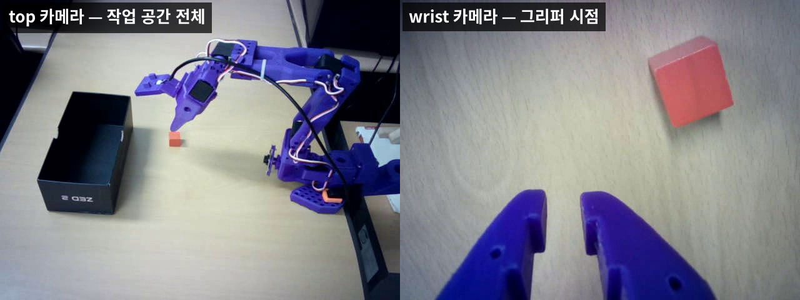
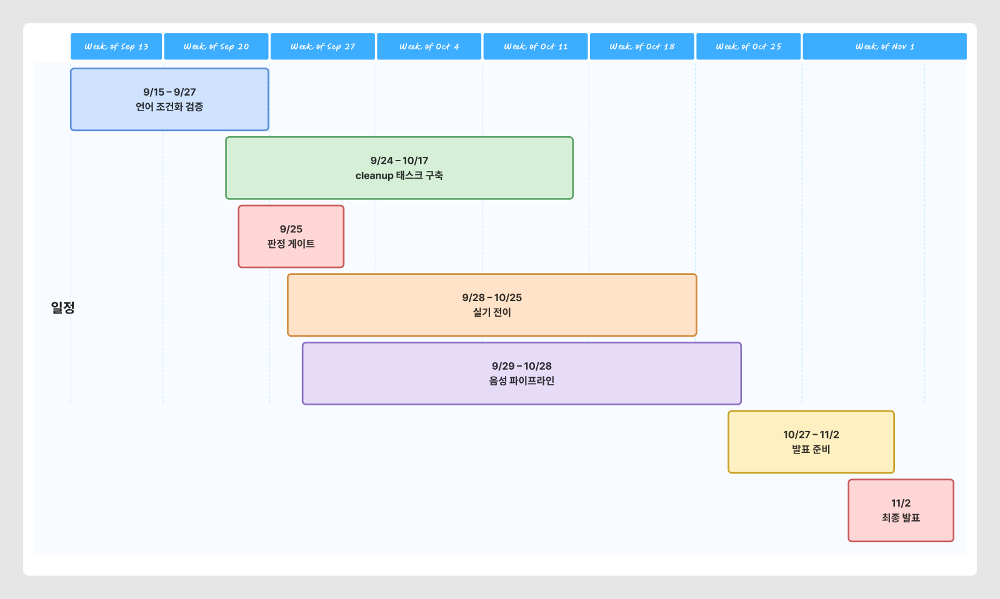
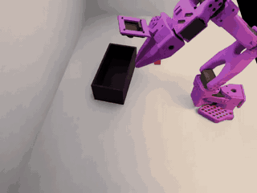
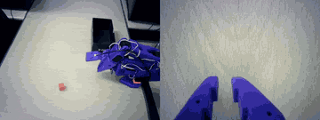
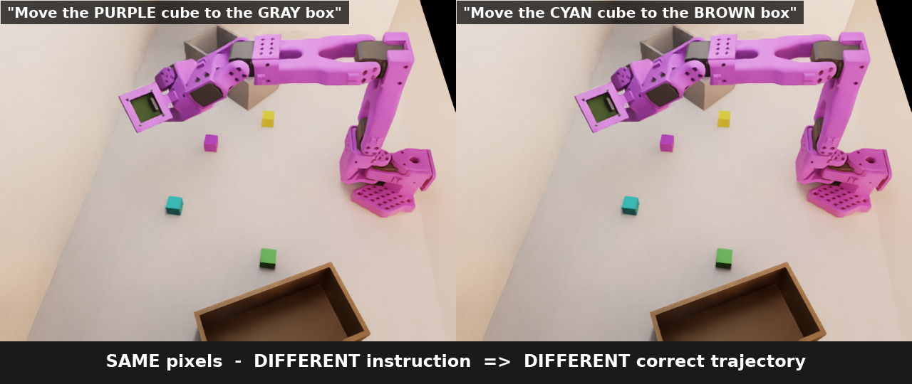

# 말하면 치우는 로봇 — Language-Guided Tabletop Cleanup

> **"빨간 물건은 왼쪽 상자에, 파란 물건은 오른쪽 상자에 넣어줘"** 라고 말하면
> SO-ARM101이 테이블 위 물체를 골라 분류하고, 완료를 음성으로 알린다.


---

## 0. 개요

### 무엇을 만드는가

음성 지시 → **VLA(Vision-Language-Action) 모델** → 로봇 동작 → 음성 피드백까지,
sim2real 파이프라인 전체를 잇는다. 모델은 NVIDIA **GR00T N1.6**(3B)를 쓴다.

<a href="docs/diagrams/D8_workspace.png"></a>

<sub>클릭하면 원본 크기 · 📐 편집: [Figma — D8 물리적 작업 공간](https://www.figma.com/board/4iKjT0Ngfm8IKmiFttKaKc?node-id=9-270)</sub>

**작업 공간 구성.** 60×40cm 테이블 위에 물체 3~5개를 무작위로 놓고, **좌·우 두 상자**에 분류한다.
카메라는 작업 공간 전체를 보는 **top**과 그리퍼에 달린 **wrist** 둘이고, 시연 수집은 **리더암**으로 한다.
Phase 2에서 **마이크·스피커**가 새로 들어간다 — 음성으로 지시하고 음성으로 보고받기 위해서다.

### 어디까지 왔고, 무엇이 남았는가

| | Phase 1 (완료) | Phase 2 (목표) |
|---|---|---|
| 물체 | 빨간 큐브 1개 | 펜·지우개·매직·큐브·원통 **5종** |
| 지시 | 고정 문장 1개 | **음성 입력, 가변 문장** |
| 동작 | 1회 pick-and-place | **N회 순차 분류** |
| 목적지 | 검은 상자 1개 | **좌/우 상자 2개** |
| 인터페이스 | 없음 | **STT + TTS 양방향** |


### 이번 기간의 핵심 질문

> **"모델이 지시문을 실제로 읽게 만들 수 있는가?"**

Phase 1에서 **정책이 언어를 사실상 무시한다**는 것이 sim·실기 양쪽에서 확인됐다.
분류 태스크는 이 능력이 없으면 성립하지 않으므로, **1~2주차에 이것부터 검증**한다.

### 기대 성과

- 음성 명령으로 다물체를 분류하는 **실기 데모**
- sim2real + 언어 조건화 파이프라인의 **재현 가능한 문서·스크립트**
- 실패를 포함한 **실측 기록** (무엇이 왜 안 되는지)

---

## 1. 개발 환경

### 머신 2대 분리

| 머신 | GPU | 역할 |
|---|---|---|
| **로컬** | RTX 5070 Ti (16GB) | 데이터 수집(리더암), 실기 로봇 제어, 추론 서빙 |
| **원격 5090** | RTX 5090 (32GB) | 모델 학습, Isaac Sim 무인 평가 |

> 리더암·로봇이 로컬에 물려 있어 **수집과 실기는 로컬에서만** 가능하고,
> 16GB로는 학습이 안 돼 **학습은 5090 전용**이다.

### 하드웨어

| 장비 | 사양 | 용도 |
|---|---|---|
| 로봇 | SO-ARM101 (6-DOF + 그리퍼) | 매니퓰레이션 |
| 리더암 | SO-ARM101 | teleop 시연 수집 |
| 카메라 | USB ×2 (top + wrist) | 시각 입력 640×480 |
| 마이크 / 스피커 | USB | 음성 입출력 (Phase 2 신규) |



<sub>정책이 받는 두 장. 왼쪽 top 카메라에 로봇과 작업 공간 전체가, 오른쪽 wrist 카메라에 그리퍼 시점이 들어온다.</sub>

### 소프트웨어

| 레이어 | 기술 |
|---|---|
| 시뮬레이터 | Isaac Sim / Isaac Lab 2.3.2 |
| VLA 모델 | GR00T N1.6 (3B, 8-bit) |
| 데이터 | LeRobot v3.0 수집 → GR00T v2.1 변환 |
| 음성 | Whisper (STT) · gTTS/Piper (TTS) |

---

## 2. 시스템 아키텍처 블록도

### 전체 파이프라인 7단계

<a href="docs/diagrams/D1_pipeline.png"></a>

> 단계별 상세와 태스크 교체 시 바꿀 부분은 [PIPELINE.md](PIPELINE.md)에 정리돼 있다.

### 추론(배포) 흐름

<a href="docs/diagrams/D3_infer_pipeline.png"></a>

마이크·카메라는 모두 **로컬 5070 Ti 한 대**에 붙는다. 음성은 STT를 거쳐 영어 지시문이 되고,
**영상 2채널 + 로봇의 관절 상태**와 함께 GR00T 정책에 들어간다. 정책이 내놓은 16-step 행동 청크를
앙상블로 다듬어 SO-ARM101이 실행하고, 완료를 판정해 스피커로 알린다. 별도 서빙 서버는 필요 없다.

### 학습 흐름

<a href="docs/diagrams/D2_train_pipeline.png"></a>

로컬에서 사람이 시연해 모으고, 5090이 변환·학습·평가한다.

---

## 2.1 일정 간트차트

### 요약 — 5개 축

<a href="docs/diagrams/D10_gantt_summary.png"></a>

<sub>클릭하면 원본 크기 · 📐 편집: [Figma — D10 일정 요약](https://www.figma.com/board/4iKjT0Ngfm8IKmiFttKaKc?node-id=23-393)</sub>

| 축 | 기간 | 끝나야 하는 것 |
|---|---|---|
| **언어 조건화 검증** | 09/15 ~ 09/26 | 지시문을 읽는가에 대한 답 (판정 게이트 09/25) |
| **cleanup 태스크 구축** | 09/24 ~ 10/17 | 다물체·순차 분류 sim 모델 |
| **실기 전이** | 09/28 ~ 10/25 | 실물 로봇에서 동작 |
| **음성 파이프라인** | 09/29 ~ 10/28 | 음성 명령 → 동작 → 음성 보고 |
| **발표 준비** | 10/27 ~ 11/02 | 데모 영상·발표 자료 |


- **독립적인 작업은 겹쳐서 진행**한다. 특히 두 가지가 전체 일정을 줄인다:
  - **음성 파이프라인(STT/TTS)** 은 로봇·GPU와 무관하므로 9월 말부터 미리 만든다
  - **실기 프롭 준비·카메라 정렬**은 조달 시간이 있어 10월 초에 착수한다

---

## 2.2 현재 구현 결과

### so-arm 101 동작 

**sim 동작** - isaac sim으로 구성한 scene 안에서 




**실기 동작** — 같은 태스크를 co-training 모델로 실물 로봇에서




### 언어 조건화용 sim 씬 




<sub>**같은 화면인데 지시문이 다르면 정답 궤적이 달라진다** — 이 구성이 있어야 모델이 언어를 볼 이유가 생긴다.</sub>


---

## 3. 주차별 세부 계획

**7주 · 2026-09-15 ~ 11-02.** 2주차 판정 결과가 이후 일정을 가른다.

> 아래 주차 날짜는 **마감 기준**이다. 실제 진행은 [§2.1 간트차트](#21-일정-간트차트)처럼
> 병행 구간이 겹친다 — 음성 파이프라인과 실기 프롭 준비는 앞당겨 시작한다.

| 주 | 기간 | 주제 |
|---|---|---|
| W1 | 09/15 ~ 09/21 | 언어 조건화 — 데이터 수집·학습 |
| W2 | 09/22 ~ 09/28 | 언어 조건화 — **판정 게이트** |
| W3 | 09/29 ~ 10/05 | cleanup 씬 확장 |
| W4 | 10/06 ~ 10/12 | cleanup 수집·학습 |
| W5 | 10/13 ~ 10/19 | 실기 전이 (co-training) |
| W6 | 10/20 ~ 10/26 | 음성 통합 |
| W7 | 10/27 ~ 11/02 | **발표주** — 최종 데모·발표 |

---

### W1 — 언어 조건화 데이터 수집·학습

**목표**: 지시문이 행동을 가르는 데이터를 만들고 학습을 돌린다.

| 작업 | 비고 |
|---|---|
| sim 수집 280ep | 사람 약 5시간, 3세션 |
| 균형 검증 → 변환·병합 | 물체별 타깃 균등, 미학습 색 유출 0 |
| 학습 (기존 모델에서 이어학습) | 기계 19시간 |

**완료 기준**: 학습 완주 + 지시문이 에피소드마다 올바르게 저장됨(검증 통과)

> 준비는 끝났다 — 씬·수집 도구·검증 스크립트·계획표 330행이 모두 구축·검증됐다.

---

### W2 — 판정 게이트 🚦

**목표**: *이 파이프라인에서 언어 조건 조작이 가능한가*에 답한다.

| 작업 | 비고 |
|---|---|
| 무인 롤아웃 10조건 × 30ep | 사람 0, 기계가 밤새 돈다 |
| 미학습 색 일반화 3조건 | 보너스 지표 |

**판정선**

| 지표 | 합격 |
|---|---|
| 물체 선택률 (후보 4개, 우연 25%) | **≥ 45%** |
| 목적지 선택률 (상자 2개, 우연 50%) | **≥ 65%** |
| 기존 성능 유지 | 기준선 대비 −2 이내 |

**분기**

- ✅ **통과** → W3으로. cleanup 씬 확장 착수
- ⚠️ **부분 통과**(언어는 읽으나 행동이 안 따라옴) → 학습량 증량 후 재평가 (+3일)
- ❌ **실패** → 데이터 구성 재설계. **cleanup은 언어 없이 색 기반 규칙으로 축소**

> 이 분기를 미리 정해 두는 이유: 실패해도 11/02 발표는 해야 한다.

---

### W3 — cleanup 씬 확장

**목표**: 1회 pick-place 씬을 **N회 순차 분류** 씬으로 바꾼다.

| 작업 | 비고 |
|---|---|
| 물체 5종 + 상자 2개 씬 구현 | 기존 씬 도구 재사용 |
| **순차 판정 설계** | 부분 점수, 종료 조건, 타임아웃 상향 |
| 씬 검증 후 수집 시작 | 배치·가시성·간격을 숫자로 확인 |

**완료 기준**: 씬 검증 통과 + 수집 100ep

> 가장 큰 미지수는 **판정**이다. "3개 중 2개 정리"를 어떻게 셀지, "더 치울 것이 없다"를
> 무엇으로 판단할지 먼저 정해야 한다.

---

### W4 — cleanup 수집·학습

**목표**: 커리큘럼 L1(2물체 단일 분류) · L2(3물체 순차)를 채우고 학습한다.

| 작업 | 비고 |
|---|---|
| 수집 완료 (누적 약 300ep) | 사람 약 5시간 |
| 학습 (5090) | 기계 약 36시간 |
| sim 무인 평가 | 레벨별 성공률 |

**완료 기준**: sim L1 ≥ 80%, L2 ≥ 70%

---

### W5 — 실기 전이

**목표**: sim 모델을 실물 로봇으로 옮긴다.

| 작업 | 비고 |
|---|---|
| 실기 프롭 준비 + 카메라 정렬 | 구도가 곧 입력 분포 |
| 실기 수집 | 사람 약 3시간 |
| co-training (sim + 실기) | 기계 약 36시간 |

**완료 기준**: 실기 L1 ≥ 70%

> Phase 1 실측: sim 모델의 **zero-shot 전이는 0%**였다. 실기 데이터 혼합이 필수다.

---

### W6 — 음성 통합

**목표**: 음성으로 지시하고 음성으로 보고받는다.

| 작업 | 비고 |
|---|---|
| STT (Whisper) → 한국어 → 영어 지시문 | push-to-talk |
| TTS 피드백 | "빨간 펜 정리 완료" |
| end-to-end 연결 | 마이크부터 스피커까지 |

**완료 기준**: 음성 명령 한 번으로 분류 1회 성공

---

### W7 — 발표주 🎤

**목표**: 11/02(월) 최종 발표. 앞주까지의 결과를 데모와 자료로 굳힌다.

| 일자 | 작업 |
|---|---|
| 10/27(화) | 데모 시나리오 확정 — 성공 조건과 실패 시 대체 시연까지 정한다 |
| 10/28(수) | 리허설 촬영 · 실패 지점 보완 |
| 10/29(목) | **최종 데모 영상 촬영** (음성 명령 → 분류 → 음성 보고) |
| 10/30(금) | 성능 정리 (sim/실기, 레벨별) · 발표 자료 작성 |
| 10/31(토)~11/01(일) | 예비일 — 재촬영·자료 다듬기 |
| **11/02(월)** | **최종 발표** |

**완료 기준**: 데모 영상 + 발표 자료 + 최종 리포트

> **데모는 실패를 전제로 준비한다.** 실기 성공률이 100%가 아니므로, 현장 시연 1회에
> 걸지 않고 **녹화 영상을 주로, 현장 시연을 보조로** 둔다. 실패 장면도 원인과 함께 보여준다.

---

### 일정 리스크

| 리스크 | 영향 | 대응 |
|---|---|---|
| **언어 조건화 실패** (W2) | 프로젝트 핵심 가정이 깨짐 | 색 기반 규칙 분류로 축소, 데모는 유지 |
| **물체 기하 실패** | 펜·매직을 못 잡음 | Phase 1에서 이미 확인된 약점 — 크기·형상 다양성을 수집에 반영 |
| **학습 시간 초과** | 주차 밀림 | 5090 점유 일정을 주 단위로 고정, 야간 가동 |
| **순차 판정 설계 지연** (W3) | W4 수집 지연 | 판정을 좌표 기반으로 자동화 (사람이 영상 안 봄) |

---

## 4. 프로젝트 구조

```
manipulator_ws/
├─ README.md            프로젝트 개요
├─ PIPELINE.md          파이프라인 해부 (단계별 재현 절차)
├─ PRESENTATION.md      이 문서 — 발표·일정
├─ manipulator_md/      실험 기록·계획서 (sim / sim2real)
├─ setup/               재현용 스크립트 (sim · gr00t · 하드웨어 · 음성)
├─ envs/                실행 환경 (lerobot · gr00t)
├─ inf_video/           추론 영상·평가 결과
└─ docs/                다이어그램·발표 이미지
```

---

## 5. 참고 자료

| 자료 | 링크 |
|---|---|
| GR00T N1.5 (모델 설계·언어 추종) | https://research.nvidia.com/labs/gear/gr00t-n1_5/ |
| Isaac GR00T 파인튜닝 | https://github.com/NVIDIA/Isaac-GR00T |
| LeRobot (데이터·로봇 제어) | https://github.com/huggingface/lerobot |
| SO-ARM101 sim2real 워크숍 | https://github.com/ycheng517/Sim-to-Real-SO-101-Workshop |
| 아키텍처 다이어그램 (FigJam) | https://www.figma.com/board/4iKjT0Ngfm8IKmiFttKaKc |

### 내부 문서

| 문서 | 내용 |
|---|---|
| [PIPELINE.md](PIPELINE.md) | 7단계 파이프라인, 태스크 교체 체크리스트 |
| [sim2real 보고서](manipulator_md/sim/sim2real_generalization_report.md) | Phase 1 전이·일반화 실측 |
| [언어 조건화 복원 계획](manipulator_md/sim/language_conditioning_plan.md) | 세 접근의 비교·선택 |
| [1단계 실행 계획](manipulator_md/sim/language_conditioning_sim_plan.md) | 씬·수집·학습·평가 설계 |
