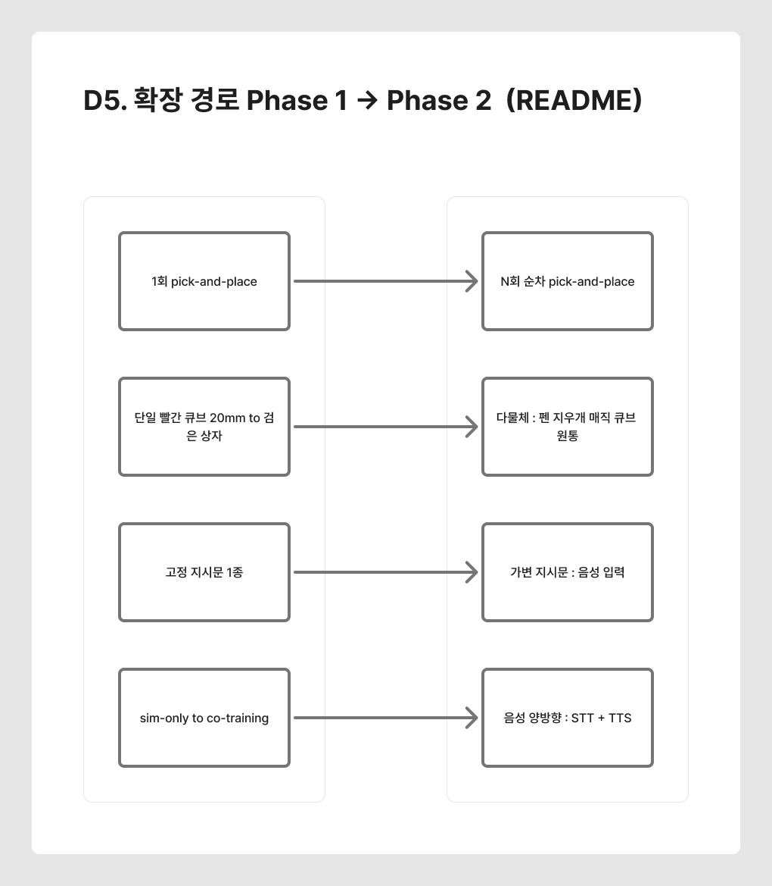
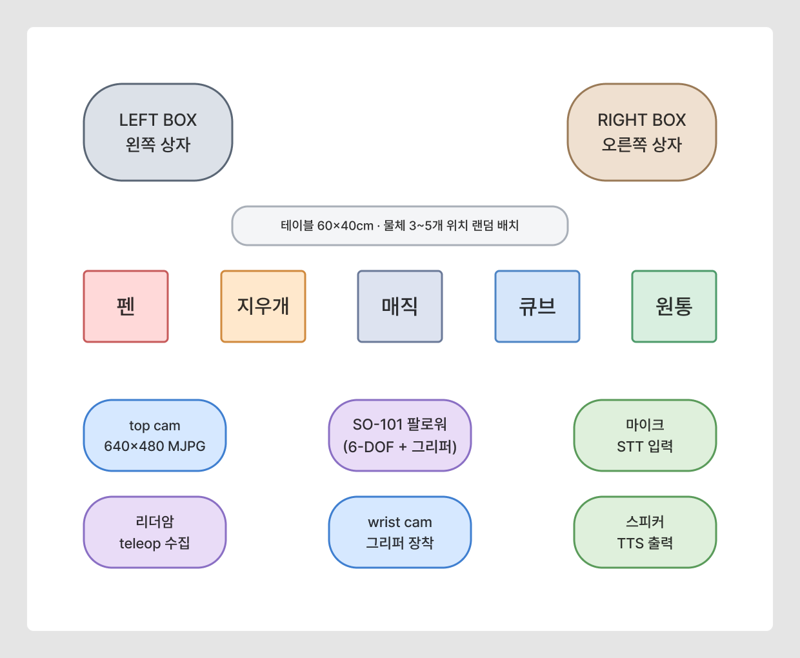
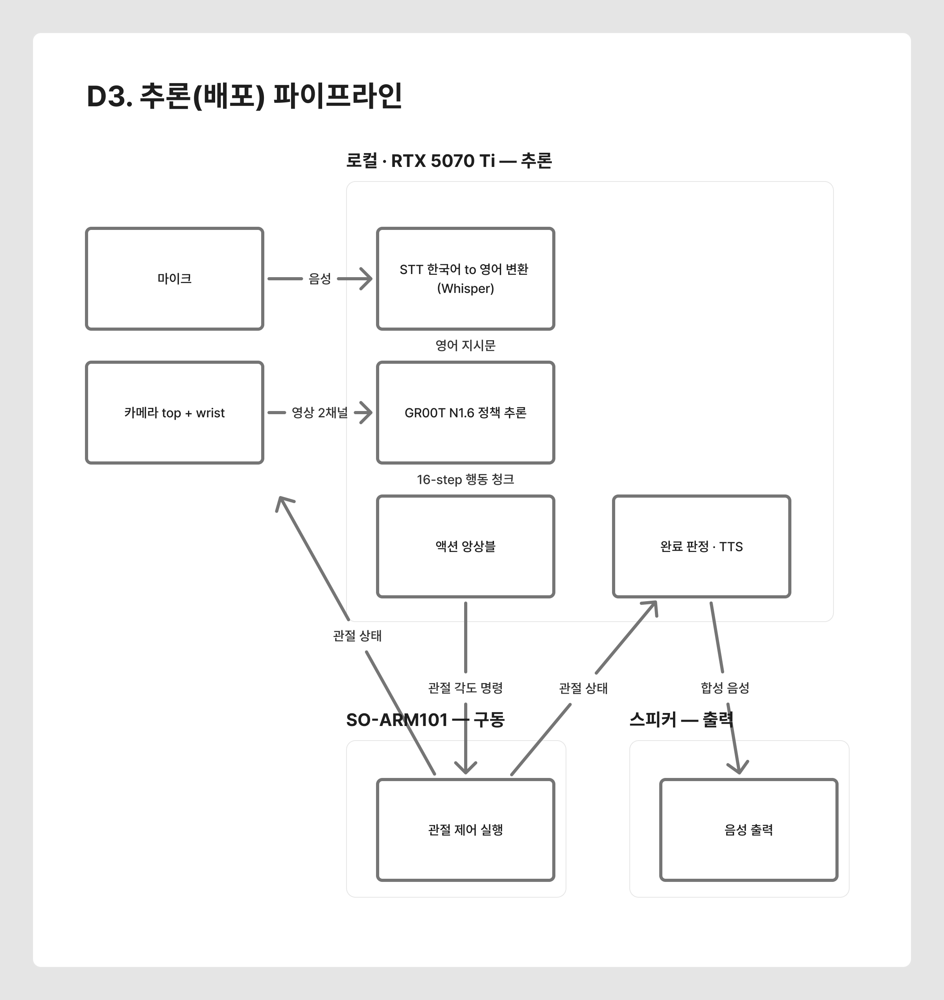
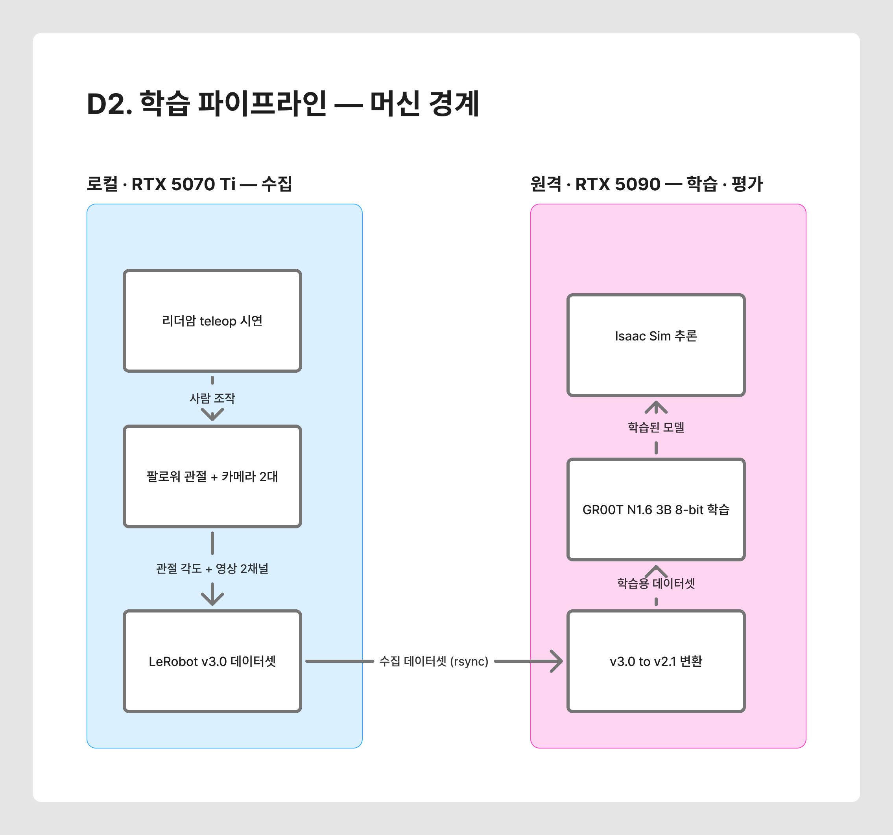
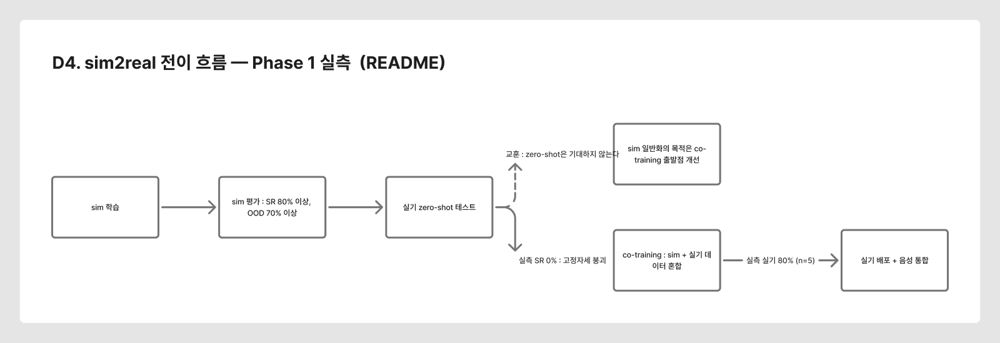
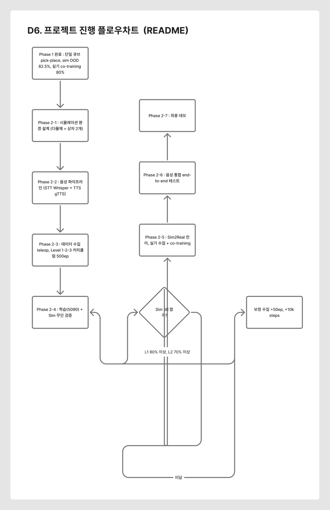
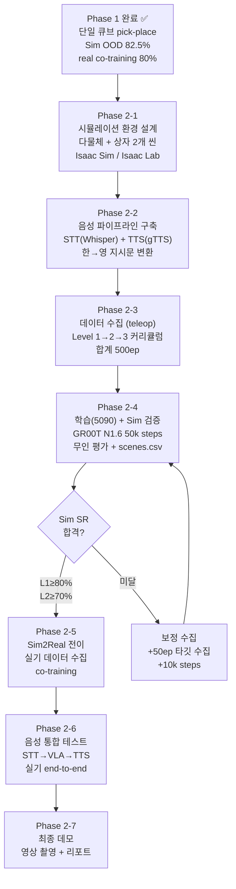

# manipulator_ws — 🧹 "말하면 치우는 로봇" Language-Guided Tabletop Cleanup

음성 명령(STT)을 통해 자연어 지시를 내리면, SO-ARM101 로봇이 테이블 위의
물체(펜, 지우개, 매직, 큐브 등)를 속성별로 분류하여 지정된 박스에 정리하고,
작업 상태를 음성(TTS)으로 피드백하는 **sim2real 파이프라인 프로젝트**.

> **핵심 시나리오**: 사용자가 _"빨간 물건은 왼쪽 상자에, 파란 물건은 오른쪽 상자에 넣어줘"_ 라고
> 말하면 로봇이 해당 물체만 골라 분류하고, 완료 시 _"정리가 완료되었습니다"_ 라고 응답합니다.

> **기반**: 2주 계획에서 확보한 **단일 빨간 큐브(20mm) → 검은 상자 pick-and-place** 파이프라인
> (sim SR ≥ 80%, OOD SR ≥ 70%)을 **다물체 + 언어 조건부 분류 + 음성 인터페이스**로 확장합니다.

> 📘 **파이프라인을 그대로 다른 태스크에 돌리려면**: [PIPELINE.md](PIPELINE.md)
> — 씬 정의부터 실기 평가까지 7단계를, **태스크에 종속된 부분 / 재사용되는 부분**으로 갈라 정리했다.

---

## 프로젝트 개요

### 목표
GR00T N1.6 VLA(Vision-Language-Action)의 비전-언어-행동 통합 능력을 활용하여,
**다물체 + 언어 조건부 분류**를 sim2real 파이프라인으로 구현한다.

### 확장 경로

<a href="docs/diagrams/D5_phase_roadmap.png"></a>

<sub>클릭하면 원본 크기 · 📐 편집: [Figma — D5 확장 경로 Phase 1 → Phase 2](https://www.figma.com/board/4iKjT0Ngfm8IKmiFttKaKc?node-id=5-177)</sub>

```
Phase 1 (완료)                          Phase 2 (현재)
─────────────────────────              ─────────────────────────
단일 빨간 큐브 → 검은 상자              다물체(펜/지우개/매직/큐브)
고정 지시문 1종                     →   가변 지시문 (음성 입력)
1회 pick-place                          N회 순차 pick-place
sim-only → co-training                  음성 양방향 (STT+TTS)
```

### 대상 물체
| 물체 | 형태 | 비고 |
|---|---|---|
| 펜 | 원통형(가늘고 긴) | 그립 난이도 높음 |
| 지우개 | 직육면체(소형) | 표준 pick 대상 |
| 매직(마커) | 원통형(중간) | 펜보다 굵음 |
| 큐브 | 정육면체(3cm) | Phase 1 기본 대상 |
| 원통 | 원기둥(2.5×4cm) | 형상 분류용 |

> ⚠️ **Phase 1 실측 경고**: sim 평가 B에서 정책이 **물체 기하에 그리퍼를 맞추지 못함**이 확인됨
> (28mm 큐브 2/10, 지우개 40×20×12mm 4/10 — 긴 변이 턱 사이에 오면 실패).
> Phase 2 대상(펜·매직·지우개)이 정확히 이 축이므로, **크기·형상 다양성 수집이 전제 조건**이다.

---

## 작업 환경

> 📐 **작업 환경 다이어그램**: [Figma — D8 물리적 작업 공간](https://www.figma.com/board/4iKjT0Ngfm8IKmiFttKaKc?node-id=9-270)

### 머신 구성 (2대 분리)

| 머신 | GPU | 역할 |
|---|---|---|
| **로컬** | RTX 5070 Ti (sm_120) | 리더암 teleop **데이터 수집**, 실기 로봇 제어, 씬 검증, **로컬 서빙(선택)** |
| **원격 (5090)** | RTX 5090 | GR00T **학습**, Isaac Sim **평가**, 모델 **서빙** |

> 두 머신 간 통신은 SSH + rsync. 실기 추론은 **5090 원격 서빙** 또는 **로컬 서빙**
> (`serve_local.sh`, real-robot 이미지 로컬 빌드) 둘 다 가능.
> 실측: 로컬 서빙이 추론 지연 중앙 **73ms**로 원격(115~171ms, 지터 최대 824ms)보다
> 낮고 안정적이다. 로컬 서빙 시 5090은 학습 전용으로 쓸 수 있다.

### 하드웨어 (로컬)

| 장비 | 사양 | 용도 |
|---|---|---|
| **로봇** | SO-ARM101 (6-DOF + 그리퍼) | 매니퓰레이션 실행 (팔로워) |
| **리더암** | SO-ARM101 (리더) | Teleop 시연 데이터 수집 |
| **카메라** | USB 카메라 ×2 (top + wrist) | 시각 입력 (640×480, MJPG 필수) |
| **마이크** | USB 마이크 | STT 음성 입력 (Phase 2 신규) |
| **스피커** | 3.5mm / USB 스피커 | TTS 음성 출력 (Phase 2 신규) |

### 소프트웨어 스택

| 레이어 | 기술 | 버전/비고 |
|---|---|---|
| **시뮬레이션** | Isaac Sim / Isaac Lab | 2.3.2, `teleop-docker` 컨테이너 |
| **VLA 모델** | GR00T N1.6 (3B, 8-bit) | `paged_adamw_8bit`(옵티마이저 상태만 8-bit), cosine LR |
| **데이터 수집** | LeRobot | v3.0 포맷으로 수집 |
| **학습 데이터** | GR00T 파이프라인 | v2.1 포맷으로 변환 후 학습 |
| **STT** | Whisper (medium) | OpenAI Whisper (Phase 2 신규) |
| **TTS** | gTTS / Piper | Phase 2 신규 |
| **로봇 제어** | lerobot 0.4.4 | HuggingFace, uv 관리 |
| **런타임** | Python 3.10 + PyTorch 2.10 (cu128) | 로봇 제어 env 기준. **서빙 이미지(real-robot)는 torch 2.8.0 고정** |

### 물리적 작업 공간 (Phase 2)

<a href="docs/diagrams/D8_workspace.png"></a>

<sub>클릭하면 원본 크기 · 📐 편집: [Figma — D8 물리적 작업 공간](https://www.figma.com/board/4iKjT0Ngfm8IKmiFttKaKc?node-id=9-270)</sub>

```
┌───────────────────────────────────────────┐
│                 테이블 (60×40cm)            │
│                                           │
│   📦 LEFT BOX           📦 RIGHT BOX     │
│   (왼쪽 상자)            (오른쪽 상자)      │
│                                           │
│      🖊️ 펜    ✏️ 지우개                    │
│          🖍️ 매직    🟥 큐브    🖊️ 펜       │
│   (물체 3~5개, 위치 랜덤 배치)              │
│                                           │
│   📷 top cam                              │
│              🤖 SO-101 (팔로워)            │
│                 📷 wrist cam              │
│   🎤 마이크       🤖 리더암    🔊 스피커    │
└───────────────────────────────────────────┘
```

---

## 시스템 아키텍처

> 📐 **시스템 아키텍처 블록 다이어그램**: [Figma — D3 추론 파이프라인](https://www.figma.com/board/4iKjT0Ngfm8IKmiFttKaKc?node-id=41-476) · [D2 학습 파이프라인](https://www.figma.com/board/4iKjT0Ngfm8IKmiFttKaKc?node-id=2-50)

### 추론(배포) 파이프라인

<a href="docs/diagrams/D3_infer_pipeline.png"></a>

<sub>클릭하면 원본 크기 · 📐 편집: [Figma — D3 추론(배포) 파이프라인](https://www.figma.com/board/4iKjT0Ngfm8IKmiFttKaKc?node-id=41-476)</sub>

```
┌─ 로컬 머신 (RTX 5070 Ti) ──────────────────────────────────┐
│                                                             │
│  [🎤 마이크] → [STT: Whisper] → 텍스트 지시문                │
│               "빨간 펜을 왼쪽 상자에 넣어줘"                  │
│                         │                                   │
│                         ▼                                   │
│               [지시문 → 영어 변환]                            │
│               "Pick up the red pen and place it             │
│                in the left box"                             │
│                         │                                   │
│  [📷 top cam] ──┐       │                                   │
│  [📷 wrist cam]─┤       │                                   │
│                 ▼       ▼                                   │
│  ┌──────────────────────────────┐                           │
│  │ GR00T 클라이언트              │                           │
│  │ (client/eval_lerobot.py)     │ ← 이미지 + 언어 지시       │
│  │ → 서빙 서버 (로컬/5090)       │ → 16-step 행동 시퀀스       │
│  └──────────────┬───────────────┘                           │
│                 ▼                                           │
│  [🦾 SO-101 팔로워] → 관절 제어 (모터 드라이버)               │
│                 │                                           │
│                 ▼                                           │
│  [📊 완료 판정] → [상태 메시지 생성]                          │
│                         │                                   │
│                         ▼                                   │
│  [🔊 스피커] ← [TTS: gTTS/Piper]                             │
│              "빨간 펜 정리 완료"                               │
└─────────────────────────────────────────────────────────────┘

┌─ 서빙 (택 1) ──────────────────────────────┐
│  로컬:  serve_local.sh (5070 Ti, 73ms)      │
│  원격:  serve_blocktask_n16_5090.sh (5090)  │
│  이미지+언어 → 행동 시퀀스 반환                │
└────────────────────────────────────────────┘
```

### 학습 파이프라인

<a href="docs/diagrams/D2_train_pipeline.png"></a>

<sub>클릭하면 원본 크기 · 📐 편집: [Figma — D2 학습 파이프라인 (머신 경계)](https://www.figma.com/board/4iKjT0Ngfm8IKmiFttKaKc?node-id=2-50)</sub>

```
┌─ 로컬 (수집) ──────────────────────────────────────────────┐
│                                                            │
│  [리더암] → [팔로워(SO-101)] + [📷×2]                       │
│     teleop 시연                                            │
│         │                                                  │
│         ▼                                                  │
│  [LeRobot v3.0 수집]                                       │
│  datasets/sim_so101_blocktask_*/                           │
│         │                                                  │
│         ▼ rsync                                            │
└─────────┬──────────────────────────────────────────────────┘
          │
┌─────────▼──── 원격 5090 (학습) ────────────────────────────┐
│                                                            │
│  [v3.0 → v2.1 변환]                                        │
│  datasets/_train/<버전>/                                    │
│         │                                                  │
│         ▼                                                  │
│  [GR00T N1.6 학습]                                         │
│  3B, 8-bit, paged_adamw                                    │
│  cosine LR, color jitter                                   │
│         │                                                  │
│         ▼                                                  │
│  [Isaac Sim 평가]                                           │
│  teleop-docker 컨테이너                                     │
│  headless 무인 평가 + scenes.csv                            │
└────────────────────────────────────────────────────────────┘
```

### sim2real 전이 흐름 (Phase 1 실측 기반)

<a href="docs/diagrams/D4_sim2real_flow.png"></a>

<sub>클릭하면 원본 크기 · 📐 편집: [Figma — D4 sim2real 전이 흐름](https://www.figma.com/board/4iKjT0Ngfm8IKmiFttKaKc?node-id=4-138)</sub>

```
[sim 학습]  ──→  [sim 평가: SR≥80%, OOD≥70%]
                         │
                         ▼
              [실기 zero-shot 테스트]
              (Phase 1 실측: SR 0% — 고정자세 붕괴)
                         │
                         ▼
              [co-training: sim + 실기 데이터]
              (Phase 1 실측: v4 co-train → 실기 80%, n=5)
                         │
                         ▼
              [실기 배포 + 음성 통합]
```

> **Phase 1 교훈**: sim-only 모델의 zero-shot은 기대하지 않는다.
> sim에서 일반화를 확보하는 목적은 **co-training의 출발점을 좋게 만드는 것**이다.

---

## 데이터 흐름 (블록 간 전송)

> 📐 **상세 데이터 흐름도**: [Figma — D3 추론 파이프라인](https://www.figma.com/board/4iKjT0Ngfm8IKmiFttKaKc?node-id=41-476) · [D2 학습 파이프라인](https://www.figma.com/board/4iKjT0Ngfm8IKmiFttKaKc?node-id=2-50)

### 추론 시 데이터 흐름

| From → To | 데이터 형식 | 내용 | 전송 방식 |
|---|---|---|---|
| 마이크 → STT | PCM audio (16kHz, mono) | 사용자 음성 원본 | PyAudio stream |
| STT → 지시문 변환 | `str` (한국어 텍스트) | `"빨간 펜을 왼쪽 상자에 넣어줘"` | 함수 호출 |
| 지시문 변환 → GR00T 클라이언트 | `str` (영어 지시문) | `"Pick up the red pen and place it in the left box"` | 함수 호출 |
| 카메라 ×2 → GR00T 클라이언트 | `ndarray` (RGB 480×640×3) ×2 | top cam + wrist cam 프레임 | USB → OpenCV |
| GR00T 클라이언트 → 서빙 | 이미지(JPEG 직렬화) + 언어 지시 | 추론 요청 | ZMQ tcp:5555 (로컬/원격) |
| 서빙 → 클라이언트 | `ndarray` (관절 각도, 16-step chunk) | 행동 시퀀스 | ZMQ tcp:5555 |
| 클라이언트 → SO-101 | 관절 각도 명령 | 모터 제어 | 시리얼 (USB) |
| 완료 판정 → TTS | `str` (상태 메시지) | `"빨간 펜 정리 완료"` | 함수 호출 |
| TTS → 스피커 | PCM audio | 합성된 음성 | PyAudio / ALSA |

### 학습 시 데이터 흐름

| From → To | 데이터 형식 | 내용 | 전송 방식 |
|---|---|---|---|
| 리더암 + 팔로워 → LeRobot | 관절 각도 + RGB ×2 | teleop 시연 에피소드 | LeRobot v3.0 |
| LeRobot v3.0 → v2.1 변환 | parquet + mp4 | 포맷 변환 (GR00T 호환) | 변환 스크립트 |
| 변환 데이터 → GR00T 학습 | v2.1 데이터셋 | `ShardedMixtureDataset` | 로컬 디스크 (5090) |
| 학습 → 체크포인트 | 모델 가중치 | checkpoint-{steps} | 5090 로컬 저장 |
| 체크포인트 → 서빙 | 모델 로드 | 추론 서버 기동 | 셸 스크립트 (원격/로컬) |

---

## 음성 파이프라인 (STT ↔ TTS, Phase 2 신규)

### STT (Speech-to-Text) — 입력 방향
- 엔진: OpenAI Whisper (medium/large)
- 한국어 음성 → 한국어 텍스트 → 영어 지시문 변환
- 실시간 스트리밍 또는 push-to-talk 방식

### TTS (Text-to-Speech) — 출력 방향
- 엔진: gTTS / Piper TTS
- 상태 피드백 예시:
  - `"빨간 펜을 집고 있습니다"`
  - `"왼쪽 상자에 놓았습니다"`
  - `"정리가 완료되었습니다. 총 3개 물체를 정리했습니다"`
  - `"지시하지 않은 물체 2개는 그대로 두었습니다"`

> **참고**: GR00T N1.6 VLA는 **언어+이미지를 함께 인코딩**하여 행동을 출력하므로,
> 별도 NLU/물체 탐지기가 필요 없다 — 는 것이 설계 전제였다.
> **그러나 Phase 1 실측에서 언어를 사실상 쓰지 않는 현상이 확인됐다**
> (sim L5 의미충돌 10/10 무시, `red` 명시 무효, 실기 L5 동일 — sim·실기 양쪽 확인).
> 원인은 수집 257ep 전체가 **단일 지시문**이라 언어 입력이 상수였던 것.
> → Phase 2 수집은 **같은 씬에서 문장이 다르면 정답 행동도 달라지는** 구성이어야 하며
> (LIBERO-Object형), Level 1에서 언어 조건화부터 검증한다.
> 상세: `manipulator_md/sim/sim2real_generalization_report.md` §9

---

## 프로젝트 진행 플로우차트

<a href="docs/diagrams/D6_project_flowchart.png"></a>

<sub>클릭하면 원본 크기 · 📐 편집: [Figma — D6 프로젝트 진행 플로우차트](https://www.figma.com/board/4iKjT0Ngfm8IKmiFttKaKc?node-id=6-193)</sub>



---

## 난이도별 커리큘럼

| Level | 물체 수 | 지시 유형 | 동작 | Sim SR 목표 | Real SR 목표 |
|---|---|---|---|---|---|
| **L1** 기본 | 2개 | 단일 색상 분류 | 1회 pick-place | ≥ 80% | ≥ 70% |
| **L2** 순차 | 3개 | 다색상 순차 | 3회 순차 pick-place | ≥ 70% | ≥ 50% |
| **L3** 선택적 | 5개 | 선택적 분류+무시 | 타겟만 정리 | ≥ 60% | ≥ 40% |
| **L4** 도전 | 5개 | 형상 기반 분류 | 큐브/원통 분류 | 보너스 | — |

---

## Phase 1 성과 (기반 파이프라인)

### 성능

| 지표 | Sim | Real (co-training 후) |
|---|---|---|
| 학습 분포 내 SR | v3 61~67% → **v4_200 근접 보강으로 해소** (고정 패널 L0 9/10) | 80% (n=5, CI 27~86%) |
| OOD SR | **82.5%** (v3 시점) ✅ | 80% (n=5, CI 27~86%) |
| Zero-shot | — | **0%** (고정자세 붕괴) |
| 일반화 (평가 B) | **15조건 중 11 견고** · 취약 2축: 물체 식별·물체 기하 | 언어 미사용 재확인 (L5) |

### 핵심 발견
- **블록-박스 근접**이 SR의 주된 병목 (39% vs 83%, 44%p 차)
- 수집 필터가 유효 근접 구간까지 걸러냄 (학습 19.2% vs 자연 43.2%)
- → 타깃 수집(65ep, 근접 55/65)으로 보강, v4_200(200ep, 근접 54.5%) 재학습
- **앙상블 결함**: 행동 앙상블이 움직임을 상쇄, 10~50초 정지 유발 (끄면 2/5→4/5)
- **언어 미사용**: 현 정책은 언어를 입력으로 쓰지 않음 → cleanup task에서 재검증 필수
- **물체 기하 실패**: 28mm 2/10, 지우개 4/10 — 크기·자세에 그리퍼를 못 맞춤
  → Phase 2 대상(펜·매직)이 이 축이므로 크기·형상 다양 수집 필수
- 상세: `manipulator_md/sim/sim2real_generalization_report.md`

### 데이터셋 계보

| 데이터셋 | ep / frames | 구성 | 학습 모델 |
|---|---|---|---|
| `sim_so101_blocktask` | 75 / 25k | 초기 | `blocktask75` 20k |
| `..._v2` | 100 / 31k | 박스 고정 | `v2` 20k |
| `..._v3` | 100 / 39k | v3 씬 (위치·박스·물리 DR) | `v3` 40k |
| `..._v4_200` | 200 / 83k | **근접 보강** | `v4_200` 86k |
| `so101_blocktask_real` | 50 / 21k | 실기 (박스 고정) | co-training (v2 시절) |
| `..._real_v2_57` | 57 / 38k | 실기 (박스 다양성) | **cotrain_v4** 48k |

---

## 다이어그램 (Figma)

문서의 ASCII·mermaid 블록을 FigJam 보드 한 장에 옮겨 두었다. 코드블록은 터미널·grep용으로 남겨 둔다.

**보드 전체**: [manipulator_ws — 아키텍처 다이어그램](https://www.figma.com/board/4iKjT0Ngfm8IKmiFttKaKc)

이미지는 `docs/diagrams/`에 PNG로 함께 두었다 — 문서에서 바로 보이고, 편집은 Figma에서 한다.

| # | 다이어그램 | 출처 | 이미지 | 편집 |
|---|---|---|---|---|
| D1 | 파이프라인 S1~S7 | `PIPELINE.md` §0 | [PNG](docs/diagrams/D1_pipeline.png) | [Figma](https://www.figma.com/board/4iKjT0Ngfm8IKmiFttKaKc?node-id=16-341) |
| D2 | 학습 파이프라인 (머신 경계) | README | [PNG](docs/diagrams/D2_train_pipeline.png) | [Figma](https://www.figma.com/board/4iKjT0Ngfm8IKmiFttKaKc?node-id=2-50) |
| D3 | 추론(배포) 파이프라인 | README | [PNG](docs/diagrams/D3_infer_pipeline.png) | [Figma](https://www.figma.com/board/4iKjT0Ngfm8IKmiFttKaKc?node-id=41-476) |
| D4 | sim2real 전이 흐름 | README | [PNG](docs/diagrams/D4_sim2real_flow.png) | [Figma](https://www.figma.com/board/4iKjT0Ngfm8IKmiFttKaKc?node-id=4-138) |
| D5 | 확장 경로 Phase 1 → Phase 2 | README | [PNG](docs/diagrams/D5_phase_roadmap.png) | [Figma](https://www.figma.com/board/4iKjT0Ngfm8IKmiFttKaKc?node-id=5-177) |
| D6 | 프로젝트 진행 플로우차트 | README | [PNG](docs/diagrams/D6_project_flowchart.png) | [Figma](https://www.figma.com/board/4iKjT0Ngfm8IKmiFttKaKc?node-id=6-193) |
| D7 | 코드가 사는 곳 (포크 vs 저장소) | `PIPELINE.md` §2 | [PNG](docs/diagrams/D7_code_layout.png) | [Figma](https://www.figma.com/board/4iKjT0Ngfm8IKmiFttKaKc?node-id=7-258) |
| D8 | 물리적 작업 공간 | README | [PNG](docs/diagrams/D8_workspace.png) | [Figma](https://www.figma.com/board/4iKjT0Ngfm8IKmiFttKaKc?node-id=9-270) |
| D9 | 일정 간트차트 (상세) | `PRESENTATION.md` §2.1 | [PNG](docs/diagrams/D9_gantt.png) | [Figma](https://www.figma.com/board/4iKjT0Ngfm8IKmiFttKaKc?node-id=21-302) |
| D10 | 일정 간트차트 (요약) | `PRESENTATION.md` §2.1 | [PNG](docs/diagrams/D10_gantt_summary.png) | [Figma](https://www.figma.com/board/4iKjT0Ngfm8IKmiFttKaKc?node-id=23-393) |

---

## 프로젝트 구조

```
manipulator_ws/
├─ PIPELINE.md                 # 📘 파이프라인 해부 (S1~S7, 태스크 교체 체크리스트)
├─ model_md/                   # Phase 1-0: 4모델 비교 (ACT/SmolVLA/π0/GR00T)
│  ├─ README.md
│  ├─ 01_ACT.md ~ 04_GR00T_N1.5.md
│  ├─ report/
│  └─ sim2real/
├─ manipulator_md/             # Phase 1~2: GR00T 기반 진행 기록
│  ├─ sim/
│  │  ├─ README.md                        # sim 학습 종합 보고서
│  │  ├─ cleanup_project_plan.md          # 🧹 Phase 2 계획서
│  │  ├─ 2week_plan.md                    # sim 일반화 2주 계획 (실행 기록)
│  │  ├─ sim2real_generalization_report.md # sim2real 전이·일반화 보고서 (§9 언어 복원 계획)
│  │  ├─ collection_plan_v4.md            # v4 근접 보강 수집 계획
│  │  ├─ cotraining_plan_v4.md            # co-training 계획
│  │  ├─ datasets.md                      # 데이터셋 카탈로그
│  │  ├─ generalization_eval_plan.md      # 일반화 평가 계획
│  │  └─ ...
│  └─ sim2real/
│     ├─ 01~03_*.md                       # 실행 기록
│     └─ 08_T1_sim2real/                  # T1 sim2real 보고서
├─ setup/                      # 재현용 스크립트
│  ├─ hardware/                # 장치 공통: udev rules, 카메라, teleop
│  ├─ data/                    # 데이터 수집 스크립트
│  ├─ sim/                     # 시뮬레이션 환경
│  │  ├─ record_sim.sh         #   sim teleop 수집
│  │  ├─ train_gr00t_sim*.sh   #   학습 스크립트
│  │  └─ t1_task/              #   T1 태스크 전용 도구
│  │     ├─ configure_scene.py           # 조건 프리셋 씬 설정 (full+X 조합 지원)
│  │     ├─ blocktask_headless_scenes.sh # 무인 대량 측정 (run.json 기록)
│  │     ├─ run_evalB.sh                 # 평가 B 드라이버 (고정 패널)
│  │     ├─ capture_background.py        # 배경·작업면 교체 실험 + GUI 뷰어
│  │     ├─ view_background.sh           # 배경 후보 Isaac Sim 확인
│  │     ├─ blocktask_collect_near.sh    # v4 타깃 수집
│  │     ├─ analyze_dataset_geometry.py  # 배치 미터단위 복원
│  │     ├─ prepare_blocktask_v4_200.sh  # 전송→변환→병합→검증
│  │     ├─ train_gr00t_blocktask_*.sh   # 버전별 학습 (realonly 대조군 포함)
│  │     └─ launch_cotrain.py            # co-training 실행
│  ├─ gr00t/                   # GR00T 서빙·실기 도구
│  │  ├─ serve_blocktask_n16_5090.sh     # 5090 원격 서빙
│  │  ├─ serve_local.sh                  # 로컬(5070 Ti) 서빙 — real-robot 이미지 필요
│  │  ├─ serve_blocktask_realclient.py   # 서빙 래퍼 (평탄키→중첩 변환, 실기 클라이언트 호환)
│  │  ├─ client/eval_lerobot.py          # 실기 추론 클라이언트 (앙상블·영상·csv 기록)
│  │  ├─ run_eval_real.sh                # 실기 평가 래퍼 (시행 자동 번호·run.json)
│  │  ├─ analyze_real_run.py             # 정지·튐·지연 자동 판정 (교시 데이터 기준선)
│  │  ├─ goto_home_real.py               # 홈 포지션 이동
│  │  ├─ real_pose_align.py              # 카메라 정렬
│  │  ├─ rerun_cam_align.py              # 카메라 정렬 시각화
│  │  ├─ record_blocktask_real_v2.sh     # 실기 수집 (박스 다양성)
│  │  └─ gen_real_collect_schedule.py    # 배치표 생성 (층화 추출)
│  ├─ act/ / smolvla/ / pi0/   # Phase 1-0 모델별 스크립트
│  └─ voice/                   # (Phase 2 예정) STT/TTS 파이프라인
├─ envs/
│  ├─ lerobot/                 # uv 프로젝트 (lerobot 0.4.4 + torch 2.10 cu128)
│  └─ gr00t/                   # uv 프로젝트 (Isaac-GR00T)
├─ inf_video/                  # 추론 결과 영상·측정 자료
│  ├─ 01_sim_inf/ ~ 04_v4_eval/  # sim 추론·평가 영상 (버전별)
│  ├─ 06_preset_capture/         # 일반화 프리셋 씬 캡처
│  ├─ 07_real_eval/              # 실기 평가 A·C — 영상·chunks/actions.csv·run.json
│  └─ 08_evalB_sim/              # 평가 B — 고정 패널 15조건, scenes.csv·run.json
└─ logs/                       # 학습·실험 로그
```

---

## 환경 재현

```bash
# 1. uv 설치
curl -LsSf https://astral.sh/uv/install.sh | sh

# 2. 의존성 설치 (Python 3.10 자동 고정)
cd envs/lerobot && uv sync

# 3. udev rules 설치 (장치 경로 고정)
sudo cp setup/hardware/99-lerobot.rules /etc/udev/rules.d/
sudo udevadm control --reload-rules && sudo udevadm trigger

# 4. 시스템 의존성
sudo apt install ffmpeg   # torchcodec(학습 영상 디코딩) 필수

# 5. 음성 파이프라인 의존성 (Phase 2)
pip install openai-whisper gtts pyaudio

# 6-a. 실기 추론 — 원격 서빙 (5090)
ssh 5090 '~/serve_blocktask_n16_5090.sh <model>/checkpoint-<step> start'
cd setup/gr00t && ./run_eval_real.sh C <조건>

# 6-b. 실기 추론 — 로컬 서빙 (지연 73ms, 지터 없음. 5090은 학습에 사용 가능)
cd ~/blocktask_ws/Sim-to-Real-SO-101-Workshop && ./docker/real/build.sh blackwell  # 최초 1회
cd ~/manipulator_ws/setup/gr00t && ./serve_local.sh <model>/checkpoint-<step>
SERVER_HOST=127.0.0.1 ./run_eval_real.sh C <조건>
```

## 데이터·모델 (HF Hub private)

| repo | 내용 |
|---|---|
| `heongyu/so101_t1_pickplace` | T1 Pick-and-Place 30ep (teleop 시연) |
| `heongyu/so101_t2_cleanup` | T2 Table Cleanup (예정) |
| `heongyu/act_so101_t1` | ACT-T1 학습 체크포인트 |
| `heongyu/sim_so101_cleanup_v1` | (예정) 500ep 다물체 분류 데이터셋 |
| `heongyu/gr00t_cleanup_v1_n16_8bit` | (예정) 언어 조건부 분류 모델 |

## 주의사항

- 카메라 설정에 **반드시 `fourcc: MJPG`** — YUYV는 USB 대역폭 포화로 영상 깨짐
- RTX 5070 Ti(Blackwell sm_120)는 CUDA 12.8+ / torch 2.10+cu128 필요 (lerobot env 기준)
- **서빙 이미지(real-robot) 빌드 재현성**: torch nightly 미고정이면 flash-attn 컴파일이 깨진다
  — `Dockerfile.blackwell`은 torch==2.8.0+cu128 + flash-attn 2.8.3 **사전 wheel**로 고정됨
- 카메라 udev rule은 물리 포트 기준 — USB 포트 이동 시 rule 수정 필요
- 마이크/스피커 장치 확인: `arecord -l` / `aplay -l`
- **데이터 포맷 주의**: 수집은 LeRobot v3.0, 학습은 v2.1 — 변환 누락 시 학습 실패
- **씬 배포 검증 필수**: 로컬에서 씬 수정 후 5090에 rsync 누락 → 무효 측정 발생 (Phase 1 경험)
- **카메라 정렬 필수**: 실기 배포 전 `rerun_cam_align.py`로 확인 — 구도가 곧 입력 분포
- **영상 코덱**: 평가 영상은 `mpeg4`로 저장돼 웹(Notion 등)에서 재생 불가 —
  업로드 전 `ffmpeg -c:v libx264 -pix_fmt yuv420p -movflags +faststart`로 변환
- **run.json이 근거**: 어떤 모델·지시문·설정으로 돌렸는지는 조건 이름이 아니라
  각 결과 디렉터리의 `run.json`으로 증명한다 (Phase 1 교훈)
