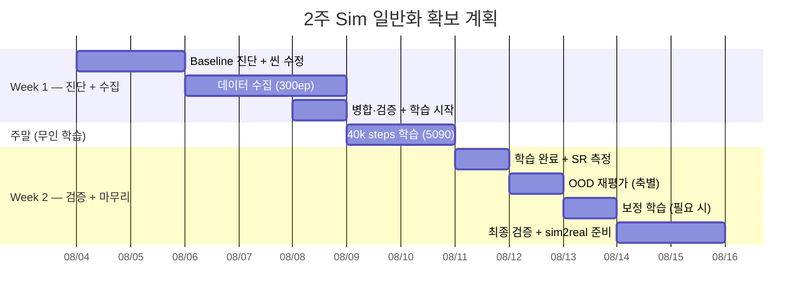

# 2주 실행 계획서 — Sim 일반화 성능 확보

> **최종 목표**: sim 학습분포 내 SR ≥ 80% **+** OOD SR ≥ 70% 달성 → sim2real 전이 준비 완료
>
> 기간: **2026-08-04(월) ~ 08-15(금)** (2주, 10 working days)
> 근거 문서: [README.md](README.md) · [분석](sim_generalization_analysis.md)

---

## 전체 로드맵



**핵심 압축 전략**: 진단과 씬 수정을 **2일로 병행** + **주말 무인 학습** 활용 → 1주 단축

---

## 📌 실제 진행 & 계획 수정 (2026-08-04)

### 계획 변경 — 색상 다양화 → **위치·박스 랜덤화**
- **원래 계획(Day3~5)**: 큐브 색상 5종 × 각 50ep = 250~300ep 수집.
- **실측 후 변경**: sim-only(v2) 모델 OOD 평가에서 **색상은 강건**(파랑 70 / 초록 90, baseline 70)으로
  색 다양성이 불필요함을 확인. 반면 **위치가 붕괴**(10~30%), 박스 90°도 부분 저하(40%).
- **→ 색 대신 "위치·박스"에 다양성을 투입**한 **100ep 집중 수집**으로 전환. (다양성을 실측된 약점 축에 집중)

### v2 OOD 프로파일 (Day1 측정)
| 축 | SR | 판정 |
|---|---|---|
| baseline(학습분포) | 70% | — |
| **위치** | 10~30% | 🔴 붕괴 |
| 색상(파랑/초록) | 70/90% | 🟢 강건 |
| 조명 | 80% | 🟢 강건 |
| 박스 45/90° | 70/40% | 🟡 부분 |

### 완료 (Day1~2 압축 실행)
- ✅ Baseline + OOD 프로파일 (위치가 유일한 심각 약점)
- ✅ 씬 개조: **물리 DR**(마찰±30%/질량±50%), **위치 전역**(반경 0.16~0.34/각 −0.7~1.25),
  **박스 위치·회전 무작위**(arc 0.28~0.34, 좌·정면·우 ±66°, yaw ±180°), 박스 0.85배 축소,
  top 카메라 고정(offset 0.03/0.02)
- ✅ **100ep 수집**(v3, 위치·박스 집중) → v2.1 변환·병합·검증 (`sim_so101_blocktask_v3`, 100ep/38,906f)
- 🔄 **v3 학습 진행 중** (N1.6 8-bit, 40k steps, color jitter) → 산출 `gr00t_blocktask_v3_n16_8bit`

### 🔀 다음 정책 — v3 학습 후 결과별 분기
학습 완료 후 **① 학습분포 내 SR** 과 **② OOD SR** 을 각각 측정해 분기한다:

| ① 학습분포 SR | ② OOD SR | 진단 | 다음 정책 |
|---|---|---|---|
| **낮음(<70%)** | 낮음 | **학습 분포조차 못 배움** — 위치/물리DR/박스로 태스크가 어려워져 **100ep·40k가 부족(언더핏)** | ⓐ 스텝↑(40k→60k+) ⓑ **데이터↑**(100→200~300ep; 다양성이 커진 만큼 ep 필요) ⓒ **과한 DR 완화**(박스 ±180°·극단 위치가 너무 어려우면 학습 가능한 범위로 축소) ⓓ 데이터 품질 점검 |
| **높음(≥80%)** | **낮음(<70%)** | **분포는 잘 배웠으나 여전히 좁음** = 학습에 없는 축의 다양성 부족 | ⓐ **축별 ablation**으로 실패 축 특정 ⓑ 그 축을 학습에 추가(물체 형상 실패→다물체 수집 / 극단 위치 실패→범위 더 확대 / DR 범위↑·ADR) ⓒ end-to-end 정체 시 **depth(RGB-D)·이중시스템(affordance)** 검토(분석 §4.5~4.6) |
| **높음** | **높음(≥70%)** | 🎉 **목표 달성** | **sim2real 전이 → co-training** (report2 파이프라인 재사용) |

> 원리(§5 진단표): **"학습분포 held-out은 되는데 OOD만 안 됨 = 다양성 부족(데이터로 해결)",
> "학습분포조차 안 됨 = 언더핏(스텝·데이터·난이도 조정)".** 위치처럼 이미 넣은 축이 학습분포에서
> 잘 되면 그 축은 해결된 것이고, 남은 OOD는 "아직 안 넣은 축"이다.

---

## Week 1 — 진단 + 데이터 수집 + 학습 시작 (08/04 월 ~ 08/08 금)

### Day 1 (08/04 월) — Baseline 진단 + 씬 수정 착수

> 진단과 씬 수정을 **같은 날** 병행. 오전에 빠르게 현 성능 파악, 오후에 DR 구현 시작.

| 시간 | 태스크 | 세부 | 산출물 |
|---|---|---|---|
| 오전 | 5090 환경 점검 | SSH, Isaac Sim, GPU 메모리 확인 | 환경 체크리스트 |
| 오전 | 학습분포 SR 재측정 | `blocktask_sim_eval.sh ... 10 eval` (10회, 빠르게) | 학습분포 SR |
| 오후 | DR-Eval 모드 평가 | 조명/텍스처 랜덤화 ON, 5회 | DR SR (OOD 감 잡기) |
| 오후 | **물리 DR 구현** | `vials_to_rack_env_cfg.py`에 마찰(±30%), 질량(±50%), 지연(10~40ms) 랜덤화 | 물리 DR 코드 |
| 오후 | **색상 랜덤화 구현** | 큐브 색 5종 에피소드마다 랜덤 선택 | 색상 DR 코드 |

> [!IMPORTANT]
> **Day 1 판단**: 학습분포 SR < 60% → 데이터/학습 근본 재검토 필요 (계획 수정).
> SR ≥ 70% → 예정대로 진행.

### Day 2 (08/05 화) — 씬 수정 완성 + 수집 파이프라인 검증

| 시간 | 태스크 | 세부 | 산출물 |
|---|---|---|---|
| 오전 | 물리 DR 완성·테스트 | 3ep 시험 수집, rerun으로 시각 확인 | 물리 DR 검증 완료 |
| 오전 | 색상 DR 테스트 | 5색 전환 확인 (rerun) | 색상 DR 검증 완료 |
| 오후 | 위치 분포 확대 | `BLOCK_REACH_*` → 도달범위 전역 격자 | 씬 config 수정 |
| 오후 | 이미지 증강 설정 | 학습 config: `color_jitter`, `random_crop` ON 확인 | 학습 설정 파일 |
| 오후 | 수집 파이프라인 리허설 | 10ep 수집 → 파일 구조·modality 확인 → 삭제 | 파이프라인 검증 |

### 데이터 수집 — **실제 실행** (08/04~08/05)

> [!NOTE]
> 원안(5색 × 50ep = 300ep)은 **폐기**. Day1 OOD 측정에서 색상이 강건함이 확인돼
> **빨강 고정 + 위치·박스·물리 다양성**에 집중하는 것으로 전환. (§📌 계획 변경 참조)

| 세션 | 수집분 | 비고 |
|---|---|---|
| `sim_so101_blocktask_v3` | **82ep** | 08/04, USB 분리로 중단 |
| `sim_so101_blocktask_v3_2` | **18ep** | 08/04, 크래시 후 재개 (→ 100ep 도달) |
| `sim_so101_blocktask_v3_3` | **31ep** | 08/05, 추가 수집(중단) |
| `sim_so101_blocktask_v3_4` | **100ep** | 08/05, 추가 수집 |
| | **합계 231ep** | |

**수집 조건(전 세션 동일)**: 빨강 큐브 · 위치 전역(반경 0.16~0.34, 각 −0.7~1.25) ·
박스 위치·회전 무작위(arc 0.28~0.34, ±66°, yaw ±π) · 물리 DR(마찰 ±30%, 질량 ±50%) ·
조명 DR · top 카메라 고정(offset 0.03/0.02) · 교정 시연 포함

**크래시 대응 실적**: Isaac Sim 크래시 2회, USB 분리 1회 발생. 저장된 ep는 매번 온전했고
`docker rm -f blocktask` → 새 폴더로 재개하는 절차로 손실 없이 복구.

### 학습용 데이터셋 2종 (병합·검증 완료)

| 데이터셋 | 구성 | 프레임 | 용도 |
|---|---|---|---|
| `sim_so101_blocktask_v3` | **100ep** (v3 82 + v3_2 18) | 38,906 | **1차 학습**(진행 중) |
| `sim_so101_blocktask_v3_200` | **200ep** (231ep에서 품질 선별) | 83,222 | 2차 학습(대기) |

**200ep 선별 규칙**: ① 길이 이상치 6개 제외(<250 또는 >700프레임) ② 시작 idle 큰 순 25개 제외
(수집 규칙 "녹화 즉시 동작 개시" 위배 정도). 결과 idle 평균 11.9 / 최대 18프레임(0.6s).
커버리지는 오히려 **넓어짐**(블록 x 폭 269→354px).

```
학습 설정 (v3 / v3_200 공통):
- base: GR00T-N1.6-3B (8-bit)
- steps: 40,000 · lr 1e-4 cosine + warmup 5%
- batch: micro 2 × accum 32 = effective 64
- augmentation: color_jitter만 (⚠️ random_crop은 미적용 — 아래 주의)
- v3: dataloader-workers 4 / v3_200: 8 (GPU util 19% 로딩 병목 대응)
```

> [!WARNING]
> **계획 대비 미적용 2건** (2026-08-05 확인, 기록용)
> 1. **`random_crop` 미적용** — 원안엔 `color_jitter + random_crop`이었으나 실제 학습 인자는
>    `--color-jitter-params`만. **단 v2도 동일**하므로 v2↔v3 비교는 공정하다.
> 2. **제어 지연(latency) DR 미구현** — 분석 §4.2가 "반드시 포함" 권고했으나, EventTerm으로
>    처리 불가(액션 파이프라인 수정 필요)해 마찰·질량 2종만 구현. sim2real 단계에서 재검토.

---

## 🔄 학습 (08/04~08/06) — v3(100ep) 40k steps

- 08/04 14:04 시작 → **약 30시간 소요** 예상(2.7s/step)
- loss 추이: 1.11 → 0.24(1.7k) → 0.021(10k) → **0.010(23k)** — 정상 수렴, v2 궤적과 유사
- 체크포인트 5k 간격 저장
- (선택) 토요일 한 번 SSH 접속하여 loss curve / GPU 상태 확인

---

## Week 2 — 검증 + 보정 + 마무리 (08/11 월 ~ 08/15 금)

### Day 6 (08/11 월) — 학습 결과 확인 + 학습분포 SR

**실행 순서 (확정)** — GPU가 1개라 평가와 학습을 동시에 못 돌리므로 아래 순서를 지킨다:

| # | 태스크 | 명령 | 소요 |
|---|---|---|---|
| 1 | v3 학습 완료 확인 | loss·체크포인트 | — |
| 2 | **v3 OOD sweep** | `~/blocktask_ood_sweep.sh gr00t_blocktask_v3_n16_8bit/checkpoint-40000 20` | ~1.5h |
| 3 | **v2 재측정** (아래 ⚠️) | `~/blocktask_ood_sweep.sh gr00t_blocktask_v2_n16_8bit/checkpoint-20000 20` | ~1.5h |
| 4 | **v3_200 학습 시작** | `~/train_gr00t_blocktask_v3_200_n16_8bit.sh` | ~30h |

> [!WARNING]
> **⚠️ v2 재측정이 필요한 이유 (공정 비교)**
> §📌의 v2 프로파일(baseline 70%, pos_ood 10~30%)은 **옛 기준으로 잰 값**이라 v3와 직접 비교하면 안 된다:
> - 그때의 "위치 OOD(반경 0.16~0.34)"는 **지금 v3의 학습 분포**다 → 같은 이름, 다른 의미
> - 그때 baseline은 **non-DR eval**로 쟀는데, v3 기준선은 **-DR-Eval**이다 (§README 5.1)
>
> → **동일한 `blocktask_ood_sweep.sh`로 v2도 다시 재야** v2 vs v3를 같은 자로 비교할 수 있다.
> 순서상 v3 sweep 직후에 이어서 돌리는 것이 효율적(씬 설정 복원 상태가 동일).

#### OOD 결과 판정

| 학습분포 SR | OOD SR (평균) | 판정 | 다음 |
|---|---|---|---|
| ≥80% | **≥70%** | **🎉 목표 달성** | sim2real 준비 (v3_200은 선택) |
| ≥80% | 60~69% | 근접 — 보정 | v3_200 학습으로 밀도 보강 |
| ≥80% | <60% | 추가 데이터 필요 | v3_200 + 취약 축 집중 수집 |
| <80% | - | 언더핏/학습 재검토 | v3_200(데이터 2배) → 그래도 낮으면 스텝↑ |

> [!NOTE]
> **v3_200 결과 해석 시 주의**: 40k 고정이면 v3는 65.8 epoch, v3_200은 30.8 epoch로 **절반 이하**다.
> v3_200 SR이 낮아도 "데이터가 많아 나빠진 것"이 아니라 **언더핏**일 수 있다.
> 진단 순서: ① 최종 loss 비교(무료) ② N=20 신뢰구간 ±11%p 확인 ③ 애매하면 epoch 정합(~86k steps).
> 상세는 `train_gr00t_blocktask_v3_200_n16_8bit.sh` 주석 참조.

### Day 8 (08/13 수) — 보정 (필요 시) 또는 추가 검증

**경로 A — 목표 달성 시**:

| 시간 | 태스크 |
|---|---|
| 오전 | 안정성 검증: 학습분포 30회 반복 → 분산·신뢰구간 산출 |
| 오후 | 최종 모델 패키징 + 모델 카드 작성 |

**경로 B — 보정 필요 시**:

| 시간 | 태스크 |
|---|---|
| 오전 | 취약 축 집중 데이터 추가 50ep 수집 |
| 오후 | 보정 학습 시작 (기존 checkpoint + 10~15k steps, ~5~7h) |
| 야간 | 보정 학습 완료 대기 |

### 최종 검증 + sim2real 준비

**서빙 스크립트는 수정 불필요** — `serve_blocktask_n16_5090.sh`가 모델 경로를 인자로 받으므로
v3 체크포인트를 그대로 넘기면 된다(`~/gr00tn16_ws/checkpoints/` 하위 경로).

```bash
# 1) 5090에서 v3 모델 서빙 (학습·sweep이 끝나 GPU가 비어 있어야 함)
ssh 5090 '~/serve_blocktask_n16_5090.sh gr00t_blocktask_v3_n16_8bit/checkpoint-40000 start'
ssh 5090 '~/serve_blocktask_n16_5090.sh "" logs'   # 'Server is ready' 대기

# 2) 로컬(로봇 연결)에서 실기 추론 — 실기 rest 홈 + 조건별 지시문
cd ~/manipulator_ws/setup/gr00t
STEP_DT=0.033 SERVER_HOST=192.168.0.56 ENSEMBLE=1 ENSEMBLE_W=0.3 TOL=1.5 \
HOME_SCRIPT=goto_home_real.py \
LANG_INSTRUCTION="Pick up the block and place it in the box" ./infer_save.sh v3_real
```

**실기 전이 시 체크리스트** (report2 §4·§5에서 확정된 설정):
- 배포 설정 `ENSEMBLE=1 ENSEMBLE_W=0.3` 고정 (§4.5 균형점)
- 시작 자세는 `goto_home_real.py`(실기 rest, elbow +89.8) — sim 홈은 OOD라 초반 지연 유발
- 실기 카메라·박스 정렬을 `real_pose_align.py`로 먼저 확인 (드리프트 시 성능 급락 선례 있음)
- 블록은 학습 분포 안(`show_safe_region.py`로 안전영역 확인)

> **주의**: v3는 sim만 학습한 모델이므로 실기에서는 **zero-shot 전이**다.
> report2 §5의 선례대로 실기 데이터 co-training이 추가로 필요할 가능성이 높다.

### Day 10 (08/15 금) — 마무리

| 시간 | 태스크 | 세부 | 산출물 |
|---|---|---|---|
| 오전 | **최종 리포트 작성** | 2주 결과 요약, v2→v3 비교, OOD 성능 지도 | `sim_generalization_report.md` |
| 오전 | README.md §10 최종 갱신 | 모든 단계 체크 | 진행 현황 완료 |
| 오후 | sim2real + co-training 계획 수립 | report2 파이프라인 기반, 데이터 구성 결정 | sim2real 실행 계획 |

---

## 위험 요소 및 대응

| 위험 | 대응 | 실제 발생 |
|---|---|---|
| **Isaac Sim 크래시** (수집 중) | 세션 분할 → 새 폴더로 재개, 저장분은 온전 | **2회 발생**. `docker rm -f blocktask`로 좀비 컨테이너 정리(VRAM 회수) 후 재개해 손실 0 |
| **USB(리더암) 분리** | 재연결 후 동일 절차로 재개 | **1회 발생**(2.5h 세션 중). 저장된 82ep 온전 |
| **5090 접속 불가** | IP·라우팅 점검 | **1회 발생** — 유선/WiFi 동일 서브넷 충돌. `ip route replace 192.168.0.56/32 dev <wifi>`로 호스트 라우트 고정 |
| **학습 실패** (OOM/crash) | 중간 checkpoint(5k 간격) 활용 | 미발생. GPU 22.7/32.6GB 안정 |
| **OOD 목표 미달** | v3_200(데이터 2배) → 취약 축 집중 보강 | 판정 대기 |
| **데이터 부족** | 목표 200ep | **231ep 확보** (초과 달성) |
| **잘못된 데이터로 학습** | 수집 후 메타·무결성 검증 필수 | **task 문자열 절단 버그 발견**(§주의). 학습 12분 시점에 발견해 재시작 |

---

## 주간 체크포인트 요약

| 주차 | 목표 | 완료 기준 |
|---|---|---|
| **Week 1** | 진단 + 300ep 수집 + 학습 시작 | 금요일 저녁 학습 job 실행 중 |
| **Week 2** | 검증 + 보정 + sim2real 준비 | SR ≥ 80% AND OOD ≥ 70%, 전이 준비 완료 |

---

## 성공 시 최종 산출물

| 산출물 | 설명 |
|---|---|
| `gr00t_blocktask_v3_n16_8bit` | 일반화 확보 GR00T N1.6 모델 |
| `sim_so101_blocktask_v3` | 다조건 300ep 데이터셋 |
| **OOD 성능 지도** | 축별(위치·조명·색·방향) SR 표 + 히트맵 |
| **sim_generalization_report.md** | v2→v3 비교, 진단, 최종 결과 |
| **sim2real 전이 계획** | co-training 데이터 구성, 실기 실험 설계 |
