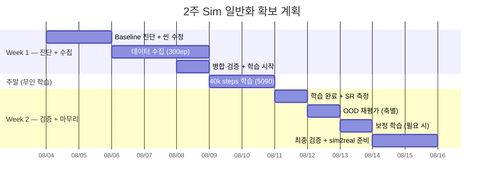

# 2주 실행 계획서 — Sim 일반화 성능 확보

> **최종 목표**: sim 학습분포 내 SR ≥ 80% **+** OOD SR ≥ 70% 달성 → sim2real 전이 준비 완료
>
> 기간: **2026-08-04(월) ~ 08-15(금)** (2주, 10 working days)
> 근거 문서: [README.md](README.md) · [분석](sim_generalization_analysis.md)

---

## 전체 로드맵



**핵심 압축 전략**: 진단과 씬 수정을 **2일로 병행** + **주말 무인 학습** 활용 → 1주 단축

---

## 📌 실제 진행 & 계획 수정 (2026-08-04)

### 계획 변경 — 색상 다양화 → **위치·박스 랜덤화**
- **원래 계획(Day3~5)**: 큐브 색상 5종 × 각 50ep = 250~300ep 수집.
- **실측 후 변경**: sim-only(v2) 모델 OOD 평가에서 **색상은 강건**(파랑 70 / 초록 90, baseline 70)으로
  색 다양성이 불필요함을 확인. 반면 **위치가 붕괴**(10~30%), 박스 90°도 부분 저하(40%).
- **→ 색 대신 "위치·박스"에 다양성을 투입**한 **100ep 집중 수집**으로 전환. (다양성을 실측된 약점 축에 집중)

### v2 OOD 프로파일 (Day1 측정)
| 축 | SR | 판정 |
|---|---|---|
| baseline(학습분포) | 70% | — |
| **위치** | 10~30% | 🔴 붕괴 |
| 색상(파랑/초록) | 70/90% | 🟢 강건 |
| 조명 | 80% | 🟢 강건 |
| 박스 45/90° | 70/40% | 🟡 부분 |

### 완료 (Day1~2 압축 실행)
- ✅ Baseline + OOD 프로파일 (위치가 유일한 심각 약점)
- ✅ 씬 개조: **물리 DR**(마찰±30%/질량±50%), **위치 전역**(반경 0.16~0.34/각 −0.7~1.25),
  **박스 위치·회전 무작위**(arc 0.28~0.34, 좌·정면·우 ±66°, yaw ±180°), 박스 0.85배 축소,
  top 카메라 고정(offset 0.03/0.02)
- ✅ **100ep 수집**(v3, 위치·박스 집중) → v2.1 변환·병합·검증 (`sim_so101_blocktask_v3`, 100ep/38,906f)
- 🔄 **v3 학습 진행 중** (N1.6 8-bit, 40k steps, color jitter) → 산출 `gr00t_blocktask_v3_n16_8bit`

### 🔀 다음 정책 — v3 학습 후 결과별 분기
학습 완료 후 **① 학습분포 내 SR** 과 **② OOD SR** 을 각각 측정해 분기한다:

| ① 학습분포 SR | ② OOD SR | 진단 | 다음 정책 |
|---|---|---|---|
| **낮음(<70%)** | 낮음 | **학습 분포조차 못 배움** — 위치/물리DR/박스로 태스크가 어려워져 **100ep·40k가 부족(언더핏)** | ⓐ 스텝↑(40k→60k+) ⓑ **데이터↑**(100→200~300ep; 다양성이 커진 만큼 ep 필요) ⓒ **과한 DR 완화**(박스 ±180°·극단 위치가 너무 어려우면 학습 가능한 범위로 축소) ⓓ 데이터 품질 점검 |
| **높음(≥80%)** | **낮음(<70%)** | **분포는 잘 배웠으나 여전히 좁음** = 학습에 없는 축의 다양성 부족 | ⓐ **축별 ablation**으로 실패 축 특정 ⓑ 그 축을 학습에 추가(물체 형상 실패→다물체 수집 / 극단 위치 실패→범위 더 확대 / DR 범위↑·ADR) ⓒ end-to-end 정체 시 **depth(RGB-D)·이중시스템(affordance)** 검토(분석 §4.5~4.6) |
| **높음** | **높음(≥70%)** | 🎉 **목표 달성** | **sim2real 전이 → co-training** (report2 파이프라인 재사용) |

> 원리(§5 진단표): **"학습분포 held-out은 되는데 OOD만 안 됨 = 다양성 부족(데이터로 해결)",
> "학습분포조차 안 됨 = 언더핏(스텝·데이터·난이도 조정)".** 위치처럼 이미 넣은 축이 학습분포에서
> 잘 되면 그 축은 해결된 것이고, 남은 OOD는 "아직 안 넣은 축"이다.

---

## Week 1 — 진단 + 데이터 수집 + 학습 시작 (08/04 월 ~ 08/08 금)

### Day 1 (08/04 월) — Baseline 진단 + 씬 수정 착수

> 진단과 씬 수정을 **같은 날** 병행. 오전에 빠르게 현 성능 파악, 오후에 DR 구현 시작.

| 시간 | 태스크 | 세부 | 산출물 |
|---|---|---|---|
| 오전 | 5090 환경 점검 | SSH, Isaac Sim, GPU 메모리 확인 | 환경 체크리스트 |
| 오전 | 학습분포 SR 재측정 | `blocktask_sim_eval.sh ... 10 eval` (10회, 빠르게) | 학습분포 SR |
| 오후 | DR-Eval 모드 평가 | 조명/텍스처 랜덤화 ON, 5회 | DR SR (OOD 감 잡기) |
| 오후 | **물리 DR 구현** | `vials_to_rack_env_cfg.py`에 마찰(±30%), 질량(±50%), 지연(10~40ms) 랜덤화 | 물리 DR 코드 |
| 오후 | **색상 랜덤화 구현** | 큐브 색 5종 에피소드마다 랜덤 선택 | 색상 DR 코드 |

> [!IMPORTANT]
> **Day 1 판단**: 학습분포 SR < 60% → 데이터/학습 근본 재검토 필요 (계획 수정).
> SR ≥ 70% → 예정대로 진행.

### Day 2 (08/05 화) — 씬 수정 완성 + 수집 파이프라인 검증

| 시간 | 태스크 | 세부 | 산출물 |
|---|---|---|---|
| 오전 | 물리 DR 완성·테스트 | 3ep 시험 수집, rerun으로 시각 확인 | 물리 DR 검증 완료 |
| 오전 | 색상 DR 테스트 | 5색 전환 확인 (rerun) | 색상 DR 검증 완료 |
| 오후 | 위치 분포 확대 | `BLOCK_REACH_*` → 도달범위 전역 격자 | 씬 config 수정 |
| 오후 | 이미지 증강 설정 | 학습 config: `color_jitter`, `random_crop` ON 확인 | 학습 설정 파일 |
| 오후 | 수집 파이프라인 리허설 | 10ep 수집 → 파일 구조·modality 확인 → 삭제 | 파이프라인 검증 |

### Day 3~5 (08/06 수 ~ 08/08 금) — 데이터 수집 (3일, 300ep)

> [!WARNING]
> **Isaac Sim 크래시 대비**: 25ep마다 백업, 세션별 별도 폴더(`_v3_s1`~`_v3_s6`)

#### 수집 명세

| 세션 | 일정 | 조건 | 목표 ep |
|---|---|---|---|
| **S1** | Day 3 오전 | 빨강 큐브, 위치 전역, 물리 DR ON | **50ep** |
| **S2** | Day 3 오후 | 파랑 큐브, 위치 전역, 물리 DR ON | **50ep** |
| **S3** | Day 4 오전 | 초록 큐브, 위치 전역, 물리 DR ON | **50ep** |
| **S4** | Day 4 오후 | 노랑 큐브, 위치 전역, 물리 DR ON | **50ep** |
| **S5** | Day 5 오전 | 흰색 큐브, 위치 전역, 물리 DR ON | **50ep** |
| **S6** | Day 5 오후 전반 | **교정(recovery) 시연** — 색상 랜덤, 의도적 빗나감 | **50ep** |
| | | **합계** | **300ep** |

#### 일과 템플릿 (Day 3~5 매일)

| 시간 | 태스크 |
|---|---|
| 09:00 | Isaac Sim 기동, rerun 확인 |
| 09:30~12:00 | **오전 세션: 50ep teleop** (~2.5h) |
| 12:00 | 중간 세이브 + 무결성 확인 |
| 13:00~15:30 | **오후 세션: 50ep teleop** |
| 15:30~16:00 | 세션 데이터 확인 (파일 수, 프레임 수) |
| 16:00~17:00 | 크래시 복구 여유 / 부족분 보충 |

### Day 5 오후 후반 (08/08 금) — 병합 + 학습 시작 🔴

| 시간 | 태스크 | 세부 | 산출물 |
|---|---|---|---|
| 15:30 | 6세션 데이터 병합 | `merge_blocktask_v2.py` 확장 → v3 병합 | `sim_so101_blocktask_v3` (300ep) |
| 16:00 | 데이터 검증 | 에피소드 재번호, 프레임, modality, stats 확인 | 검증 로그 |
| 16:30 | **재학습 시작** | 5090에서 40k steps 시작 (주말 무인 학습) | 학습 job 실행 |

```
학습 설정 (v3):
- base: GR00T-N1.6-3B (8-bit)
- data: sim_so101_blocktask_v3 (300ep, ~90k frames)
- steps: 40,000
- lr: 1e-4, cosine decay, warmup 5%
- batch: micro 2 × accum 32 = effective 64
- augmentation: color_jitter=True, random_crop=True
- 예상: ~20시간 → 토요일 오후~일요일 아침 완료
```

#### Week 1 체크포인트

| 항목 | 완료 기준 |
|---|---|
| ✅ Baseline SR 파악 | 학습분포 + DR-Eval SR 기록 |
| ✅ 물리/색상 DR 구현 | 3종 물리 + 5색 랜덤 동작 확인 |
| ✅ 데이터 수집 | **≥ 250ep** (300 목표) |
| ✅ 학습 시작 | **금요일 오후** 5090에서 40k steps 돌리는 중 |

---

## 🔄 주말 (08/09~10) — 무인 학습

5090에서 40k steps 학습 진행. **별도 작업 불필요**.
- 예상 완료: **일요일 아침 (~20시간)**
- (선택) 토요일 한 번 SSH 접속하여 loss curve / GPU 상태 확인

---

## Week 2 — 검증 + 보정 + 마무리 (08/11 월 ~ 08/15 금)

### Day 6 (08/11 월) — 학습 결과 확인 + 학습분포 SR

| 시간 | 태스크 | 세부 | 산출물 |
|---|---|---|---|
| 오전 | 학습 완료 확인 | loss curve, 체크포인트 저장 확인 | loss 그래프, checkpoint |
| 오전 | **v3 학습분포 SR** | 20회 eval (학습 조건과 동일) | 학습분포 SR |
| 오후 | held-out SR | 같은 분포, 학습에 없던 위치 10회 | held-out SR |
| 오후 | 위치 OOD proxy 스크리닝 | 3×3 격자 × 5회 = 45회 (proxy) | 위치 히트맵 |

> [!IMPORTANT]
> **분기 판단**:
> - v3 학습분포 SR ≥ 80% → Day 7 OOD 전체 평가
> - v3 학습분포 SR 60~79% → Day 7에 50k까지 추가 학습 (10k steps, ~5h)
> - v3 학습분포 SR < 60% → 학습 설정 재검토 (lr/steps/데이터 점검)

### Day 7 (08/12 화) — OOD 전체 평가

| 시간 | 태스크 | 세부 | 산출물 |
|---|---|---|---|
| 오전 | 위치 약한 칸 전체 PnP | proxy에서 약한 3칸 × 5회 = 15회 | 위치 OOD SR |
| 오전 | DR-Eval 모드 | 조명/텍스처 랜덤화 10회 | DR SR |
| 오후 | 색상 OOD | 학습 5색 외 **새 2색**(보라/주황) × 5회 = 10회 | 미학습 색 SR |
| 오후 | 박스 방향 | 0°/45°/90° × 5회 = 15회 | 방향 SR |

#### OOD 결과 판정

| 학습분포 SR | OOD SR (평균) | 판정 | 다음 |
|---|---|---|---|
| ≥80% | **≥70%** | **🎉 목표 달성** | Day 9~10 sim2real 준비 |
| ≥80% | 60~69% | 근접 — 보정 | Day 8 보정 학습 |
| ≥80% | <60% | 추가 데이터 필요 | Day 8 집중 보강 |
| <80% | - | 학습 재검토 | Day 8 학습 설정 변경 |

### Day 8 (08/13 수) — 보정 (필요 시) 또는 추가 검증

**경로 A — 목표 달성 시**:

| 시간 | 태스크 |
|---|---|
| 오전 | 안정성 검증: 학습분포 30회 반복 → 분산·신뢰구간 산출 |
| 오후 | 최종 모델 패키징 + 모델 카드 작성 |

**경로 B — 보정 필요 시**:

| 시간 | 태스크 |
|---|---|
| 오전 | 취약 축 집중 데이터 추가 50ep 수집 |
| 오후 | 보정 학습 시작 (기존 checkpoint + 10~15k steps, ~5~7h) |
| 야간 | 보정 학습 완료 대기 |

### Day 9 (08/14 목) — 최종 검증 + sim2real 준비

| 시간 | 태스크 | 세부 | 산출물 |
|---|---|---|---|
| 오전 (A) | 최종 모델 확정 | 최적 checkpoint 선택 | `gr00t_blocktask_v3_n16_8bit` |
| 오전 (B) | 보정 모델 SR 측정 | 학습분포 10회 + OOD 20회 | 보정 후 SR |
| 오후 | sim2real 전이 준비 | 5090 서빙 스크립트 갱신, 실기 설정 확인 | 서빙 스크립트 업데이트 |
| 오후 | 실기 zero-shot 1회 시도 | v3 모델 서빙 → 실기 1회 | 첫 전이 결과 |

### Day 10 (08/15 금) — 마무리

| 시간 | 태스크 | 세부 | 산출물 |
|---|---|---|---|
| 오전 | **최종 리포트 작성** | 2주 결과 요약, v2→v3 비교, OOD 성능 지도 | `sim_generalization_report.md` |
| 오전 | README.md §10 최종 갱신 | 모든 단계 체크 | 진행 현황 완료 |
| 오후 | sim2real + co-training 계획 수립 | report2 파이프라인 기반, 데이터 구성 결정 | sim2real 실행 계획 |

---

## 위험 요소 및 대응

| 위험 | 대응 |
|---|---|
| **Isaac Sim 크래시** (수집 중) | 25ep마다 백업, 세션 분할, 매일 1h 여유 |
| **5090 접속 불가** | Day 1에 점검, IP 고정, 대안 환경 탐색 |
| **주말 학습 실패** (OOM/crash) | 월요일 아침 즉시 재시작, 30k 중간 checkpoint 활용 |
| **OOD 목표 미달** | Day 8 보정 경로 B 활용 (추가 50ep + 10k steps) |
| **데이터 300ep 미달** | 최소 250ep 확보 목표, 교정 시연으로 압축 |

---

## 주간 체크포인트 요약

| 주차 | 목표 | 완료 기준 |
|---|---|---|
| **Week 1** | 진단 + 300ep 수집 + 학습 시작 | 금요일 저녁 학습 job 실행 중 |
| **Week 2** | 검증 + 보정 + sim2real 준비 | SR ≥ 80% AND OOD ≥ 70%, 전이 준비 완료 |

---

## 성공 시 최종 산출물

| 산출물 | 설명 |
|---|---|
| `gr00t_blocktask_v3_n16_8bit` | 일반화 확보 GR00T N1.6 모델 |
| `sim_so101_blocktask_v3` | 다조건 300ep 데이터셋 |
| **OOD 성능 지도** | 축별(위치·조명·색·방향) SR 표 + 히트맵 |
| **sim_generalization_report.md** | v2→v3 비교, 진단, 최종 결과 |
| **sim2real 전이 계획** | co-training 데이터 구성, 실기 실험 설계 |
