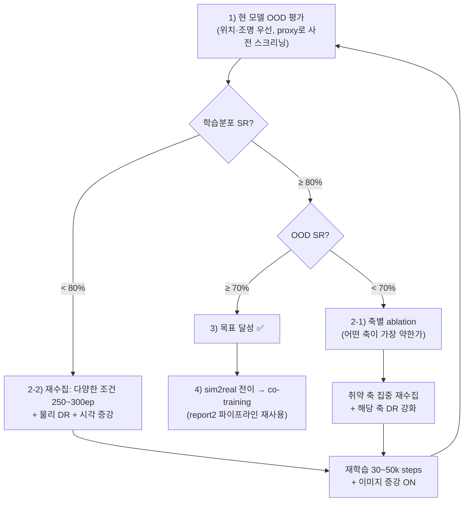

# Simulator 일반화 성능 확보 — GR00T N1.6 (sim-only)

> **한 줄 목표**: 실기 전이 전에, **시뮬레이터 안에서** pick-and-place의 **높은 성공률**과
> **일반화 성능**을 모두 갖춘 GR00T N1.6 모델을 확보한다.

작성: 2026-08-04 · 상위 진행: [../sim2real/08_T1_sim2real/report2.md](../sim2real/08_T1_sim2real/report2.md)
· **선행연구·개선 분석: [sim_generalization_analysis.md](sim_generalization_analysis.md)** (이 계획은 그 분석을 반영해 갱신됨)

---

## 1. 배경 & 동기

- 지금까지 GR00T N1.6 VLA로 **sim→real 파이프라인을 완성·검증**했다 (실기 co-training까지, [report2](../sim2real/08_T1_sim2real/report2.md)).
- 그러나 **sim dataset으로 학습한 모델은 "간단한 추론에서 pick&place SR ~80%"만 확인**했고,
  **다양한 환경에서의 일반화 성능은 확인하지 못했다.**
- 일반화를 **실기로 전이한 뒤** 확인하는 것은 **비효율적**이다 — 실기는 리셋·정렬·카메라/팔 드리프트·
  위치 커버리지 제약 등 교란이 크고 시행 비용이 높다 (실기에서 실제로 겪음).
- 따라서 **시뮬레이터에서 먼저** 성공률·일반화를 끌어올린다. sim은 조건을 프로그램으로 바꿔가며
  **싸고·재현 가능하게·ground-truth 판정**으로 대량 평가할 수 있다.
- 이 방향은 최신 연구(π₀.5, Sim2Real-VLA)와 동일하며, 핵심 결론은 **"데이터 다양성 > 양"** 과
  **"시각 DR만으로는 부족 — 물리 DR 필요"** 이다 ([분석](sim_generalization_analysis.md) §2·§4).

## 2. 목표 (합격 기준)

1. **높은 성공률** — 학습 분포 내 pick&place **SR ≥ 80%** (현재 80% → 안정 확보/향상).
2. **일반화 성능** — 학습 분포 밖(OOD) 조건에서 **SR ≥ 70%**.
3. 위 둘을 **모두** 만족한 뒤에야 **sim2real + co-training**으로 넘어간다.

## 3. 작업 흐름 (의사결정 — 분석 반영본)



### 단계별 정의

- **1. 추론 재실행 & 일반화 확인** — sim-only 모델(`gr00t_blocktask_v2_n16_8bit`)로 sim closed-loop
  평가. **학습 분포 내 SR**과 **OOD 조건 SR**을 각각 측정. 비용 절감을 위해 **proxy task로 사전 스크리닝**(§4).
- **2-1. 추론 O / 일반화 X → 원인 진단 + 축별 ablation.** "VLM 과적합"인지 "데이터 다양성 부족"인지는
  **§5 기준**으로 가른다. (결론: 광범위 사전학습 백본 특성상 순수 암기 과적합은 드물고, 대개 **파인튜닝이
  좁은 sim 분포에 특화**된 것 → 해법은 **더 다양한 데이터 + 물리/시각 DR**.) 그 뒤 **가장 약한 축을 찾아**
  거기 집중 재수집.
- **2-2. 추론 X / 일반화 X → 재수집·재학습.** 학습 자체가 부실 → 데이터셋 수집 계획부터 다시.
- **3. 추론 O / 일반화 O → 목표 달성.**
- **4. sim2real + co-training** — 3 달성 시, 실기 전이 후 [report2](../sim2real/08_T1_sim2real/report2.md)에서
  검증한 방식(zero-shot 전이 → 실기 데이터 co-training)을 그대로 적용.

## 4. 일반화 평가 — OOD 축 · 우선순위 · 효율화

각 조건 N회, 위치 무작위, 배포 설정 고정(유일 변수를 '조건'으로). 씬 편집 지점은
[deploy.md §8](../sim2real/08_T1_sim2real/assets/deploy.md)(`vials_to_rack_env_cfg.py`).

**우선순위 (영향 큰 순 — [분석](sim_generalization_analysis.md) §4.4):**

| 순위 | OOD 축 | 이유 | sim 편집 지점 |
|---|---|---|---|
| **1** | **위치(공간 커버리지)** | 가장 직접적. 실기 실패의 주 원인이었음 | `reset_block_position` / `BLOCK_REACH_*` |
| **2** | **조명/카메라** | VLA 비전 백본 최대 교란, sim-real gap 핵심 | `-DR-Eval` 태스크(이미 존재) |
| 3 | 큐브 색상 | 백본이 사전학습에서 다양한 색 경험 → 의외로 쉬울 수 있음 | `block_red...diffuse_color` |
| 4 | 박스 방향(45/90°) | 놓기 정밀도 | `basket_black.init_state.rot` |
| 5 | 물체 종류 | 형상 일반화가 가장 어려움 → **별도 단계로 분리** | `block_base`(Cuboid→USD) |

→ **1·2를 먼저 공략** (이 둘만 해결해도 gap 대부분 감소).

**효율화 — Proxy task 사전 스크리닝** ([분석](sim_generalization_analysis.md) §4.3): 전체 pick&place(~60s/ep)
대신 **접근→그리퍼 닫기만(5~10s/trial)** 으로 축별 "접근 성공률"을 1/6 비용에 빠르게 스크리닝 → 취약 축 파악
후 전체 평가는 그 축에 집중.

> 언어 지시문은 학습(`"Pick up the block..."`)과 **동일 고정** — 색/물체 실험은 *시각 일반화*를 깨끗이 본다.

## 5. 진단 기준 — "과적합" vs "데이터 다양성 부족" (2-1)

추론은 되는데 일반화가 안 될 때, **같은 분포에서 뽑은 held-out 에피소드**로 원인을 가른다:

| 학습분포 내 SR | held-out(같은분포) SR | OOD SR | 해석 | 조치 |
|---|---|---|---|---|
| 높음 | **높음** | 낮음 | 분포는 잘 배웠으나 **학습 분포가 좁음**(좁은분포 과적합) | **다양성↑ + DR** 재학습 (2-1) |
| 높음 | **낮음** | 낮음 | 학습셋 암기(진짜 과적합) 또는 규모/설정 부실 | 정규화·데이터규모·학습설정 재검토 |
| 낮음 | 낮음 | 낮음 | 학습 자체 실패 | **재수집·재학습** (2-2) |

- GR00T처럼 **광범위 사전학습 VLM**은 순수 암기 과적합이 드물다 → 대부분 **첫 행(다양성 부족)**.
  정답은 **"더 다양한 sim dataset(색·위치·물체·조명 폭 확대) + 도메인 랜덤화"**.
- 선례: 실기 50ep는 **블록 위치 커버리지가 좁아**(깊이 한 띠) 그 밖 위치에서 실패 — 데이터 커버리지가
  일반화를 좌우함을 이미 확인. sim에선 **위치 격자 스윕**으로 정량화한다.

## 6. 데이터 · DR 전략 (핵심 — [분석](sim_generalization_analysis.md) §4.1·§4.2)

### 6.1 데이터: 다양성 > 양 🔴
현재 v2 100ep은 **한 조건**(고정 색·조명, 좁은 위치)에서 수집됨 → 일반화 부족의 유력 원인.
재수집 시:
```
[현재]  100ep × 1조건
[제안]  250~300ep × 다양한 조건
        · 색상 5종 × 각 50ep (환경-물체 쌍당 ~50ep 기준선)
        · 위치 격자 전역 커버리지
        · 조명/텍스처 DR 적용 상태에서 수집
        · 교정(recovery) 시연 30% 유지
```

### 6.2 물리 DR 추가 🔴 (현재 계획에 빠져 있던 부분)
파지 실패의 주 원인은 **접촉 역학** — 시각 DR만으로는 부족:

| 물리 DR | 파라미터 | 효과 |
|---|---|---|
| 마찰 계수 | 큐브·바닥·그리퍼 패드 ±30% | 파지 안정성 |
| 큐브 질량 | ±50% | 들어올리기 역학 |
| **제어 지연** | action latency 10~40ms 랜덤 | 실기 지터 내성 (report2 §4.2 앵커지연 선례 → **반드시 포함**) |
| 그리퍼 힘 | 서보 torque ±20% | 서보 편차 흡수 |

## 7. 학습 설정 개선 ([분석](sim_generalization_analysis.md) §4.5)

| 항목 | 현재 | 제안 |
|---|---|---|
| steps | 20k | **30~50k** (데이터 늘리면 비례) |
| 이미지 증강 | 미확인 | **color jitter + random crop + gaussian noise** ON |
| LR 스케줄 | 기본 | cosine decay + warmup 확인 |
| modality | RGB 2ch | **depth 채널(RGB-D)** 추가 검토 (SpatialVLA: 공간 정밀도↑) |

## 8. 장기 대안 (선택 — 한계 도달 시)
end-to-end VLA가 한계에 부딪히면 **Sim2Real-VLA식 이중 시스템**(affordance 플래너 + 저수준 액터)
검토. 시각 노이즈 불변·전이 용이하나 복잡도↑. **현 계획을 먼저 실행해 한계가 드러난 뒤** 검토
([분석](sim_generalization_analysis.md) §4.6).

## 9. 도구 · 모델 · 참조

- **평가 모델**: `gr00t_blocktask_v2_n16_8bit/checkpoint-20000` (sim-only, 현재 sim SR 80%). 5090 보관.
- **sim closed-loop 평가**: `setup/sim/t1_task/blocktask_sim_eval.sh <MODEL> <N> [eval|dr]`
  (성공률 자동 집계). `-DR`은 조명·외형 랜덤화.
- **데이터 수집 환경 재현**: [deploy.md](../sim2real/08_T1_sim2real/assets/deploy.md).
- **선행연구·개선 분석**: [sim_generalization_analysis.md](sim_generalization_analysis.md).
- **sim2real 계획(모델 비교)**: [../../model_md/sim2real/05_SimToReal.md](../../model_md/sim2real/05_SimToReal.md).
- **실기 파이프라인 선례(co-training)**: [../sim2real/08_T1_sim2real/report2.md](../sim2real/08_T1_sim2real/report2.md).

## 10. 진행 현황

### Step 1 측정 결과 — v2(sim-only) OOD 전체 프로파일 (2026-08-04)

| 축 | 조건 | SR | 판정 |
|---|---|---|---|
| (기준) | Baseline (red, 학습위치, 고정조명) | **70%** (7/10) | 학습 분포 |
| **위치** | 스폰범위 확대 (0.16–0.34, 각 −0.7~1.3) | **10~30%** | 🔴 **붕괴** |
| 조명/외형 | DR (light·texture·camera) | 80% | 🟢 강건 (수집을 `-DR`로 함) |
| 색상 | 파랑 | 70% | 🟢 강건 |
| 색상 | 초록 | 90% | 🟢 강건 |
| 박스방향 | 45° 회전 | 70% | 🟢 강건 |
| 박스방향 | 90° 회전 | 40% | 🟡 부분 저하 |

- **결론: 심각한 약점은 "위치" 하나.** 색상·조명은 강건(분석 §4.4 예측 적중 — VLM 백본이 색 일반화),
  박스는 45°까진 OK·90°만 부분 저하. → §5 진단표 **첫 행(학습 분포가 좁음 = 위치 커버리지 부족)** 확정.
- 위치가 어긋나면 **grasp(2/10)부터** 무너짐 → **위치 다양성이 재수집 최우선.**
- **데이터 수집 설계 확정**: **색 다양성 불필요**(강건) → 계획서의 5색 300ep 대신,
  **빨강 큐브 + 위치 전역 커버리지 + 물리 DR로 100ep 우선**. 박스 90°는 2차(소량 회전 variety 선택).
- 시행별 영상(로컬, gitignore): `inf_video/01_sim_inf/{eval_baseline, eval_posood, ood_color_blue, ood_color_green, ood_box_45, ood_box_90}/`.

### 단계 체크리스트

| 단계 | 상태 | 비고 |
|---|---|---|
| 1. sim-only OOD 평가(위치·조명) | ✅ 완료 | 위치 OOD 붕괴 확인 |
| 1b. 색상 OOD 공짜 측정(현 v2, 씬만 변경) | ⬜ | 색 다양성 필요 여부 판단 |
| 2. 물리 DR + 위치 전역 + (필요시 색상) DR 구현 | 🔄 진행 | Day 1 오후~Day 2 |
| 데이터 재수집 (**위치 집중 100ep 먼저** → 필요시 확장) | ⬜ | §6 (계획 수정: 300→100 우선) |
| 재학습(30~50k + 이미지 증강) | ⬜ | §7 |
| 3. 추론·일반화 모두 확보(SR≥80% / OOD≥70%) | ⬜ | 목표 |
| 4. sim2real + co-training | ⬜ | 3 달성 후 |
