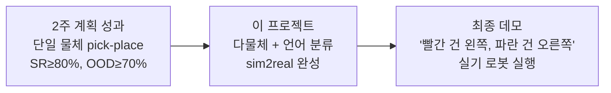
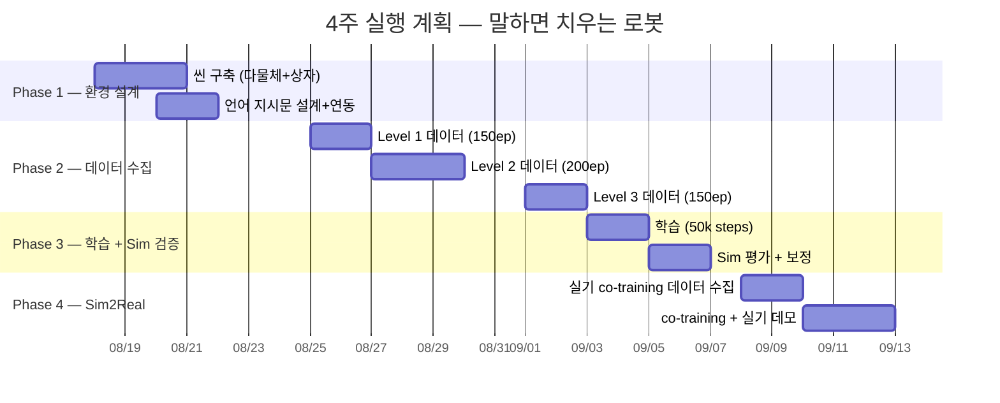

# 🧹 "말하면 치우는 로봇" — Language-Guided Tabletop Cleanup

> **한 줄 목표**: 자연어 지시(`"빨간 건 왼쪽, 파란 건 오른쪽"`)에 따라 테이블 위 다양한 물체를
> **속성별로 분류·정리**하는 SO-101 로봇을 sim2real 파이프라인으로 구현한다.
>
> **전제 조건**: [2week_plan](2week_plan.md) 완료
> (sim SR ≥ 80%, OOD SR ≥ 70% 달성)
>
> 기간: **2026-08-18(월) ~ 09-12(금)** (4주)

---

## 1. 프로젝트 개요

### 1.1 왜 이 프로젝트인가?

2주 계획에서 확보한 **단일 물체 pick-and-place 일반화**를 **다물체 + 언어 조건부 분류**로 확장한다.
이것이 GR00T N1.6 VLA의 핵심 강점(비전-언어-행동 통합)을 가장 직접적으로 보여주는 데모다.



### 1.2 데모 시나리오 (최종 목표 영상)

```
[테이블 위 초기 상태]
  🔴 빨간 큐브    🔵 파란 원통    🟡 노란 큐브
        🟢 초록 원통    🔴 빨간 원통

[사람이 말한다]
  "빨간 물체는 왼쪽 상자에, 파란 물체는 오른쪽 상자에 넣어줘"

[로봇 동작 — 순차 실행]
  1. 빨간 큐브 → 왼쪽 상자에 놓기
  2. 파란 원통 → 오른쪽 상자에 놓기
  3. 빨간 원통 → 왼쪽 상자에 놓기
  (나머지 물체는 무시)

[완료 상태]
  왼쪽 상자: 🔴🔴    오른쪽 상자: 🔵
  테이블 잔류: 🟡 🟢 (지시하지 않은 물체)
```

### 1.3 핵심 도전 과제

| 도전 | 2주 계획과의 차이 | 해결 방향 |
|---|---|---|
| **다물체 인식** | 단일 물체 → 3~5개 동시 | 씬에 다물체 배치, 타겟 선택 학습 |
| **언어 그라운딩** | 고정 지시문 → 가변 지시문 | 다양한 언어 지시 템플릿으로 학습 |
| **순차 실행** | 1회 pick-place → N회 반복 | 에피소드당 다회 pick-place 시연 |
| **영역 분류** | 고정 목표 위치 → 조건부 목표 | 왼쪽/오른쪽 상자를 언어로 구분 |
| **선택적 무시** | 전부 집기 → 해당 물체만 집기 | "빨간 것만" → 다른 색 무시 학습 |

---

## 2. 단계별 난이도 구성 (Curriculum)

> [!TIP]
> 처음부터 5물체+복잡한 지시를 하면 실패 확률이 높다. **단계적으로 복잡도를 올린다.**

### Level 1 — 색상 기반 단일 분류 (기본)
```
씬: 물체 2개 (빨강 1 + 파랑 1) + 상자 2개 (왼쪽/오른쪽)
지시: "Pick up the red object and place it in the left box"
동작: 1회 pick-place
```
→ 2주 계획의 직접 확장. **가장 먼저 성공시킬 것.**

### Level 2 — 색상 기반 순차 분류
```
씬: 물체 3개 (빨강 2 + 파랑 1) + 상자 2개
지시: "Put red objects in the left box, blue objects in the right box"
동작: 3회 순차 pick-place
```
→ 순차 실행 + 다물체 타겟 선택 도입.

### Level 3 — 다색상 + 선택적 무시
```
씬: 물체 5개 (빨강 2 + 파랑 1 + 노랑 1 + 초록 1) + 상자 2개
지시: "Put red objects in the left box, blue objects in the right box"
동작: 빨강 2 + 파랑 1 = 3회 pick-place, 노랑·초록은 무시
```
→ **최종 데모 수준.** 무관한 물체를 건드리지 않는 것이 핵심.

### Level 4 (도전) — 형상 기반 분류
```
지시: "Put cubes in the left box, cylinders in the right box"
```
→ 색이 아닌 **형상(shape)** 기준 분류. 언어 그라운딩의 깊은 수준.

---

## 3. 시뮬레이션 환경 설계

### 3.1 씬 구성

```
┌─────────────────────────────────────┐
│              테이블                   │
│                                      │
│   📦 왼쪽 상자        📦 오른쪽 상자  │
│   (LEFT_BOX)          (RIGHT_BOX)    │
│                                      │
│      🔴    🔵                        │
│          🟡    🟢    🔴              │
│   (물체 3~5개, 위치 랜덤)             │
│                                      │
│              🤖 SO-101               │
└─────────────────────────────────────┘
```

### 3.2 씬 파라미터

| 요소 | 파라미터 | DR 범위 |
|---|---|---|
| **물체 수** | 2~5개 | 에피소드마다 랜덤 |
| **물체 색** | 빨강/파랑/초록/노랑/흰색 | 색 조합 랜덤 |
| **물체 형상** | 큐브(3cm) / 원통(2.5×4cm) | Level 1~3: 큐브만, Level 4: 혼합 |
| **물체 위치** | 도달범위 내 격자 | 전역 랜덤 (겹침 방지) |
| **상자 위치** | 좌/우 고정 영역 | ±3cm 지터 |
| **조명** | 시각 DR | 밝기/방향 ±30% |
| **물리 DR** | 마찰/질량/지연 | 2주 계획에서 구현한 것 재사용 |

### 3.3 언어 지시문 템플릿

```python
# 색상 기반 분류 (Level 1~3)
TEMPLATES_COLOR = [
    "Pick up the {color} object and place it in the {side} box",
    "Put the {color} one in the {side} box",
    "Move the {color} block to the {side} box",
    "Place {color} objects in the {side} box",
    "Sort the {color} items to the {side}",
]

# 형상 기반 분류 (Level 4)
TEMPLATES_SHAPE = [
    "Put all cubes in the {side} box",
    "Move the cylinders to the {side} box",
    "Sort cubes to the left, cylinders to the right",
]

# 복합 지시 (Level 3)
TEMPLATES_MULTI = [
    "Put red objects in the left box and blue objects in the right box",
    "Sort by color: red goes left, blue goes right",
    "Red to the left, blue to the right",
]
```

> [!IMPORTANT]
> GR00T N1.6의 언어 인코더가 **문장 수준의 의미 차이**를 구분할 수 있는지가 핵심 가정.
> Level 1에서 먼저 검증한다. 실패 시 → 지시문을 **고정 템플릿 3종**으로 제한.

---

## 4. 4주 실행 계획

### 전체 타임라인



---

### Phase 1 — 시뮬레이션 환경 설계 (08/18 월 ~ 08/22 금, 5일)

#### Week 3 Day 1~3 (08/18~20) — 씬 구축

| 일 | 태스크 | 세부 | 산출물 |
|---|---|---|---|
| Day 1 | 다물체 씬 기본 구축 | 기존 blocktask 씬에 **상자 2개 + 물체 3~5개** 추가. 물체 스폰 위치 랜덤화 로직 | `cleanup_env_cfg.py` |
| Day 2 | 물체 에셋 준비 | 큐브 5색 + 원통 5색 USD 에셋. 색상 material 랜덤 할당 | `assets/cleanup/` |
| Day 3 | 성공 판정 로직 | "타겟 색 물체가 올바른 상자 안에 있는가?" 자동 판정. 다회 pick-place 지원 | `cleanup_success_checker.py` |

#### Week 3 Day 4~5 (08/21~22) — 언어 연동 + 수집 파이프라인

| 일 | 태스크 | 세부 | 산출물 |
|---|---|---|---|
| Day 4 | 언어 지시문 시스템 | 에피소드 시작 시 **색/방향 조합에 따라 지시문 자동 생성**. 지시문이 데이터에 메타데이터로 기록되도록 파이프라인 수정 | `instruction_generator.py` |
| Day 5 | Teleop 수집 리허설 | Level 1 (물체 2개) 씬에서 10ep 시험 수집. 순차 pick-place 녹화 흐름 확인 | 리허설 완료 |

---

### Phase 2 — 데이터 수집 (08/25 월 ~ 09/03 수, 8일)

#### 수집 전략: Curriculum 순서

> [!WARNING]
> **순차 pick-place의 수집 특성**: 1 에피소드 = 2~3회 pick-place = 기존보다 **2~3배 긴 ep**.
> ep당 ~20~30초(Level 1) ~ ~60초(Level 3). 하루 수집량 조절 필요.

| Level | 일정 | 씬 구성 | 지시문 예 | 목표 ep | 일수 |
|---|---|---|---|---|---|
| **L1** | 08/25~26 | 물체 2, 상자 2 | `"Put the red in the left box"` | **150ep** | 2일 |
| **L2** | 08/27~29 | 물체 3, 상자 2, 순차 | `"Red left, blue right"` | **200ep** | 3일 |
| **L3** | 09/01~02 | 물체 5, 상자 2, 선택적 | `"Red left, blue right"` (나머지 무시) | **150ep** | 2일 |
| | | | **합계** | **500ep** | **7일** |

#### Level별 수집 세부

**Level 1 (150ep, 2일)**
```
매 에피소드:
1. 물체 2개(빨강+파랑) 랜덤 배치
2. 지시문 자동 생성: "Put the {red/blue} object in the {left/right} box"
3. Teleop: 1회 pick-place (지시된 물체만)
4. 성공 판정 → 저장

수집 분배:
- 빨강→왼쪽 50ep / 빨강→오른쪽 50ep / 파랑→왼쪽 25ep / 파랑→오른쪽 25ep
- 교정 시연 30% 포함
```

**Level 2 (200ep, 3일)**
```
매 에피소드:
1. 물체 3개(빨강 2 + 파랑 1) 랜덤 배치
2. 복합 지시: "Put red in the left, blue in the right"
3. Teleop: 3회 순차 pick-place
4. 전체 완료 판정 → 저장

수집 분배:
- 색 조합 다양화 (빨+파, 빨+초, 파+노 등)
- 물체 위치 전역 랜덤
```

**Level 3 (150ep, 2일)**
```
매 에피소드:
1. 물체 5개(타겟 3 + 비타겟 2) 랜덤 배치
2. 복합 지시 + 무시 대상 존재
3. Teleop: 타겟만 3회 pick-place, 비타겟 무시
4. 정확도 판정(잘못 집은 것 없는지) → 저장
```

#### 수집 일과 (매일)

| 시간 | 태스크 |
|---|---|
| 09:00 | Isaac Sim 기동, 씬 로드, 당일 Level 설정 |
| 09:30~12:00 | 오전 세션 (~35~40ep) |
| 12:00 | 중간 백업 (25ep마다) |
| 13:00~16:00 | 오후 세션 (~35~40ep) |
| 16:00~17:00 | 무결성 확인 + 크래시 복구 여유 |

---

### Phase 3 — 학습 + Sim 검증 (09/03 수 ~ 09/06 토, 4일)

#### Day (09/03 수) — 데이터 병합 + 학습 시작

| 시간 | 태스크 | 산출물 |
|---|---|---|
| 오전 | L1+L2+L3 데이터 병합 (500ep) | `sim_so101_cleanup_v1` |
| 오전 | 데이터 검증 (언어 메타데이터 포함 확인) | 검증 로그 |
| 오후 | **학습 시작** (50k steps, 이미지 증강 ON) | 학습 job |

```
학습 설정:
- base: GR00T-N1.6-3B (8-bit)
- data: sim_so101_cleanup_v1 (500ep)
- steps: 50,000 (500ep → 50k 비례)
- 예상: ~24시간 (목요일 오후 완료)
```

#### Day (09/05 금) — Sim 평가

| 평가 항목 | 방법 | 합격 기준 |
|---|---|---|
| **L1 SR** | 물체 2개 + 단일 지시, 20회 | ≥ 80% |
| **L2 SR** | 물체 3개 + 순차 지시, 20회 | ≥ 70% |
| **L3 SR** | 물체 5개 + 선택적, 10회 | ≥ 60% |
| **OOD 색상** | 학습에 없던 보라/주황, 10회 | ≥ 50% |
| **언어 변형** | 같은 의미 다른 표현, 10회 | ≥ 70% |
| **오분류율** | 잘못된 상자에 넣은 비율 | ≤ 10% |

#### Day (09/06 토) — 보정 (필요 시)

미달 시 취약 Level 집중 50ep 추가 + 10k steps 보정 학습.

---

### Phase 4 — Sim2Real 전이 + 데모 (09/08 월 ~ 09/12 금, 5일)

#### Day (09/08~09) — 실기 환경 준비 + 실기 데이터 수집

| 일 | 태스크 | 세부 |
|---|---|---|
| 09/08 | 실기 환경 구축 | 테이블 위 상자 2개 배치, 카메라(top+wrist) 정렬, 물체(큐브+원통) 준비 |
| 09/08 | Zero-shot 테스트 | sim 모델 그대로 실기 서빙 → L1 5회 시도 → 성공률 기록 |
| 09/09 | **실기 데이터 수집** | L1~L2 기준 **50ep** co-training용 (sim 설정과 동일한 언어 지시) |

#### Day (09/10~11) — Co-training + 평가

| 일 | 태스크 | 세부 |
|---|---|---|
| 09/10 | Co-training 학습 | sim 500ep + real 50ep 혼합 (MIX=1.0, sim:real 2:1), 20k steps |
| 09/11 | 실기 최종 평가 | L1 10회 + L2 10회 → SR 기록 |

#### Day (09/12 금) — 최종 데모 + 리포트

| 시간 | 태스크 | 산출물 |
|---|---|---|
| 오전 | **데모 영상 촬영** | 최종 데모 시나리오 3회 촬영 (성공 컷 선별) |
| 오전 | 데모 편집 | 지시문 자막 + 로봇 동작 + 성공 판정 표시 | 데모 영상 |
| 오후 | **최종 리포트 작성** | 전체 파이프라인 요약, 성능 표, 한계점 분석 | `cleanup_project_report.md` |

---

## 5. 기술적 난제와 대응

### 5.1 다물체 중 타겟 선택 — 어떻게?

> [!IMPORTANT]
> 5개 물체 중 "빨간 것만 집어"를 어떻게 학습시키는가?

**방법**: GR00T N1.6 VLA는 **언어+이미지를 함께 인코딩**하여 행동을 출력한다.
따라서 별도의 물체 탐지기(detector)가 필요 없다 — 언어 지시(`"red"`)와 이미지 속 빨간 물체가
어텐션 메커니즘으로 자동 연결된다.

**검증 방법**: Level 1에서 빨강+파랑 2개를 놓고 `"Pick up the red"` → 정확히 빨간 것을 집는지 확인.
실패 시 → 언어 그라운딩이 부족 → 지시문 다양성을 늘리거나 데이터 증량.

### 5.2 순차 실행 — 1 에피소드에 N회 pick-place

**문제**: 기존 에피소드는 1회 pick-place로 끝남. 3회 순차 실행 시 중간 상태가 바뀜.

**해법**:
- 학습 데이터에 **3회 연속 pick-place를 하나의 에피소드로 녹화**
- 모델은 전체 궤적을 시퀀스로 학습 → "첫 번째 물체를 놓은 뒤 다음 물체로 이동"하는 패턴 습득
- 어텐션 윈도우가 충분히 길어야 함 (GR00T N1.6: chunk 16 steps → 충분)

### 5.3 "무시" 학습

**문제**: `"빨간 것만 집어"` → 초록/노란 물체를 건드리지 않아야 함.

**해법**:
- 학습 데이터에서 **비타겟 물체 근처를 지나가되 집지 않는 궤적**을 자연스럽게 포함
- 교정 시연: 실수로 비타겟에 접근했다가 **방향을 바꿔 타겟으로 가는** 궤적 30% 포함
- 평가 시 "오분류율(잘못 집은 비율)" 별도 측정

---

## 6. 성공 기준

| 기준 | Level 1 | Level 2 | Level 3 |
|---|---|---|---|
| **Sim SR** | ≥ 80% | ≥ 70% | ≥ 60% |
| **Real SR (co-training 후)** | ≥ 70% | ≥ 50% | ≥ 40% |
| **오분류율** | ≤ 5% | ≤ 10% | ≤ 15% |
| **데모 가능** | ✅ 필수 | ✅ 필수 | ⭐ 보너스 |

> Level 1~2가 실기에서 안정적으로 동작하면 **데모로 충분**. Level 3는 보너스.

---

## 7. 최종 산출물

| 산출물 | 설명 |
|---|---|
| **데모 영상** | "말하면 치우는 로봇" 최종 시연 영상 (1~2분) |
| `gr00t_cleanup_v1_n16_8bit` | 언어 조건부 분류 GR00T 모델 |
| `sim_so101_cleanup_v1` | 500ep 다물체 분류 데이터셋 |
| `cleanup_env_cfg.py` | Isaac Sim 다물체 분류 환경 |
| `cleanup_project_report.md` | 전체 파이프라인 리포트 |
| 포트폴리오/논문 소재 | sim2real VLA 파이프라인 end-to-end 데모 |

---

## 8. 리스크 관리

| 리스크 | 확률 | 대응 |
|---|---|---|
| 언어 그라운딩 실패 (빨강/파랑 구분 못함) | 중간 | Level 1에서 조기 검증. 실패 시 지시문 3종 고정으로 축소 |
| 순차 실행 불안정 (2번째 pick에서 실패) | 높음 | Level 1 (1회)부터 안정화 후 확장. 청크 오버랩 조절 |
| 실기 co-training 데이터 부족 | 낮음 | 50ep → 필요시 80ep까지 증량 |
| 학습 시간 초과 (500ep, 50k steps) | 낮음 | 주말 무인 학습 활용, 40k 중간 checkpoint |
| Isaac Sim 다물체 씬 불안정 | 중간 | 물체 수 3개로 제한 후 점진적 증가 |
