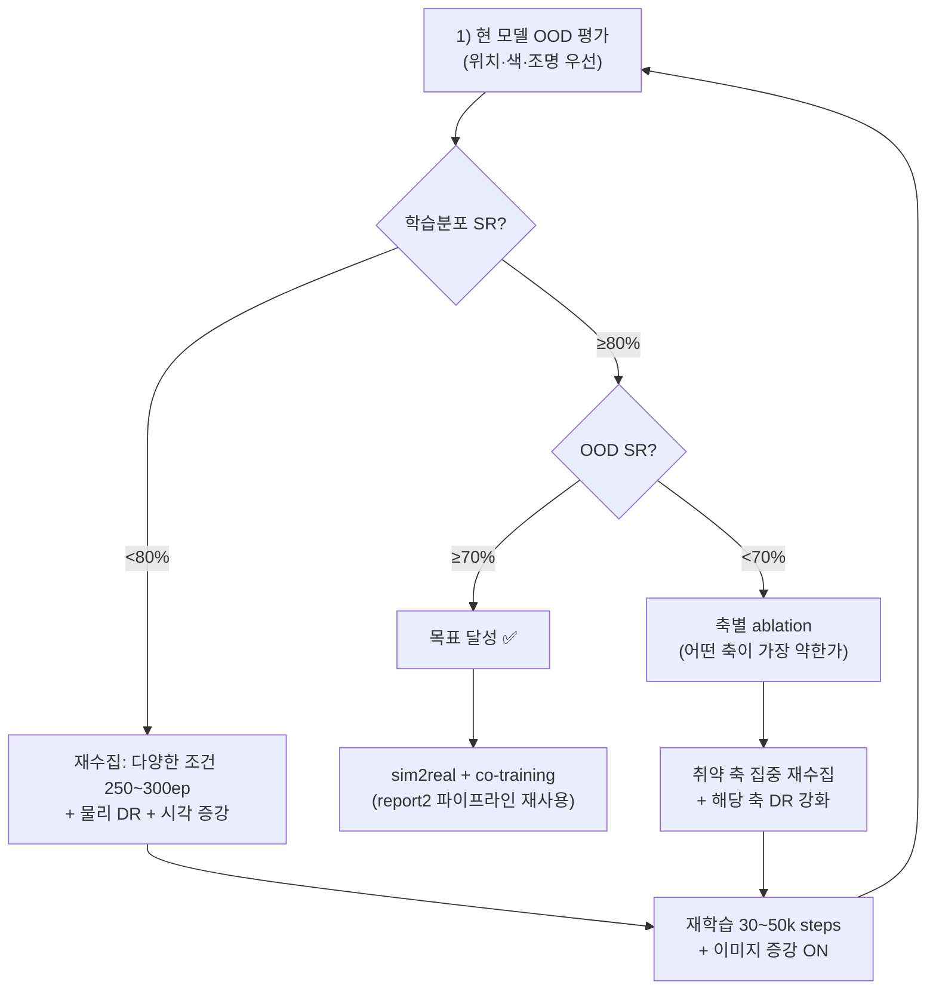

# Sim 일반화 계획 분석 — 선례·관련 연구·개선 방향

> 대상: [README.md](README.md) (GR00T N1.6 sim-only 일반화 확보 계획)

---

## 1. 현재 계획 요약

| 항목 | 현재 계획 |
|---|---|
| 모델 | GR00T N1.6 DiT (8-bit), sim-only fine-tune |
| 현 성능 | sim SR 80% (학습분포 내), 실기 zero-shot 간헐적 성공 |
| 목표 | sim 내 높은 SR + OOD 일반화 확보 → 그 뒤 sim2real |
| 방법 | 추론 재평가 → 진단(과적합 vs 다양성 부족) → 데이터+DR 보강 → 재학습 |
| 평가 OOD 축 | 위치, 큐브 색상, 박스 방향, 물체 종류, 조명/외형 |

---

## 2. 관련 선례 및 연구

### 2.1 직접 관련 — GR00T / NVIDIA 생태계

| 선례 | 핵심 교훈 | 출처 |
|---|---|---|
| **GR00T N1.6 공식 sim-to-real 워크플로** | 4가지 핵심 요소: ① Multi-level DR ② 포토리얼리스틱 렌더링 ③ 물리 사실적 모델링 ④ RL 업데이트. **단순 시각 DR만으로는 부족**, 물리·렌더링·학습 업데이트 모두 필요 | NVIDIA Isaac GR00T docs |
| **SO-101 커뮤니티 벤치마크** | 50~120ep fine-tune 시 성공률 70~80% 달성 가능. **실행 불안정성이 지배적 실패 원인** (모델보다 제어 루프). 5~6% 학습 분산 존재 | Community benchmarks |
| **Isaac Lab DR 기반 전이** | rigid object pick-place는 전형적으로 **15~30% sim-real gap**. 정밀 조립은 30~50%. DR + 소량 실기 fine-tune 조합이 최적 | NVIDIA research |

### 2.2 VLA 모델 일반화 연구 (2024–2025)

| 연구 | 핵심 발견 | 시사점 |
|---|---|---|
| **π₀ / π₀.5** (Physical Intelligence) | heterogeneous 데이터 co-training + "knowledge insulation"으로 open-world 일반화. **다양성 > 양** | 현재 100ep 단일 태스크는 좁음. 다양한 조건을 포함한 데이터가 핵심 |
| **Sim2Real-VLA** (CUHK, ICLR 2026) | **이중 시스템(dual-system)** 아키텍처: 고수준 플래너(affordance 추론) + 저수준 액터. **affordance 기반 추론**으로 시각 노이즈에 불변. **100% 합성 데이터만으로 zero-shot 전이 성공** | 현재 end-to-end 방식의 한계를 보완할 대안 아키텍처 |
| **SpatialVLA** | 3D 공간 정보(Ego3D 인코딩) 주입으로 공간 추론 강화 → pick-and-place 정밀도 향상 | 깊이 정보 활용을 고려할 가치 있음 |
| **Data Scaling Laws** (2024–2025 다수) | 일반화 성능은 **환경·물체 다양성**과 power-law 관계. **환경-물체 쌍당 ~50ep**이 실용적 기준선. 그 이상은 수확 체감 | 현재 100ep × 1조건 < 10ep × 10조건 |

### 2.3 도메인 랜덤화 연구

| 연구 | 핵심 발견 | 시사점 |
|---|---|---|
| **Active Domain Randomization (ADR)** | 고정 범위 DR보다 **자동 난이도 조절 DR**이 전이 성능 우수 | 고정 범위 DR 대신 ADR 고려 |
| **Factor World** (ablation benchmark) | 색상·텍스처·조명·카메라 중 **어떤 축이 가장 영향이 큰지** 체계적으로 분리 가능 | 현재 계획의 OOD 축 5개를 한꺼번에 하기보다, **축별 ablation → 영향 큰 축에 집중** |
| **Proxy Task DR 최적화** | 전체 policy 학습 전에 **단순 proxy task (예: 큐브 위치 분류)**로 DR 파라미터를 빠르게 최적화 → 본 학습에 적용 | 싸고 빠른 사전 탐색 방법 |
| **물리 DR (dynamics randomization)** | 시각 DR만으로는 부족. **마찰·질량·제어 지연 랜덤화**가 sim-real gap에 더 큰 영향 (특히 grasping) | 현재 계획에 물리 DR이 빠져 있음 ⚠️ |

### 2.4 데이터 전략 연구

| 연구 | 핵심 발견 |
|---|---|
| **DexScale** | sim 대규모 데이터 + 다양한 real 소량 = zero-shot 전이. **핵심은 motion-critical dynamics에 집중** |
| **Hybrid Training 권장** | sim에서 수천 ep + real 20~50ep fine-tune 조합이 **sim-only, real-only 모두보다 우수** |
| **"Curse of Precision"** | 고정밀 태스크는 데이터 요구량이 **초지수적 증가**. pick-and-place는 중정밀이라 다양성으로 해결 가능 |

---

## 3. 현재 계획의 강점

> [!TIP]
> 계획에서 이미 잘 잡은 부분들

1. **"sim에서 먼저 일반화를 확보"하는 전략** — 실기 비용을 피하고 재현 가능한 환경에서 체계적으로 개선. π₀.5, Sim2Real-VLA 등 최신 연구와 동일한 방향
2. **진단 프레임워크 (§5)** — "과적합 vs 다양성 부족"을 held-out으로 가르는 것은 정석. Factor World류 ablation과 일맥상통
3. **OOD 축 정의 (§4)** — 위치/색/방향/물체/조명을 분리해 평가하겠다는 것은 체계적
4. **flowchart 기반 의사결정** — 결과에 따라 분기하는 계획이 명확

---

## 4. 개선 제안

### 4.1 데이터 전략: "100ep × 1조건" → "N ep × K조건" 🔴 핵심

> [!IMPORTANT]
> **데이터 스케일링 연구의 일관된 결론: 다양성 > 양.**
> 현재 v2 100ep은 **한 가지 조건**(고정 색상, 고정 조명, 좁은 위치)에서 수집됨. 일반화 부족의 원인이 여기에 있을 가능성 높음.

**제안**: 먼저 현 모델의 OOD 평가를 하고 (이건 현 계획과 동일), 그 결과로 재수집 시:

```
[현재]  100ep × 1조건(빨간 큐브, 고정 조명, 좁은 위치)
[제안]  200~300ep × 다양한 조건:
        - 색상 5종 × 각 20ep
        - 위치 격자 전역 커버리지
        - 조명/텍스처 DR 적용 상태에서 수집
        - 교정 시연 30% 유지
```

환경-물체 쌍당 50ep이 실용적 기준선이므로, **5색 × 50ep = 250ep**이면 충분한 출발점.

### 4.2 물리 DR 추가 🔴 중요

> [!WARNING]
> 현재 계획의 DR은 **시각 DR** (조명·텍스처)에 한정됨. 그러나 파지 실패의 주 원인은 **접촉 역학**임.

| 추가할 물리 DR | 파라미터 | 효과 |
|---|---|---|
| **마찰 계수** | 큐브·바닥·그리퍼 패드 friction ±30% | 파지 안정성 일반화 |
| **큐브 질량** | mass ±50% | 들어올리기 역학 |
| **제어 지연** | action latency 10~40ms 랜덤 | 실기 지터 내성 (report2 §4.2에서 이미 겪은 문제) |
| **그리퍼 힘** | 서보 torque ±20% | 실기 서보 편차 흡수 |

특히 **제어 지연 랜덤화**는 report2에서 이미 앵커 지연 문제를 겪었으므로 **반드시 포함** 권장.

### 4.3 평가 효율화: Proxy Task 사전 스크리닝

전체 pick-and-place 평가(~60초/ep)를 모든 OOD 축 × N회 돌리면 비용이 큼. 제안:

```
1단계: Proxy task (큐브 접근 → 그리퍼 닫기만) — 5~10초/trial, 100회
        → 색상/위치/조명 별 "접근 성공률" 빠르게 스크리닝
2단계: 전체 pick-and-place — proxy에서 드러난 취약 축에 집중, 각 20~30회
```

이렇게 하면 **어떤 OOD 축이 가장 취약한지**를 1/6 비용으로 빠르게 파악 가능.

### 4.4 OOD 축 우선순위 재배열

연구에 기반한 **영향 크기 순서** (pick-and-place에서):

| 순위 | OOD 축 | 이유 | 현재 계획 난이도 |
|---|---|---|---|
| 1 | **위치(공간 커버리지)** | 가장 직접적. report2에서도 실기 실패의 주 원인 | 쉬움 ✅ |
| 2 | **조명/카메라** | VLA 비전 백본에 가장 큰 교란. sim-real gap 핵심 | 이미 있음 ✅ |
| 3 | **큐브 색상** | VLM 백본이 사전학습에서 다양한 색을 봤으므로 **의외로 쉬울 수 있음** | 쉬움 |
| 4 | **박스 방향** | 놓기(place) 정밀도에 영향 | 쉬움 |
| 5 | **물체 종류** | 형상 일반화는 가장 어려움. 별도 단계로 분리 권장 | 중간 |

**제안**: 1~2를 먼저 공략. 이 둘만 해결해도 sim2real gap의 대부분이 줄어듦.

### 4.5 학습 설정 개선

| 항목 | 현재 | 제안 | 근거 |
|---|---|---|---|
| **학습 steps** | 20k | **30~50k** (데이터 늘리면 비례) | 200~300ep 데이터에 20k는 부족할 수 있음 |
| **이미지 증강** | (미확인) | **color jitter + random crop + gaussian noise** 활성화 | GR00T fine-tune 시 시각 증강이 일반화에 직접 기여 |
| **learning rate** | (기본값) | cosine decay with warmup 확인 | 데이터 다양성 높아지면 더 오래 학습 필요 |
| **modality 추가** | RGB 2ch | **depth 채널 추가** 고려 (RGB-D) | SpatialVLA 연구: depth가 공간 정밀도 향상에 기여 |

### 4.6 장기 방향: 이중 시스템 아키텍처 (선택적)

현재의 end-to-end VLA가 한계에 부딪히면, **Sim2Real-VLA 스타일의 이중 시스템** 고려:

```
[고수준] Affordance 추론 — "어디를 잡을까?" → 좌표 출력
[저수준] 모션 실행 — 좌표 → 관절 궤적

장점: 시각 노이즈(색·조명)에 불변, 실기 전이 용이
단점: 파이프라인 복잡도 증가
```

단, 이건 현재 계획을 먼저 실행해보고 **한계가 드러난 뒤**에 검토할 사안.

---

## 5. 제안하는 수정된 작업 흐름



### 핵심 변경점 (vs 현재 계획)

| 현재 | 제안 | 이유 |
|---|---|---|
| OOD 축 5개 동시 평가 | **위치·조명 우선 → 축별 ablation** | 비용 절감 + 원인 분리 |
| 시각 DR만 | **물리 DR (마찰·질량·지연) 추가** | 파지 일반화 필수 |
| 100ep × 1조건 재수집 | **250~300ep × 다양한 조건** | 데이터 다양성이 일반화 핵심 |
| 20k steps 학습 | **30~50k + 이미지 증강** | 다양한 데이터에 맞게 |
| 진단 후 방향 결정 | **proxy task로 빠른 사전 스크리닝** | 평가 비용 1/6 절감 |

---

## 6. 참고 논문/자료 목록

| # | 이름 | 핵심 | 관련성 |
|---|---|---|---|
| 1 | **GR00T N1.6 Sim-to-Real Workflow** (NVIDIA) | 4축 DR + 포토리얼리스틱 렌더링 | 직접 참조 |
| 2 | **π₀.5** (Physical Intelligence, 2025) | heterogeneous co-training, knowledge insulation | 데이터 전략 |
| 3 | **Sim2Real-VLA** (CUHK, ICLR 2026) | 이중 시스템, affordance chain, 100% 합성 데이터 zero-shot | 대안 아키텍처 |
| 4 | **SpatialVLA** (2025) | Ego3D, depth 주입 → 공간 정밀도 | depth 활용 |
| 5 | **Factor World** (ablation benchmark) | OOD 축별 영향도 분리 | 평가 방법론 |
| 6 | **Active Domain Randomization** (Mehta et al.) | 자동 DR 범위 조절 | DR 전략 |
| 7 | **REALM Benchmark** (2025) | sim-real 상관관계 표준 평가 | 평가 프로토콜 |
| 8 | **Data Scaling Laws for Manipulation** (2024~2025 다수) | 다양성 > 양, 50ep/조건 기준선 | 데이터 수량 결정 |
| 9 | **DeGuV** (depth-guided visual generalization) | 깊이 기반 마스킹으로 배경 노이즈 제거 | 시각 일반화 |
| 10 | **Dynamics Randomization for Dexterous Manipulation** | 마찰·질량·지연 랜덤화 효과 | 물리 DR |
