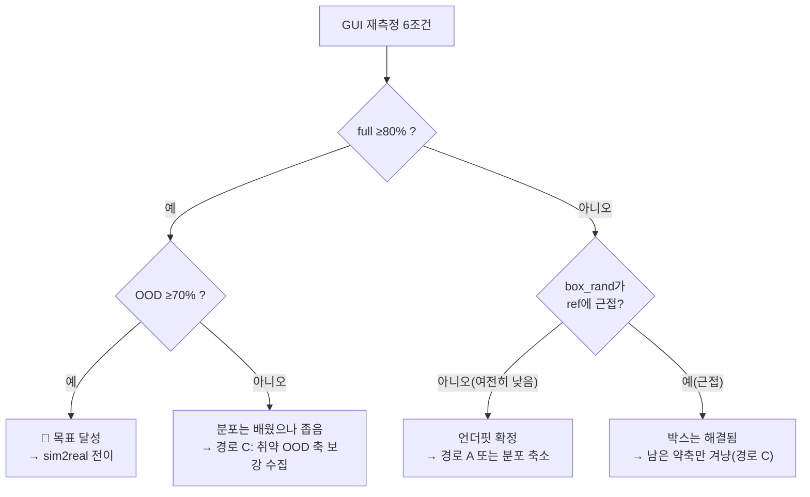

# 다음 학습 계획 — 측정 결과에 따른 분기 설계

> [training_strategy_analysis.md](training_strategy_analysis.md)의 4조합 분석을 **우리 실측 진단에
> 맞춰 보정**하고, GUI 재측정 결과에 따라 무엇을 할지 확정하는 문서.
>
> 작성: 2026-08-06 · 관련: [README](README.md) · [2주 계획](2week_plan.md)

---

## 1. ⚠️ 먼저 보정 — "C가 항상 A보다 낫다"는 우리 경우엔 성립하지 않는다

`training_strategy_analysis.md`는 **문제가 "데이터에 없는 축"** 이라는 전제 위에 서 있다.
그 전제에서는 C(취약 축 재수집) > A(같은 분포 추가)가 맞다.

**그런데 우리 진단은 다르다.**

| 측정 | 값 | 이 조건의 성격 |
|---|---|---|
| `ref` (박스 고정) | 90% | 학습 분포 |
| **`box_rand`** (박스 랜덤, **학습 범위 그대로**) | **50%** | **학습 분포 — OOD 아님** |

`box_rand`는 **수집 때 100% 겪은 범위**다. 그런데 반토막이 났다.

> **즉 "데이터에 없어서 못 하는 것"이 아니라, "데이터에 있는데도 못 배운 것"이다.**
> 이건 다양성 부족이 아니라 **언더핏(밀도 부족)** 이고, 처방은 **A(같은 분포 추가)** 다.

### 그리고 결정적으로 — 우리 경우 A와 C는 사실상 같다

sweep이 지목한 취약 축은 **박스 랜덤화**인데, 그건 이미 v3 데이터 100ep **전부**에 들어 있다.
따라서 "취약 축을 집중 수집"하려 해도 **똑같은 조건으로 더 모으는 것**이 되어 A와 구분되지 않는다.

**C가 A와 달라지려면 분포 자체를 바꿔야 한다** — 예:
- yaw 범위를 ±180° → ±45°로 **축소**
- 박스 위치 범위를 좁히기
- 반대로 극단 위치를 **의도적으로 더** 넣기

즉 이 국면에서 진짜 선택지는 **"데이터를 늘릴까"가 아니라 "분포를 어떻게 재설계할까"** 다.

---

## 2. Resume 분석 — 문서 내용 검증 결과

| 문서의 주장 | 검증 | 비고 |
|---|---|---|
| cosine LR이 40k에서 바닥 | ✅ **사실** | 실측: peak 1e-4 → 40k에서 ~0 |
| LR 리셋하면 warm restart | ✅ 사실 | 다만 "붕괴한다"는 과장 — SGDR처럼 **의도적 기법**이기도 함. 문제는 성능이 아니라 **해석이 지저분해지는 것** |
| catastrophic forgetting | 🟡 타당 | 특히 분포가 바뀔 때. 같은 분포면 위험 낮음 |
| optimizer 모멘트 불일치 | 🟡 타당 | 같은 분포면 오히려 이점 |

**문서에 없던 추가 위험** (실측 확인):
GR00T는 `ShardedMixtureDataset(IterableDataset)` 을 쓰고, trainer 주석에
*"stateful samplers rely on global_step"* 이라고 명시돼 있다.
→ **데이터셋이 바뀌면 샘플러 상태가 다른 데이터 레이아웃을 가리킨다.** resume의 의미가 더 훼손된다.

**결론**: 문서의 판단(resume은 진단용, 최종 수치는 신규 학습)에 **동의**한다.

---

## 3. 판정 기준 — GUI 재측정에서 볼 것

자동 sweep 대비 GUI 측정은 **겹침 씬 제외 + 오표기 교정**이 들어가므로 **수치가 올라갈 가능성이 크다**.
(겹침만으로도 약 10%p 하향 편향이 있었다)

| 지표 | 합격선 | 자동 sweep 값 |
|---|---|---|
| `full` (학습 분포) | **≥ 80%** | 50% |
| OOD 평균(pos_ood·box_ood·color) | **≥ 70%** | 50% |
| `ref` (상한 기준) | — | 90% |
| **`box_rand`** ← 언더핏 판별 | **ref에 근접해야 정상** | 50% (−40%p) |

---

## 4. 분기 계획



### 경로 W1 — 목표 달성 (full ≥80%, OOD ≥70%)
**추가 학습 불필요.** 바로 sim2real로 넘어간다.
```bash
ssh 5090 '~/serve_blocktask_n16_5090.sh gr00t_blocktask_v3_n16_8bit/checkpoint-40000 start'
```
실기는 zero-shot이므로 [report2 §5](../sim2real/08_T1_sim2real/report2.md) 선례대로
**co-training이 추가로 필요할 가능성이 높다.**

### 경로 W3 — 언더핏 (full <80% & box_rand 낮음) ← **현재 가장 유력**

여기서 **20분 진단**을 먼저 한다. `box_rand`의 손실이 **위치** 때문인지 **회전(yaw)** 때문인지:

| 진단 조건 | 박스 위치 | 박스 yaw |
|---|---|---|
| `box_pos_only` | 랜덤 | 고정 0° |
| `box_yaw_only` | 고정 | 랜덤 ±π |

**진단 결과별 처방**

| 결과 | 해석 | 처방 | 비용 |
|---|---|---|---|
| **yaw만 낮음** | yaw ±180°가 과도한 랜덤화 | **분포 축소** (yaw ±45°) 후 **기존 100ep 재사용 가능성 검토** → 안 되면 재수집 | 0~2.5일 |
| **위치만 낮음** | 박스 위치 학습 부족 | **A: v3_200(200ep) 신규 학습** | 30h(40k) / 65h(86k) |
| **둘 다 낮음** | 결합 난이도 | **분포 소폭 축소 + 데이터 2배** 병행 | 2.5일 + 30h |

> **왜 분포 축소를 먼저 보는가**: v3는 v2 대비 결합 분포가 **수십 배** 커졌는데(블록 면적 2.34배 +
> 박스 위치·yaw·물리 = 새 차원 3개) 에피소드는 100 그대로였다. yaw만 ±45°로 줄여도 **그 차원이 4배 축소**된다.
> 데이터를 2배 늘리는 것(30h + 수집)보다 **싸고 효과가 클 수 있다.** 게다가 실기에서 박스가
> 180° 뒤집힐 일은 없으므로 **버려도 되는 다양성**이다.

### 경로 W2 / W4 — 특정 OOD 축만 약함
그 축만 겨냥해 **분포를 넓혀 재수집**(진짜 C). 예: `pos_ood`만 낮으면 블록 범위를 0.12~0.38로
넓혀 수집. 이때는 문서의 논리(C > A)가 **정확히 들어맞는다.**

---

## 5. 학습 방식 확정 — 어느 경로든 공통

| 항목 | 결정 | 근거 |
|---|---|---|
| 학습 방식 | **신규 학습** | resume은 LR 바닥·샘플러 상태·forgetting으로 최종 수치에 부적합 |
| resume 용도 | **진단만** (예: "더 돌리면 오르나?" 확인) | 싸게(≈절반 시간) 방향만 봄 |
| 스텝 수 | 데이터 2배면 **86k 권장**(66.1 epoch) | 40k면 30.8 epoch으로 v3(65.8)의 **절반** → 오히려 더 언더핏 |
| 하이퍼파라미터 | v3와 **동일** 고정 | 변수를 데이터/분포 하나로 |
| dataloader workers | 4 → **8** | v3 학습 중 GPU util 19% (로딩 병목) |

### ⚠️ 스텝 수 함정 (자주 놓침)

| 학습 | steps | epoch |
|---|---|---|
| v3 (100ep) | 40k | **65.8** |
| v3_200 (200ep) | 40k | **30.8** ← 절반 |
| v3_200 (200ep) | **86k** | **66.1** ← 정합 |

"데이터를 늘렸는데 성능이 떨어졌다"는 결과가 나오면, **데이터 탓이 아니라 epoch 부족**일 수 있다.
비교하려면 **86k로 맞추거나**, 최소한 이 차이를 명시해야 한다.

---

## 6. 실행 순서 (권장)

```
[지금] GUI 재측정 6조건 완료
   ↓
[1] full·OOD 수치로 §4 분기 판정                     (0분)
   ↓ (W3인 경우)
[2] yaw/위치 분해 진단 2조건                          (20분)
   ↓
[3] 처방 결정: 분포 축소 vs 데이터 2배               (0분)
   ↓
[4-a] 분포 축소면 → 씬 수정 후 재수집 100ep          (2.5일)
[4-b] 데이터 2배면 → v3_200 학습 (준비 완료)         (30~65h)
   ↓
[5] 동일 6조건으로 재측정 → v3와 직접 비교            (1시간)
   ↓
[6] 합격 시 sim2real + co-training
```

**핵심**: [2]번 20분 진단이 [4]번 30~65시간의 방향을 정한다. **반드시 먼저 한다.**

---

## 7. 요약 — 사용자 질문에 대한 답

> *"재측정에서 일반화가 나쁘지 않게 나오면, 새 데이터셋 100ep 재수집 후 학습하는 방향도 괜찮은가?"*

**조건부로 맞다.**

- **일반화가 나쁘지 않다 = OOD ≥70%** 라면 → 애초에 **추가 학습이 불필요**할 수 있다.
  `full`도 ≥80%면 바로 sim2real로 가는 게 맞다. 재수집은 **낭비**다.
- **일반화는 괜찮은데 `full`이 낮다** → 언더핏 → **같은 분포 데이터 추가(A)** 가 처방.
  이때 "새 100ep 재수집"은 A와 같으므로 **괜찮다** (단, 이미 v3_200이 준비돼 있어 재수집은 불필요).
- **특정 OOD 축만 낮다** → 그 축을 넓힌 **재수집(진짜 C)** 이 정답. 이때가 재수집의 제대로 된 용처다.

즉 **재수집 자체가 좋고 나쁨이 아니라, "무엇을 채울지"가 정해진 뒤에야 의미가 있다.**
그래서 §4 분기 판정과 §6의 20분 진단을 먼저 하는 것이다.
