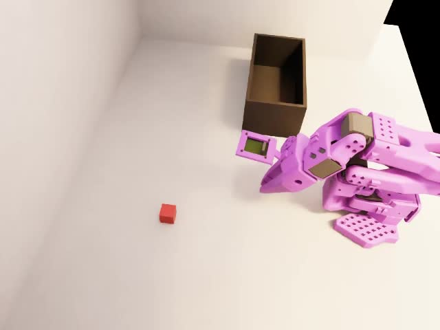
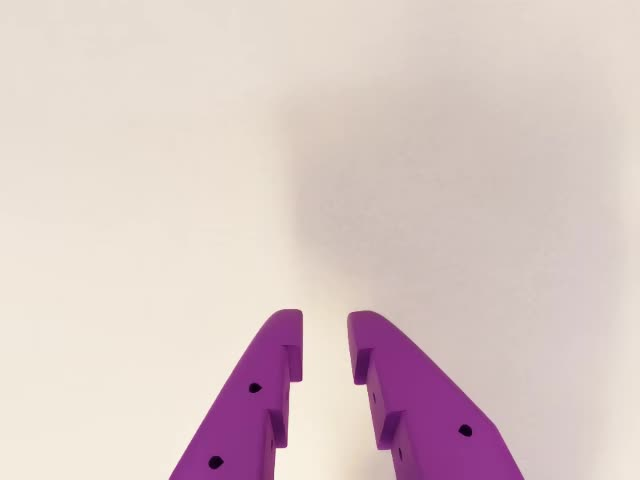
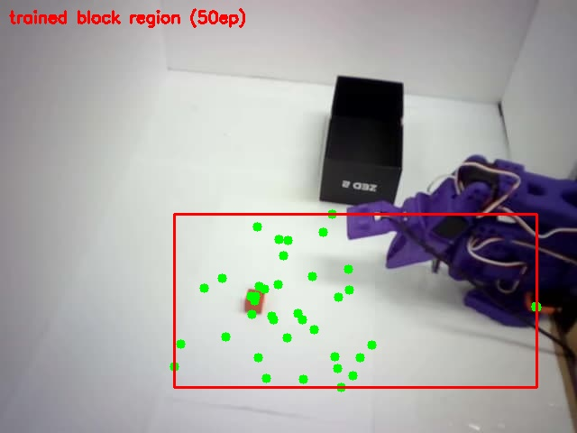

# Isaac Sim 데이터 수집 환경 배포 가이드 — T1 blocktask (빨간 큐브 → 검은 박스)

> **목적**: coworker가 이 문서만 보고 **Isaac Sim에서 T1 blocktask 시뮬레이터 데이터셋을 수집하는
> 환경을 그대로 재현**할 수 있게 한다. GitHub에 올라간 것(이 repo의 패치·스크립트 + coworker fork)
> 만으로 씬·수집·변환까지 완결된다.
>
> 이 가이드가 재현하는 것 = **Phase A(씬·에셋) + Phase B(리더암 teleop 수집)**.
> 상세 배경: [A_scene_asset.md](../A_scene_asset.md) · [B_data_collection.md](../B_data_collection.md)

작성: 2026-08-04

---

## 0. 결과물 (이 가이드를 끝내면 얻는 것)

- Isaac Sim에 뜨는 **T1 blocktask 씬**: 보라색 SO-101 + 빨간 큐브(20mm) + 검은 오픈박스 + 밝은 평면 바닥
- **리더암 teleop 녹화** 파이프라인 → LeRobot v3.0 데이터셋 출력 (`datasets/<name>`)
- (선택) 그 데이터셋을 **GR00T N1.6용 v2.1**로 변환

수집 규모 예시(우리 기준): `sim_so101_blocktask` 75ep / 25,549 frames @ 30fps, 카메라 2대
(`observation.images.ego`=wrist, `observation.images.external_D455`=front).

---

## 1. 사전 요구사항

### 하드웨어
- **NVIDIA RTX GPU** — 수집(1 env 렌더+teleop)은 16GB로 충분(로컬 5070 Ti로 검증). 5090도 OK.
- **SO-101 리더암** (teleop 입력용, `/dev/ttyLEADER`). ※ 키보드 teleop 대안도 있으나, 품질·교정
  시연을 위해 **리더암 권장**.
- GUI가 필요(조작자가 가상 카메라 뷰를 보며 녹화) → **디스플레이 있는 워크스테이션**.

### 소프트웨어
- Ubuntu + **Docker** + **NVIDIA Container Toolkit** (GPU 컨테이너)
- **git** + **git-lfs** (USD 에셋이 LFS로 관리됨 — 필수)
- 이 repo(`manipulator_ws`)를 클론해 둘 것 (패치·스크립트·modality.json·이 문서 포함)

### 버전 고정 (드리프트 방지 — 반드시 동일하게)
| 구성 | 버전/핀 |
|---|---|
| Base 이미지 | `nvcr.io/nvidia/isaac-lab:2.3.2` (Isaac Lab 2.3.2 / Isaac Sim 5.1.0-rc.19) |
| workshop 커밋 | `1d62ec5` (teleop-docker 빌드 기준) |
| lerobot(컨테이너 내) | 커밋 `e670ac5` |
| coworker fork 커밋 | `124eb1c` (아래 clone 대상) |

> Dockerfile이 베이스 태그·lerobot 커밋·주요 패키지를 전부 고정하므로, 같은 커밋으로 빌드하면
> 빌드 시점이 달라도 버전이 일치한다.

---

## 2. 두 저장소의 역할

| 저장소 | 내용 | 왜 필요 |
|---|---|---|
| **coworker fork** `github.com/tjdwlswkd21/Sim-to-Real-SO-101-Workshop` @ `124eb1c` | 블록 씬 본체 + 커스텀 USD 에셋(`basket_box.usda`, `mat.usda`, LFS) + Docker 정의 | 시뮬레이터 환경 원본 |
| **이 repo** `manipulator_ws` | 로컬 정제 패치(`blocktask_fork.patch`) + 런처(`blocktask_run.sh`) + 변환(`prepare_blocktask_gr00t.sh`, `blocktask_modality.json`) + 문서 | fork에 얹는 우리 수정 + 수집/변환 도구 |

fork origin에 **이미 블록 씬과 에셋이 들어 있고**, 이 repo의 `blocktask_fork.patch`는 그 위에 얹는
**우리 정제분**(recorder OOM 수정, 키 리매핑, rerun 연동, wrist_roll 오프셋, 매트 kinematic화,
spawn 높이, 성공 판정 termination, eval 영상 덤프 — 7파일 190줄)이다.

---

## 3. Step 1 — fork 클론 + LFS + 패치 적용

> ⚠️ **클론 위치 고정**: 런처 스크립트들이 `~/blocktask_ws/Sim-to-Real-SO-101-Workshop` 경로를
> 하드코딩한다. 다른 경로를 쓰려면 `blocktask_run.sh`의 `WORKSHOP` 변수를 함께 바꿔야 한다.

```bash
# git-lfs 준비 (USD 에셋이 LFS — 미설치 시 130바이트 포인터만 받아져 FileNotFoundError)
sudo apt install -y git-lfs && git lfs install

# fork를 지정 커밋으로 클론
mkdir -p ~/blocktask_ws && cd ~/blocktask_ws
git clone https://github.com/tjdwlswkd21/Sim-to-Real-SO-101-Workshop.git
cd Sim-to-Real-SO-101-Workshop
git checkout 124eb1c
git lfs pull          # ★ USD 에셋 실제 바이너리 수신 (SO-ARM101 23MB, basket_box, mat ...)

# 이 repo의 정제 패치 적용 (경로는 본인 manipulator_ws 위치에 맞게)
MW=~/manipulator_ws
git apply "$MW/setup/sim/t1_task/blocktask_fork.patch"
git diff --stat        # 7 files changed, ~190 insertions 확인
```

적용되는 7파일: `scripts/lerobot_agent.py`(rerun), `scripts/lerobot_eval.py`(영상 덤프),
`tasks/task_env_cfg.py`(카메라/DR), `tasks/vials_to_rack_env_cfg.py`(블록 씬 정제·성공 판정),
`utils/keyboard.py`(키 리매핑), `utils/lerobot_interface.py`(wrist_roll 오프셋),
`utils/lerobot_recorder.py`(VRAM 누수 수정 + `SIM_RECORD_SECONDS`).

> `git lfs pull` 후 `.usd`/`.usda`가 실제 파일인지 `file source/sim_to_real_so101/assets/usd/basket_box.usda`
> 로 확인(“ASCII text”면 정상, “ASCII text, 130 bytes 포인터”면 LFS 미수신).

---

## 4. Step 2 — teleop-docker 이미지 빌드

fork 루트에서 워크숍 공식 sim 이미지를 빌드한다(같은 커밋 기준이면 버전 일치).

```bash
cd ~/blocktask_ws/Sim-to-Real-SO-101-Workshop
docker build -t teleop-docker:latest -f docker/sim/Dockerfile .
```

> 상세·옵션은 fork의 `README.md` / `MANAGING_MULTIPLE_ENVIRONMENTS.md` 참고. 이미 다른 워크숍
> 환경에서 `teleop-docker:latest`를 빌드해 뒀다면 **재사용 가능**(이미지는 소스 마운트로 주입되므로
> 블록 씬 때문에 다시 빌드할 필요 없음).

Isaac Sim 캐시 디렉터리를 미리 만들어 둔다(런처가 마운트):
```bash
mkdir -p ~/docker/isaac-sim/cache/{kit,ov,glcache,computecache}
```

---

## 5. Step 3 — 씬 육안 확인 (view)

```bash
cd ~/manipulator_ws/setup/gr00t   # (blocktask_run.sh 는 setup/sim/t1_task/ 에 있음)
~/manipulator_ws/setup/sim/t1_task/blocktask_run.sh view
```

GUI(zero_agent, 로봇 0액션)로 씬이 뜬다. **체크리스트**:
- 빨간 큐브(20mm) · 검은 오픈박스 · **보라색** SO-101 · 밝은 평면 바닥
- 물체가 바닥을 통과/낙하하지 않음(매트 kinematic collision 정상)

정상 씬 예시 (external_D455/front 시점, 실제 sim 렌더):



수집 시 보게 되는 wrist(ego) 시점:



`view` 태스크 ID = `Lerobot-So101-Teleop-Vials-To-Rack` (fork가 이 등록을 블록 씬으로 덮어씀).

---

## 6. Step 4 — 리더암 teleop 데이터 수집 (record)

### 6.1 리더암 캘리브레이션 경로 맞추기 (최초 1회)
컨테이너 lerobot(핀 `e670ac5`)은 `calibration/teleoperators/`**`so101_leader`**`/leader.json`을
기대하는데, 실기 lerobot 0.6.x는 **`so_leader`**`/`에 저장한다. 포맷 동일 → **복사본 생성**:

```bash
# 리더암 캘리브레이션이 so_leader/ 에 있다고 가정. 컨테이너 안에서 복사(권한 문제 회피)
# (record를 한 번 띄운 뒤, 다른 터미널에서:)
docker exec blocktask bash -c \
 "mkdir -p /root/.cache/huggingface/lerobot/calibration/teleoperators/so101_leader && \
  cp /root/.cache/huggingface/lerobot/calibration/teleoperators/so_leader/leader.json \
     /root/.cache/huggingface/lerobot/calibration/teleoperators/so101_leader/leader.json"
```
(호스트 `~/.cache/huggingface/lerobot/calibration`가 컨테이너로 마운트됨 — 리더암 캘리브레이션이
없다면 먼저 실기 lerobot로 리더암 calibrate 필요.)

### 6.2 녹화 실행
```bash
~/manipulator_ws/setup/sim/t1_task/blocktask_run.sh record
```
- 태스크: `Lerobot-So101-Teleop-Vials-To-Rack-DR` (+`--rerun` 실시간 가상 카메라 뷰, `/dev/ttyLEADER`)
- 출력: `datasets/<DSNAME>` (기본 `sim_so101_blocktask_v2`; 이미 있으면 `_2`, `_3`… 새 폴더 자동)
  - 다른 이름: `DSNAME=my_collect ~/…/blocktask_run.sh record`
  - repo_id: `heongyu/<DSNAME>` (Hub 업로드 시)
- 언어 태스크: `"Pick up the block and place it in the box"`

### 6.3 키 매핑 (녹화 조작)
| 키 | 동작 |
|---|---|
| `S` | 녹화 시작 |
| `→` (RIGHT) | 녹화 중지 **+ 저장** |
| `←` (LEFT) | 녹화 중지 **+ 삭제(discard)** |
| `R` | 리셋 + 진행 중 녹화 취소 |

### 6.4 수집 규칙 (품질 — 실기와 동일 철학)
- **성공으로 끝나는 에피소드만 저장**.
- **큐브 위치를 넓게 다양화**(도달 범위 전역) — 이게 정책의 공간 커버리지를 결정한다.
  (실기에서 “학습 안 된 위치는 못 잡음”을 겪었으므로, sim 수집에선 **위치 분포를 넓게**.)

  아래는 **실기 50ep의 실제 블록 시작위치 분포**(녹색점=학습 위치, 빨간 박스=커버 영역).
  좌우는 넓지만 **깊이(앞뒤)가 한 띠로 좁아**, 그 밖 위치에서 파지가 실패했다. **이렇게 좁게
  수집하지 말고**, 도달 범위 전역(특히 깊이)을 고르게 덮어라:

  
- **녹화 시작 즉시 동작 개시**(idle 최소화) — GR00T의 “시작에서 오래 멈추는” idle 어트랙터 방지.
- **교정(recovery) 시연 포함**(빗나감→재접근→성공 ~30%) — covariate shift 완화, 재시도 학습.

### 6.5 유용한 환경변수
| 변수 | 기본 | 용도 |
|---|---|---|
| `DSNAME` | `sim_so101_blocktask_v2` | 데이터셋 폴더/`repo_id` 이름 |
| `SIM_RECORD_SECONDS` | 60 | recorder GPU 버퍼 길이(초). 16GB에선 60 권장(120은 OOM 위험) |
| `CAM_X/Y/Z` | 0 | external_D455(top) 카메라 오프셋(m) — 실기 화각에 맞출 때만 |
| `LEROBOT_RERUN_MEMORY_LIMIT` | 30% | rerun 메모리 상한 |

### 6.6 초기화(재수집)
```bash
DSNAME=sim_so101_blocktask_v2 ~/manipulator_ws/setup/sim/t1_task/blocktask_run.sh clear
```
⚠️ 해당 데이터셋 폴더의 **에피소드가 전부 삭제**된다(recorder가 append/resume 불가라 재시작 전 필요).

---

## 7. Step 5 — (선택) GR00T N1.6용 v2.1 변환

수집본은 LeRobot **v3.0**(recorder 기본)이고 GR00T는 **v2.1**(에피소드별)이 필요하다.
5090으로 전송 → 변환 → modality.json → stats 수정을 한 번에:

```bash
# (5090 SSH 접속 설정 되어 있어야 함. 로컬 데이터셋 이름이 sim_so101_blocktask 라고 가정)
~/manipulator_ws/setup/sim/t1_task/prepare_blocktask_gr00t.sh
```
결과: `5090:~/gr00tn16_ws/sim_data/heongyu/sim_so101_blocktask` (v2.1, 학습 바로 가능),
v3.0 백업은 `…_v3.0`. 카메라 매핑은 `blocktask_modality.json`(top→front, ego→wrist).

> 학습은 이 가이드 범위 밖. 5090에서 `train_gr00t_sim_n16_8bit.sh`의 `--dataset-path`를
> `/data/heongyu/sim_so101_blocktask`로 지정해 N1.6 8-bit 학습.

---

## 8. 씬 커스터마이즈 참조 — 일반화 실험용 편집 지점

파일: `source/sim_to_real_so101/tasks/vials_to_rack_env_cfg.py`

| 바꾸려는 것 | 심볼 | 방법 |
|---|---|---|
| **큐브 색상** | `block_red.spawn.visual_material` (`diffuse_color=(0.9,0.1,0.1)`) | RGB 교체 |
| **큐브 크기** | `BLOCK_SIZE = (0.02,0.02,0.02)` | 값 변경 |
| **큐브 위치 범위** | `BLOCK_REACH_MIN_DIST/MAX_DIST/ANGLE_RANGE` + `reset_block_position` | 애뉼러스 범위(전역 스윕) |
| **박스 위치** | `basket_black.init_state.pos = (0.10,-0.22,…)` | 값 변경 |
| **박스 회전(45/90°)** | `basket_black.init_state.rot` (현재 없음) | `euler_angles_to_quat([0,0,deg],degrees=True)` 추가 |
| **물체 변경** | `block_base = CuboidCfg(...)` | USD(`Vial_opaque.usda` 등)/다른 프리미티브로 교체 + `contact_grasp` 필터·성공판정 `vials=[...]` 이름 정합 |
| **조명/외형 DR** | `Lerobot-So101-Teleop-Vials-To-Rack-DR(-Eval)` 태스크 | 이미 sky light·노출·온도·카메라 지터 랜덤화 |

성공 판정은 `_block_place_params()` + `VialsToRackTerminationsCfg.success`(블록이 박스 로컬
경계 안 + 접촉 릴리스). 박스를 회전해도 **박스 로컬 좌표** 기준이라 유효.

closed-loop 평가는 `setup/sim/t1_task/blocktask_sim_eval.sh <MODEL> <N> [eval|dr]`
(real-robot 서버 + teleop-docker `lerobot_eval`, 성공률 자동 집계).

---

## 9. 함정 모음 (troubleshooting)

| 증상 | 원인 → 해결 |
|---|---|
| `FileNotFoundError: ...SO-ARM101-USD.usd` | git-lfs 미수신(130B 포인터) → `git lfs install && git lfs pull` |
| 컨테이너가 아무 출력 없이 즉시 종료(exit 1) | entrypoint가 `docker/env`·`source` 마운트 필요 → 런처는 이미 포함. 수동 실행 시 두 마운트 필수 |
| teleop가 캘리브레이션 못 찾음 | `so_leader` vs `so101_leader` 경로 불일치 → §6.1 복사 |
| 2번째 에피소드에서 CUDA OOM | recorder 버퍼 누수(패치로 수정) + `SIM_RECORD_SECONDS=60`으로 축소 |
| wrist(ego) 카메라가 90° 돌아감 | `init_state` Wrist_Roll(-1.6034rad) vs leader-rest 0° 불일치 → 패치의 관절 매핑 오프셋으로 해결(기록 데이터는 실기 프레임 유지) |
| 물체가 바닥을 통과/낙하 | GPU 물리에서 정적 collision 미등록 → 매트를 **kinematic RigidObject 평면**으로(패치 반영) |
| 뷰포트에서 매트 토글 시 “Simulation view invalidated” | GPU 물리 런타임 프림 토글 불가 → cfg에서 처음부터 평면으로(패치 반영) |
| AV1 mp4가 VLC에서 검은 화면 | 하이브리드 그래픽 이슈 → **mpv**로 재생 |

---

## 10. 참고

- 이 repo 관련 파일: `setup/sim/t1_task/`(blocktask_fork.patch, blocktask_run.sh, blocktask_sim_eval.sh,
  prepare_blocktask_gr00t.sh, blocktask_modality.json), `setup/sim/README.md`, `setup/sim/patches/README.md`
- Phase 기록: [A_scene_asset.md](../A_scene_asset.md), [B_data_collection.md](../B_data_collection.md),
  [C_training.md](../C_training.md), [report2.md](../report2.md)
- coworker fork: https://github.com/tjdwlswkd21/Sim-to-Real-SO-101-Workshop (@ `124eb1c`)
- NVIDIA 워크숍(upstream): https://github.com/isaac-sim/Sim-to-Real-SO-101-Workshop
- 교육 문서: https://docs.nvidia.com/learning/physical-ai/sim-to-real-so-101/latest/index.html
