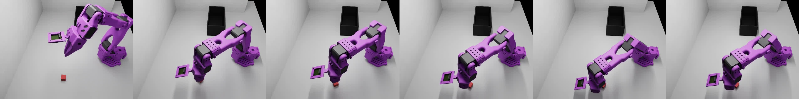
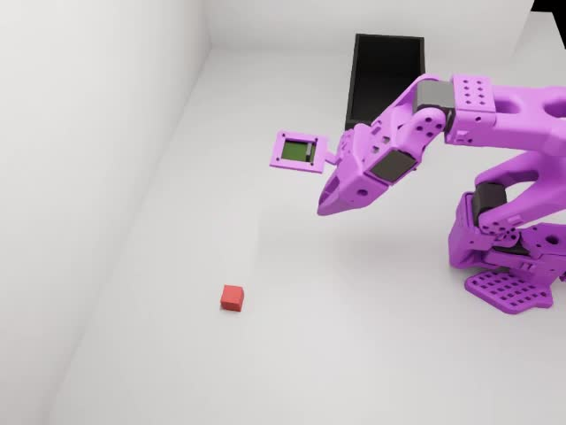
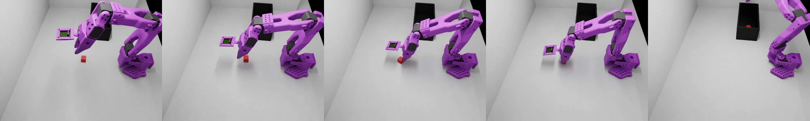
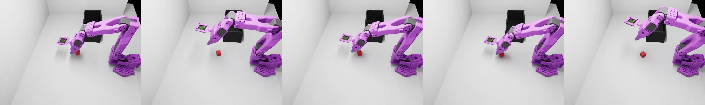
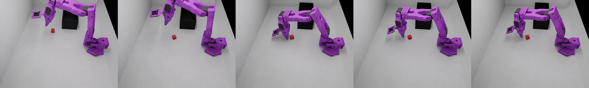
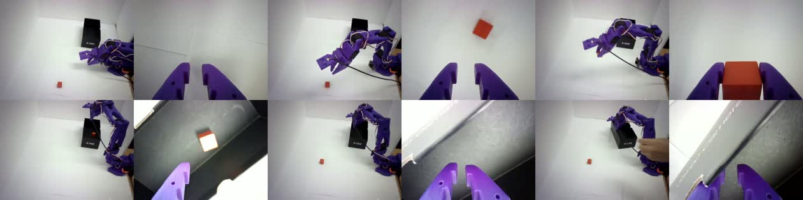
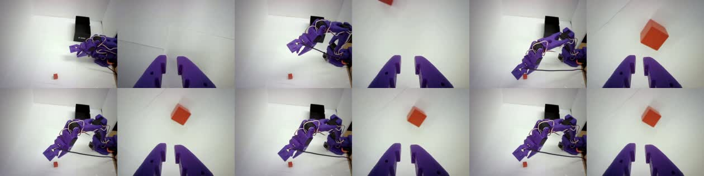
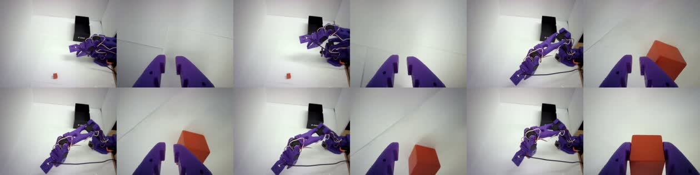

# T1 Sim-to-Real 재제작 리포트 (report2) — 반면교사: 데이터 문제 규명 → 재수집

> v1 데이터(sim 75ep)로 학습한 GR00T N1.6의 한계를 분석하고, **원인을 데이터에서 찾아** 개선된
> 데이터셋(v2)을 재제작·재학습하는 기록. 1차 결과: [report.md](report.md) · 전이 시도: [E_sim2real_transfer.md](E_sim2real_transfer.md)

작성: 2026-07-28

**요약**: v1 데이터로 학습 시 sim SR **60%(Eval)/50%(DR)**, 실기 zero-shot은 **파지 전혀 실패**.
실패의 정체는 모델이 아니라 **데이터**였다 — 씬 기하(mat)·카메라 구도·시연 구성의 3가지 결함.

---

## 1. 이전 데이터의 문제 (무엇이 잘못됐나)

sim 실패 영상 분석 결과 **실패는 전부 "파지(pickup)"에 집중** — 접근·인식은 되는데 큐브 근처에서
**맴돌기만 하고 못 집는다**. 아래는 실패 궤적 6프레임(접근→맴돎→못 집음, 큐브가 30초 내내 바닥에):




이 "맴돎"의 근본 원인 3가지:

### 1-A. mat이 로봇과 겹치고 너무 높음 → 그리퍼 하강 여유 부족 ⭐
- 로봇 base는 z=0, 그런데 **mat(충돌 평면) top=0.035**가 로봇 base 위를 덮음(겹침) + 물체가 그 위(0.045)에 안착.
- 원본 vials(80% 성공)는 물체가 **~0.026**에 안착했는데, 블록은 **~1cm 높고** 전면 충돌 평면까지 깔려
  **그리퍼가 큐브까지 끝까지 못 내려가** 파지가 얕거나 실패 → 시연 자체가 어려웠고 정책도 못 배움.

### 1-B. top(external) 카메라가 너무 멀어 큐브 위치 추정 부정확
- 위에서 내려다보는 external_D455 시점에서 **큐브가 작게** 잡혀 위치 단서가 흐림.



### 1-C. 교정(recovery) 시연 부재 → 빗나가면 복구 못 하고 "맴돎"
- 시연은 대부분 **한 번에 깔끔히 성공**만 담김. 파지가 살짝 빗나간 상태는 데이터에 거의 없음.
- 배포에서 파지가 조금만 어긋나면 → **분포 밖(covariate shift)** → 정책이 재시도를 못 하고 그 자리서 맴돎.

---

## 2. 추론에서 나타난 문제 (동영상)

### 2-A. sim 추론 — 파지 실패로 timeout
정책이 큐브에 접근하지만 집지 못하고 900프레임(30초) timeout. (성공은 조기 종료, 실패는 끝까지)
- 실패 영상: [ep01_fail.mp4](assets/eval_run10/ep01_fail.mp4) · [ep05_fail.mp4](assets/eval_run10/ep05_fail.mp4) ·
  [ep06_fail.mp4](assets/eval_run10/ep06_fail.mp4) · [ep10_fail.mp4](assets/eval_run10/ep10_fail.mp4)
- (위 §1 몽타주가 이 영상들의 프레임 요약)

### 2-B. 실기 zero-shot 추론 — 파지 전혀 못 함
- 블록 **인식·접근은 정상**, 그러나 **그리퍼가 블록 위에서 멈춰** 하강·파지 실패 (sim과 동일한 파지 실패가
  실기에선 더 심함). 상세·해결 시도: [E_sim2real_transfer.md](E_sim2real_transfer.md) §3.
- 배포 자체는 부드럽게 동작(서버·모션 문제 해결 완료) → **남은 실패는 순수 데이터/구도 gap**임이 확정.

> 즉 sim·real 양쪽에서 **같은 파지 실패**가 나왔고, 그 뿌리는 §1의 데이터 결함이다.

---

## 3. 해결 — 새 데이터셋(v2) 제작 & 계획

**결정**: 위 3결함을 고친 씬에서 **교정 시연 포함 100ep 재수집** → 재학습. (진행 중)

### 반영한 개선
| 결함 | 조치 (v2) |
|---|---|
| 1-A mat 높음/겹침 | mat·물체 **top 0.026으로 낮춤**(원본 작동높이) → 그리퍼 하강 여유 확보 → **파지 개선 확인** |
| 1-B 카메라 | (당겨봤다가 원복 — 실기 top 카메라를 원 시점에 맞추기로) |
| 1-C 교정 부재 | **교정 시연 ~30% 포함**(빗나감→재접근→성공) → 재시도 학습 |

### 진행 현황 (2026-07-29)
1. ✅ **재수집 100ep** — mat 낮춤·교정 시연 반영. Isaac Sim 크래시로 3세션 분할 수집(`_v2`,`_v2_2`,`_v2_3`)
2. ✅ **병합·변환·검증** — 각 세션 v3→v2.1 변환 후 에피소드 재번호 병합(불완전 1개 자동 제외 후 마저 추가).
   최종 `sim_so101_blocktask_v2`: **100ep / 30,887 frames / mp4 200**, 정합·인덱스 연속성·modality·stats 검증 통과.
   도구: `merge_blocktask_v2.py`
3. ✅ **재학습 완주** — `gr00t_blocktask_v2_n16_8bit` (N1.6 8-bit, 하이퍼파라미터 동일, 데이터만 v2, 20k steps, **최종 loss 0.008**)
4. ✅ **sim 재평가** — 아래 결과 (§3.1)
5. ✅ **실기 zero-shot 전이 검증** — 실기 50ep 수집 완료(`so101_blocktask_real`). 배포 결함(앵커 지연·과평활·계측 오류) 규명·제거 후 **zero-shot 파지 성공 확인**. 단 성공이 불안정 → §4
6. 🔄 **co-training 진입** — 배포 측 원인 소진 확인. zero-shot baseline 성공률 10회 측정 중 → `sim_v2 + 실기 50ep`(MIX=1.0, sim:real 2:1)

### 3.1 결과 — sim SR **60% → 80%** ✅ (2026-07-29)
| 데이터 | sim Eval SR | 파지 |
|---|---|---|
| v1 (mat 높음·교정 없음) | **6/10 (60%)** | 접근 후 못 집고 맴돎 |
| **v2 (mat 낮춤·교정 시연)** | **8/10 (80%)** | 파지 안정·재시도 가능 |

- v2 에피소드별: ✅✅❌❌✅✅✅✅✅✅ (성공 8, 실패 2)
- **가설 검증**: 모델·하이퍼파라미터 불변, **데이터만 교체**했는데 60%→80%(+20%p). 파지 실패의 근본이
  씬 기하(mat)·시연 구성(교정)이었음이 확인됨.
- 성공 롤아웃(예): `assets/eval_v2/ep01_success.mp4` (영상 `assets/eval_v2/`)



### 3.2 잔여 실패 분석 (2/10)
v1의 "안 내려감·맴돎"은 **사라짐** — v2는 팔이 실제로 큐브까지 내려가 **파지를 시도**한다(mat 수정 효과).
남은 실패는 **파지 정밀도·엣지 커버리지** 문제이지 근본 결함이 아니다.

| 실패 | 양상 | 원인 |
|---|---|---|
| ep03 | 큐브를 **건드려 밀어내고** 놓침 | 그리퍼가 살짝 off-center로 닫힘 (파지 정밀도) |
| ep04 | **far-edge 큐브** 도달·파지 못 함 | 워크스페이스 끝 위치 학습 부족 (커버리지) |




> 더 올리려면(85~90%): 파지 정밀 시연 + 엣지 위치 데이터 보강. 현재 80%는 실기 전이로 넘어가기 충분.

### 3.3 실기 zero-shot 전이 (진행 중)
- 실기 카메라를 sim v2 뷰에 맞춰 정렬(`real_pose_align.py`로 팔 자세 재현 비교) 후 고정.
- 실기 시연 **50ep 수집 완료**(`so101_blocktask_real`, 무작위 배치·교정 포함, top/wrist).
- v2 모델(sim 80%)을 5090에 실기서빙(`serve_blocktask_n16_5090.sh`, 실기 클라이언트 호환) → 로컬에서
  `infer_gr00t_blocktask_remote.sh`로 **zero-shot 전이 테스트 진행 중**.
- zero-shot 결과(§4): 배포 결함 제거 후 파지는 **가능**해졌으나 **간헐적** → **sim_v2 + 실기 50ep
  co-training** 착수(§5). (MIX=1.0 → 유효 sim:real ≈ 59:41)

> 핵심 교훈: **모델·하이퍼파라미터가 아니라 데이터(씬 기하·카메라·시연 구성)가 성능을 갈랐다.**
> v2는 "파지가 물리적으로 쉽고, 빗나가도 복구를 배우는" 데이터를 목표로 한다.

---

## 4. 실기 zero-shot 실행 — 배포 결함 제거 → co-training 결정 (2026-07-29)

sim 80% 모델을 실기에 그대로 붙였을 때 처음 나온 결론은 "파지를 못 한다"였다. 그러나 원인을 파고들자
**실패의 상당 부분이 정책이 아니라 배포 파이프라인(제어 루프)의 결함**이었다. 아래는 그 결함을 하나씩
제거해 나간 기록이며, **모든 배포 측 교란을 걷어낸 뒤에도 남은 gap이 co-training의 근거**가 된다.

> ⚠️ **두 층위를 섞지 말 것 — 이 절 전체의 전제.** 실기 실패는 성격이 다른 두 문제가 겹쳐 있었다.
> 원인도 해법도 다르며, 이 둘을 혼동하면 "co-training으로 지그재그를 고친다" 같은 잘못된 인과가 된다.
>
> | 층위 | 증상 | 원인 | 해법 | 다루는 절 |
> |---|---|---|---|---|
> | **① 배포(제어 루프)** | 지그재그·과평활·정지 | 청크 경계 앵커 지연, 앙상블 과평활 등 — **정책과 무관** | **추론 파라미터**(ensembling W=0.3) | 4.1–4.5 |
> | **② 데이터 갭(sim↔real)** | 배포를 다 고친 뒤에도 **간헐적으로만** 성공 | 실기 관측이 학습 분포 가장자리 | **co-training**(재학습) | 4.6 |
>
> 즉 **지그재그는 ①**로 이미 해결됐다(모델을 재학습해도 안 고쳐지는, 순수 제어 문제). co-training이
> 겨냥하는 건 **② — ①을 전부 제거·검증한 뒤에도 남는 성공의 불안정성**이다.

### 4.1 1차 증상 — 접근은 하는데 파지 못 하고 정지, 그리고 지그재그

`ENSEMBLE=0 HORIZON=8`로 실행한 초기 시도. 블록 인식·접근은 정상인데 파지로 넘어가지 못하고
일정 시점 이후 **완전히 굳었다**(최근 30초 전 관절 변동 < 1.2°). 동시에 궤적이 눈에 띄게 **지그재그**로 떨렸다.



영상: [real_zigzag_ens_off.mp4](assets/real_zeroshot/real_zigzag_ens_off.mp4) *(앙상블 OFF, 60초 발췌)*
· sim 비교: [ep01_success.mp4](assets/eval_v2/ep01_success.mp4)

### 4.2 지그재그의 정체 — 예측 분산이 아니라 **체계적 앵커 지연**

`actions.csv` 실측으로 청크 경계의 액션 변화량이 청크 내부 대비 **평균 4.1배**(내부 0.25°/스텝 vs
경계 1.05°, 최대 14.3°)임을 확인했다. 코드를 보면 원인이 명확했다 — `eval_lerobot.py`의 청크 루프는
**다음 청크용 관측을 현재 청크 실행 *전에* 샘플링**한다:

```
t0            obs 샘플링 → 추론 시작
t0 → t0+277ms 현재 청크 8스텝 실행 (팔은 계속 움직임)
t0+277ms      새 청크의 action[0] 전송  ← t0 시점 자세 기준으로 예측된 값
```

즉 새 청크는 **한 청크(≈277ms, 약 2°) 전 자세로 되돌아가라**고 명령한다. chunk 8→9에서 팔이
펴지는 중인데 새 청크가 굽혀진 자세로 시작한 방향 역전이 이것으로 설명된다.

### 4.3 계측 오류 정정 — `infer_ms` 컬럼은 추론시간이 아니었다

기존 `chunks.csv`의 `infer_ms`는 `_exec_ms + _wait_ms`, 즉 **청크 실행 sleep 루프 시간**을 기록하고
있었다(276~281ms, 편차 ≈ 0). 상수를 측정하고 있었으니 괴리량과의 상관이 0.07로 나온 것은 당연했다.

앙상블 루프에 실측 타이머를 추가해 확인한 **실제 서버 추론+왕복 지연은 중앙 67ms**(p95 156, σ 25)로,
가정치의 **1/4**이었다. 임계 경로는 추론이 아니라 실행 루프였고, `HORIZON`을 키울수록 앵커 지연이
비례해 커지는 구조였다.

### 4.4 Temporal ensembling — 켜니 부드러워졌지만 **파지 결단을 잃었다**

앙상블 루프는 청크를 요청 시점 `cs`에 앵커링하고 `c[t-cs]`로 인덱싱하므로 **재정렬(re-anchoring)이
이미 내장**되어 있다. 켜자 경계 점프가 사라졌다.

| 설정 | 평균 \|Δ\|/스텝 | 최대 \|Δ\| | 경로효율 | 그리퍼 최대 개도 |
|---|---|---|---|---|
| ENSEMBLE=0 (H=8) | 0.353 | **14.32°** | 0.084 | **37.6** |
| ENSEMBLE=1 W=0.02 | 0.184 | 4.27° | 0.199 | 30.7 |
| ENSEMBLE=1 W=0.05 | 0.205 | 4.31° | 0.212 | 29.6 |

그런데 **파지가 오히려 안 됐다**. 그리퍼 최대 개도가 37.6 → 30으로 눌렸다(학습 데이터 최대는 sim 44 /
real 53). 원인은 **과평활**이다 — 추론이 67ms로 빨라 2스텝마다 새 청크가 도착하는데 청크 길이가 50이라
**최대 25개 예측이 동시에 평균**된다. "지금 내려가서 집어라"라는 결단이 "아직 접근 중"이라는 옛 예측
20여 개와 섞여 희석됐다. W를 0.02→0.05로 올려도(실효 10개) 부족했고, 정지는 더 빨리 왔다.



영상: [real_stall_w005.mp4](assets/real_zeroshot/real_stall_w005.mp4)

### 4.5 균형점 W=0.3 — **zero-shot 파지 성공**

가중치 `exp(W·(cs−t))`의 실효 평균 청크 수를 계산해 재조정했다:

| ENSEMBLE_W | 실효 평균 청크 수 | 결과 |
|---|---|---|
| 0.02 | ~25 | 과평활 → 정지 |
| 0.05 | ~10 | 과평활 → 정지(더 빠름) |
| **0.3** | **~2.2** | **파지 성공** ✅ |

재정렬 효과(경계 점프 억제)는 유지하면서 결단력을 회복하는 지점이다. 이 설정에서
**실기 zero-shot 파지·이송에 성공**했다.



영상: [real_success_w03.mp4](assets/real_zeroshot/real_success_w03.mp4)

### 4.6 그래서 왜 co-training인가

**먼저 오해 하나를 못박는다 — co-training은 지그재그를 고치려는 게 아니다.** 지그재그(4.1)는 층위 ①,
즉 제어 루프의 앵커 지연 문제였고 추론 파라미터(W=0.3)로 이미 해결됐다. 모델을 아무리 재학습해도
제어 루프를 그대로 두면 지그재그는 다시 나타난다. **co-training이 겨냥하는 것은 층위 ②뿐이다** — 아래처럼
배포 측 원인을 *모두* 제거한 뒤에도 남는 **성공의 불안정성**.

4.1~4.5를 거치며 **실기 실패의 배포 측 원인을 모두 제거**했다:

| 제거한 교란 요인 | 근거 |
|---|---|
| 청크 경계 앵커 지연 | 재정렬로 최대 점프 14.32° → 4.3° |
| 계측 오류(지연 4배 과대평가) | 실측 67ms 확인 |
| 과평활로 인한 파지 결단 상실 | W=0.3으로 실효 2개 평균 |
| 시작 자세 OOD | `goto_home_sim.py`로 오차 < 1.2° 통제 |
| 서버·전원·시리얼 등 인프라 | 전 구간 검증 완료 |

그 결과 **zero-shot은 "가능"해졌다.** 그러나 성공이 안정적이지 않다 — 같은 설정·같은 명령으로
반복해도 시행마다 결과가 갈리고, 굳어버리는 실행이 여전히 나온다.

여기서 중요한 것은 **이제 그 편차를 설명할 배포 측 변수가 남아 있지 않다**는 점이다. 제어 지연도,
평활 강도도, 시작 자세도, 인프라도 모두 통제되고 검증됐다. 그렇다면 남은 편차의 출처는 하나다 —
**정책이 실기 관측 분포를 충분히 겪어보지 못했다는 것**, 즉 순수한 sim↔real 데이터 갭이다.

sim에서 80%를 내는 정책이 실기에서 간헐적으로만 성공한다는 것은, 실기 관측(조명·질감·카메라 응답·
블록 위치 분포)이 학습 분포의 가장자리에 있다는 뜻이다. §3.2에서 확인한 **파지 정밀도·엣지 커버리지**
한계가 실기에서 증폭되어 나타나는 것으로 보인다.

> **결론**: 배포를 고쳐서 얻을 수 있는 이득은 소진됐다(층위 ①). 남은 gap은 데이터로만 메울 수 있다(층위 ②).
> → **sim_v2(100ep) + 실기 50ep co-training**으로 진행한다. 실기 `MIX=1.0` 설정 시 GR00T의 mixture
> 가중치(`weight = 상대 프레임 길이 × mix_ratio`)에 따라 **유효 비율 sim:real ≈ 59:41**(sim 29,387 /
> real 20,425 steps, 프레임 기준)이 된다 — 실기가 target·희소(50ep)임을 반영하면서 sim 다양성도 유지되는 균형점.

### 4.7 co-training 효과 검증 프로토콜 (before/after)

co-training이 gap을 줄였다고 **정량적으로** 말하려면, 재학습 전후를 같은 자로 재야 한다. 이를 위한 baseline을
**동일 설정(`ENSEMBLE=1 ENSEMBLE_W=0.3`) N회 반복**으로 측정한다. 설계 근거:

- **왜 반복인가** — zero-shot 성공은 확률적(§4.6 "간헐적")이라 1회로는 성공률을 말할 수 없다. 반복해야
  성공률(예: 3/N)이라는 비교 가능한 숫자가 나온다.
- **왜 설정 고정인가** — before(v2)와 after(co-train)에서 **유일한 변수를 '학습 데이터'로 고정**하기 위함.
  추론 파라미터까지 바뀌면 개선이 데이터 덕인지 파라미터 덕인지 분리 불가. 그래서 W=0.3으로 못박는다.
- **왜 무작위 위치인가** — 한 위치만 재면 그 위치에만 유효. top 카메라 좌표를 매 시행 바꿔 태스크 분포를 샘플링.
- **판정** — top 카메라에서 **블록의 최종 변위** 자동 산출(검증: 성공 301px vs 실패 0~40px로 분리 확인).
- **N에 대하여** — 핵심은 N=10 자체가 아니라 **before와 after가 같은 N·같은 프로토콜**인 것. 실기 리셋
  부담이 크면 각 6회로 줄여도 무방하나, N이 작을수록 신뢰구간이 넓다는 점(5/10 ≈ ±30%p)을 함께 명시한다.

이 프로토콜로 **2026-07-30 측정 완료** → 결과는 **[§5.3](#53-효과-검증-결과-47-프로토콜--2026-07-30)** 참조
(v2 ≈ 10% vs co-train 90%). v2 모델은 별도 폴더에 보존되므로, `gr00t-srv`에 v2 → co-train 순으로
서빙하며 **한 세션에서 before/after를 연달아 측정**해 조명·세팅 편차까지 통제했다.

### 4.8 부수적으로 고친 것들

- **앙상블 모드 로깅 누락**: `_log_chunk()`가 청크 경로에서만 호출되어 `ENSEMBLE=1`에서는
  `chunks.csv`·`video.mp4`가 남지 않았다. 앙상블 루프에도 8스텝마다 호출을 추가(실측 `infer_ms` 포함).
- **mp4 손상**: 백그라운드 실행 시 셸이 SIGINT를 SIG_IGN으로 막아 Ctrl+C가 무시되고, 강제 종료가
  `atexit`의 `VideoWriter.release()`를 잘라 `moov` atom이 유실됐다. **포그라운드 실행**이 해법.
  (손상분은 정상 파일의 `esds` 디코더 헤더를 `mdat` 앞에 이식해 복구)
- **웹 재생 불가**: OpenCV `fourcc('mp4v')`는 MPEG-4 Part 2라 브라우저·Notion·Slack에서 재생되지 않고,
  `moov`가 파일 끝에 있어 faststart도 아니다. 공유용은 H.264 + `-movflags +faststart`로 변환한다.
  (본 문서의 실기 영상은 모두 변환본)
- **sim 데이터 언어 지시문이 `"Pick"`으로 잘려 저장됨** (2026-08-04 발견, 아래 §4.9 별도 정리)

### 4.9 ⚠️ sim 데이터의 언어 지시문 절단 버그 (2026-08-04 발견)

sim 일반화 작업 중 v3 데이터셋을 검증하다, **저장된 task 문자열이 의도한
`"Pick up the block and place it in the box"`가 아니라 `"Pick"` 4글자뿐**임을 발견했다.

**원인** — `blocktask_run.sh`의 셸 따옴표 중첩:
```bash
INNER="... --task_name 'Pick up the block and place it in the box'"
...  teleop-docker:latest bash -c '$INNER'      # ← 바깥 작은따옴표
```
`$INNER` 안의 작은따옴표가 바깥 `bash -c '...'`와 중첩되어, 셸이 `--task_name ` 직후 첫 `'`에서
바깥 따옴표를 닫아버린다. 그 결과 `Pick`만 명령 문자열로 남고 `up the block ...`은
`bash -c`의 **위치 인자($1,$2,…)로 흩어져 조용히 버려졌다**(에러 없음 → 오래 미발견).

**영향 범위 (감사 결과)**:

| 데이터셋 | 저장된 task | 비고 |
|---|---|---|
| `sim_so101_blocktask`(원본 75ep) | `"Pick"` | sim 수집 경로 |
| `sim_so101_blocktask_v2`(100ep) | `"Pick"` | **§3~§5의 모든 sim 학습이 이 상태** |
| `sim_so101_blocktask_v3`(100ep) | `"Pick"` → **수정 완료** | 2026-08-04 |
| **`so101_blocktask_real`(실기 50ep)** | **정상**(전체 문구) | 실기 수집은 `record_blocktask_real.sh`가 `--dataset.single_task="..."`를 도커 `bash -c` 중첩 없이 직접 전달 → **버그 없음** |

> **따라서 §5의 co-training은 sim 쪽 `"Pick"` + 실기 쪽 전체 문구라는 "언어 불일치" 상태로 학습됐다.**
> 그럼에도 실기 SR 10%→90%를 달성했다(§5.3). 즉 이 태스크에서 성능을 가른 것은 언어 문구가 아니라
> **시각·데이터 분포**였다는 방증이며, §5.3의 결론(데이터가 gap을 메웠다)은 유지된다.
> 다만 배포 시 클라이언트가 보내는 문구는 항상 전체 문장이었으므로 **학습·추론 문구는 불일치했다**.

**조치**:
- `blocktask_run.sh`: task 문자열을 리터럴 대신 **컨테이너 env(`TASK_NAME`, `docker -e`)로 전달**하고
  `INNER`에서 `--task_name "$TASK_NAME"`로 참조 → 중첩 따옴표 자체를 제거(`CAM_X`와 동일 패턴).
- v3 데이터셋(5090 v2.1 병합본 + 로컬 v3.0 원본 2세션)의 `tasks`/`episodes` 메타를 전체 문구로 수정.
  GR00T는 `lerobot_episode_loader.py`가 `tasks.jsonl`로 `task_index→task` 매핑을 만들고
  parquet엔 `task_index`만 있으므로 **메타 수정만으로 충분**(재수집 불필요).
- v2 등 기존 데이터는 **의도적으로 보존** — 이미 학습된 모델과의 대응 관계(“v2 모델은 `"Pick"`으로
  학습됨”)를 기록으로 남기기 위함.

---

## 5. Co-training 모델 — 학습 & base task 실기 추론 (2026-07-29 ~)

§4의 결론(배포 결함은 소진, 남은 gap은 데이터)에 따라 **sim_v2(100ep) + 실기(50ep) co-training**을 진행하고,
그 모델로 **base task(빨간 큐브 → 검은 박스)** 실기 추론을 확인한다.
목표는 §4.6에서 규명한 **층위 ②(실기 관측 분포 갭)** 를 좁혀 zero-shot 성공의 **간헐성**을 낮추는 것.
(학습 분포를 벗어난 조건에서의 일반화 성능은 별도로 **§6**에서 측정한다.)

### 5.1 학습 설정

| 항목 | 값 |
|---|---|
| 베이스 모델 | `nvidia/GR00T-N1.6-3B` (v2와 동일 출발점, **v2 checkpoint는 별도 보존**) |
| 데이터 | sim `sim_so101_blocktask_v2` (29,387 steps) + 실기 `so101_blocktask_real` (20,425 steps / 50ep) |
| 유효 혼합비 | 실기 `MIX=1.0` → GR00T mixture(`weight = 상대 프레임길이 × mix_ratio`)로 **sim:real ≈ 59:41** |
| 하이퍼파라미터 | v2와 **동일** (8-bit `paged_adamw`, LR 1e-4, warmup 0.05, batch 2×grad_accum 32, max-steps 20,000, save 5,000마다) |
| 실행 | 5090 단일 GPU, `train_gr00t_blocktask_cotrain_n16_8bit.sh` → `gr00t-train8` 컨테이너 |
| 출력 | `~/gr00tn16_ws/checkpoints/gr00t_blocktask_cotrain_n16_8bit` |
| ⚠️ 언어 지시문 | **sim `"Pick"` / 실기 전체 문구**로 불일치 상태에서 학습됨 (2026-08-04 사후 발견, [§4.9](#49-️-sim-데이터의-언어-지시문-절단-버그-2026-08-04-발견)) |

> 하이퍼파라미터를 v2와 동일하게 고정한 이유: §4.7과 같은 논리로, **비교 시 유일한 변수를 '실기 데이터
> 추가' 하나로** 두기 위함.

### 5.2 진행 상황

- **2026-07-29** co-training 착수. 첫 스텝 정상(loss ~1.05, grad_norm 정상, OOM 없음), ~2.74 s/step.
  VRAM 확보를 위해 이전 zero-shot 서버는 종료(상태 없음 — 필요 시 재기동).
- **2026-07-30 완주** ✅ 20,000 steps 도달, 최종 loss ≈ **0.008~0.010**(grad_norm 0.07~0.11, 안정 수렴,
  v2 최종 0.0073과 유사 궤적). checkpoint 5k/10k/15k/**20000** 저장, 에러·OOM 없음.
  최종 산출물: `checkpoints/gr00t_blocktask_cotrain_n16_8bit/checkpoint-20000`.

### 5.3 base task 실기 추론 결과 — 효과 검증 (§4.7 프로토콜) — **2026-07-30**

base task(빨간 큐브 → 검은 박스)에서 v2 → co-train 순으로 `gr00t-srv`에 서빙하고, **같은 세션에서
연달아** 실기 성공률을 측정했다 (배포 설정 `ENSEMBLE=1 W=0.3` 고정, 블록 위치 무작위).

| 모델 | 성공 / N | 성공률 | 비고 |
|---|---|---|---|
| v2 (sim-only) zero-shot | ≈ 1 / 10 | **≈ 10%** | 위치 의존 — 학습 밀집 위치만 성공, 희소 위치는 거의 실패 |
| **co-train (sim + 실기)** | **9 / 10** | **90%** | 예외 1건(3.5) 제외. 보수적으로 포함 시 9/11 ≈ 82% |
| **Δ (개선폭)** | | **≈ +80%p (약 9배)** | 유일하게 바뀐 변수 = 실기 50ep 추가 |

> **결론 확정**: 배포 설정·하이퍼파라미터를 모두 고정한 채 **학습 데이터에 실기 50ep을 추가한 것만으로**
> 실기 성공률이 10% → 90%로 뛰었다. §4의 "남은 gap은 데이터로만 메울 수 있다"가 정량적으로 입증됐다.

**co-train 시행별 기록** (블록 무작위 위치):

| # | 결과 | 파지 시도 | 비고 |
|---|---|---|---|
| 1 | ✅ 성공 | 6~7회 | 재시도 끝에 성공 |
| 2 | ❌ 실패 | — | 바깥쪽을 집어 블록이 안쪽으로 밀리며 **가동범위 밖**으로 이탈(복구 불가) |
| 3 | ✅ 성공 | 1회 | |
| 3.5 | ⚪ 제외 | — | 첫 그립 실패로 블록이 회전해 가동범위 밖으로 날아감 — **물리 예외**로 지표 제외 |
| 4 | ✅ 성공 | 1회 | |
| 5 | ✅ 성공 | 4회 | 재시도 |
| 6 | ✅ 성공 | 1회 | |
| 7 | ✅ 성공 | 4회 | 재시도 |
| 8 | ✅ 성공 | 2회 | 재시도 |
| 9 | ✅ 성공 | 2회 | 재시도 |
| 10 | ✅ 성공 | 8회 | 초반 #2와 같은 양상(밀림) 보이다가 재시도로 회복해 성공 |

**부수 발견 ① — 교정(recovery) 행동의 발현.** 성공 9건 중 **6건이 다중 시도** 끝의 성공이었다(1회컷은
#3·#4·#6뿐). v2는 파지에 빗나가면 그 자리에서 **굳었지만**(§4.6 "굳어버리는 실행"), co-train은
**빗나가도 자세를 고쳐 다시 시도해 결국 잡는다.** 이는 실기 데이터에 의도적으로 포함한 **교정 시연
(반면교사, §1-C)** 이 정책에 이식된 결과로 해석된다 — 단순 성공률뿐 아니라 **실패로부터의 회복력**이
sim-only 대비 근본적으로 달라졌다.

**부수 발견 ② — 간헐적 실패: 그리퍼가 블록을 튕겨내는 경우.** 항상은 아니고 **가끔**, 그리퍼가 닫히며
블록을 **튕기듯 밀어내** 위치가 크게 흐트러지는 양상이 나온다(#2, #10에서 관찰 — 같은 양상 2회 중
#10은 회복해 성공, #2는 블록이 가동범위 밖으로 나가 회복 불가로 실패). 위치 명령식 그리퍼가 힘 피드백
없이 닫히며 실제 블록을 과하게 밀어낼 때 생기는 것으로 보이는 **접촉 동역학 측 sim2real 갭**의 흔적이다.
빈도가 낮아 이번 결과(90%)를 좌우하진 않았고, 개선이 필요하면 그리퍼 힘 제한·마찰 패드 등 **배포/하드웨어
레버**가 재학습보다 먼저 검토할 방향이다.

> 정리: co-training은 **간헐성(10%→90%)** 과 **회복력** 두 축 모두를 끌어올렸다. 남은 것은 가끔 나오는
> **그리퍼 튕김(접촉 동역학 갭)** 정도이며, 이는 배포/하드웨어 레버로 다룰 여지가 있다.

---

## 6. 일반화 성능 확인 (co-training 모델) — 2026-08-03 ~

§5에서 base task(빨간 큐브 → 검은 박스)를 **90%**로 확인한 co-training 모델이, **학습 분포를 벗어난
조건**에서 얼마나 견디는지 측정한다. 세 축으로 나눈다: **① 큐브 색상 ② 박스 방향 ③ 물체 종류.**

### 공통 프로토콜

- **모델**: `gr00t_blocktask_cotrain_n16_8bit/checkpoint-20000` (§5와 동일).
- **배포 설정 고정**: `STEP_DT=0.033 ENSEMBLE=1 ENSEMBLE_W=0.3` (§5.3과 동일 — 유일한 변수를 '조건'으로 둠).
- **각 조건 10회 시행**, 블록/물체 위치 무작위. 시작 자세는 `home_then_infer.sh`로 sim-홈(오차 ≤1.0°) 통제.
- **실행**: 조건별로 `LANG_INSTRUCTION`만 바꿔 재실행.
  ```bash
  cd ~/manipulator_ws/setup/gr00t
  STEP_DT=0.033 SERVER_HOST=192.168.0.56 ENSEMBLE=1 ENSEMBLE_W=0.3 \
  LANG_INSTRUCTION="<조건별 지시문>" ./home_then_infer.sh
  ```
- **참고(지시문의 성격)**: 학습 데이터의 지시문은 색·물체명이 없는 `"Pick up the block and place it in the box"`
  단일 문구였다. 색/물체명을 넣은 지시문은 학습에서 본 적 없고, 매 시행에 물체가 1개뿐이라 **언어가 물체를
  구분하는 역할은 없다.** 따라서 이 실험은 *다른 색·모양에 대한 시각적 일반화 + 지시문 문구 변화에 대한
  강건성*을 함께 본다.

### 6.1 큐브 색상 변경 (6종)

빨강(학습색)에서 **색 거리가 멀어질수록** 성능이 저하되는지 측정. 큐브만 해당 색으로 바꾸고 지시문의
색 단어를 맞춰 변경.

| 색상 | LANG_INSTRUCTION | 성공/10 | 성공률 | 비고 |
|---|---|---|---|---|
| 빨강 (기준) | `Pick up the red block and place it in the box`    | / 10 | | |
| 주황        | `Pick up the orange block and place it in the box` | / 10 | | |
| 노랑        | `Pick up the yellow block and place it in the box` | / 10 | | |
| 초록        | `Pick up the green block and place it in the box`  | / 10 | | |
| 파랑        | `Pick up the blue block and place it in the box`   | / 10 | | |
| 보라        | `Pick up the purple block and place it in the box` | / 10 | | |

### 6.2 박스 방향 변경 (45° / 90° 회전)

박스 **위치는 기준과 비슷하게** 두고 **방향만** 회전시켜 place 일반화를 본다. 지시문은 base와 동일.

| 조건 | 성공/10 | 성공률 | 비고 |
|---|---|---|---|
| 기준 (0°)  | / 10 | | |
| 45° 회전   | / 10 | | |
| 90° 회전   | / 10 | | |

### 6.3 물체 변경 (소형 장난감 — 논문 표준)

학습한 큐브 대신 **다른 소형 물체**로 pick-and-place가 되는지 본다. 물체는 매니퓰레이션/VLA 논문에서
표준으로 쓰이는 YCB류 소형 물체 중 SO-ARM101 그리퍼가 파지 가능한 **소형 장난감**으로 선정. 지시문은
물체 명사에 맞춰 변경.

| 물체 | LANG_INSTRUCTION | 성공/10 | 성공률 | 비고 |
|---|---|---|---|---|
| (물체명) | `Pick up the toy and place it in the box` | / 10 | | |

> 결과는 실험 진행 후 위 표에 **사실 그대로** 채운다(해석은 별도).
