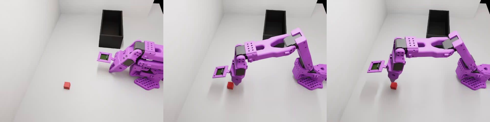
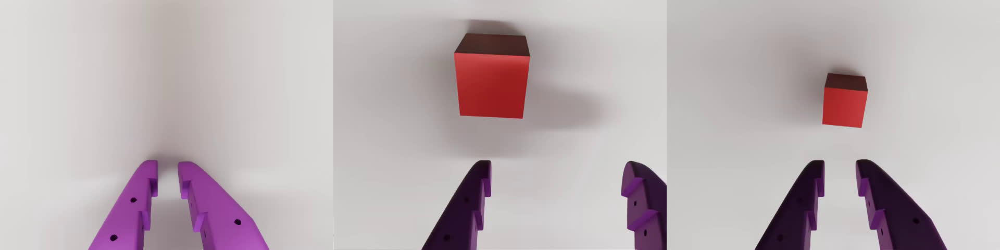
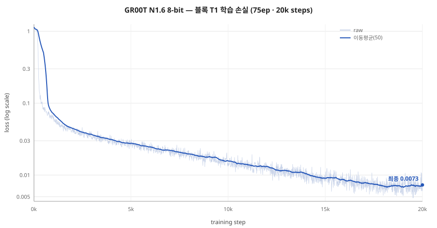

# T1 Sim-to-Real 실행 리포트 — 빨간 큐브 → 검은 박스 (GR00T N1.6)

> Isaac Sim에 T1 태스크(빨간 큐브를 검은 오픈박스에 넣기) 씬을 만들고, 리더암 teleop으로
> 학습 데이터를 수집해 GR00T N1.6를 학습하기까지의 실행 기록.
> 계획: [../08_custom_T1_sim2real.md](../08_custom_T1_sim2real.md) · Phase별 상세: [README.md](README.md)

작성: 2026-07-25

| Phase | 내용 | 상태 |
|---|---|---|
| **A** | T1 씬·에셋 제작 | ✅ 완료 |
| **B** | 리더암 teleop 데이터 수집 (75ep) | ✅ 완료 |
| **C** | GR00T N1.6 8-bit 학습 | 🔄 진행 중 |

---

## A. 씬·에셋 제작

coworker 포크의 블록 씬을 **별도 클론**(`~/blocktask_ws`)으로 가져와 기존 vials 환경과 분리해
사용했다(포크의 `MANAGING_MULTIPLE_ENVIRONMENTS.md` Method 1 — 안전). 빨간 큐브(20mm 프리미티브),
검은 오픈박스(`basket_box.usda`), 흰 평면 바닥(kinematic), 보라색 SO-101로 구성.

### 실행 스크립트

```bash
# 런처: setup/sim/t1_task/blocktask_run.sh
./blocktask_run.sh view      # zero_agent로 씬 육안 확인 (로봇 0액션)
./blocktask_run.sh record    # 리더암 teleop 녹화 (학습 데이터 수집)
./blocktask_run.sh clear     # 데이터셋 폴더 초기화 (재녹화 전)
```

- 태스크 ID: `Lerobot-So101-Teleop-Vials-To-Rack-DR` (coworker가 이 등록을 블록 씬으로 덮어씀)
- 씬 정의: `~/blocktask_ws/.../tasks/vials_to_rack_env_cfg.py`
- 5090 동기화: `setup/sim/t1_task/deploy_t1.sh 5090`

### 씬 (external_D455 / front 카메라 시점)


> 보라색 SO-101, 빨간 큐브(20mm), 검은 오픈박스(100×200×75mm), 밝은 흰색 평면 바닥.
> 실기 셋업과 동일한 pick&place 구도.

---

## B. 리더암 teleop 데이터 수집

리더암(`/dev/ttyLEADER`)으로 블록 씬을 조종하며, 가상 카메라 시점을 **rerun**으로 실시간
확인하면서 75ep을 수집했다.

### 결과 데이터셋

| 항목 | 값 |
|---|---|
| repo_id | `heongyu/sim_so101_blocktask` |
| 포맷 | LeRobot **v3.0** (recorder 기본, lerobot 0.4.3) |
| 에피소드 | **75ep** |
| 프레임 | 25,549 @ 30fps |
| 관측(state) / 행동(action) | 각 6-DoF float32 (SO-101 관절) |
| 카메라 | `ego`(wrist, 480×640) · `external_D455`(front, 480×640) |
| 언어 태스크 | 빨간 큐브 → 검은 박스 pick&place |

### 데이터셋 샘플 (한 에피소드 궤적: 접근 → 파지 → 이송)

**front (external_D455)** — 전역 시점:


**wrist (ego)** — gripper 장착 시점:


> wrist 뷰에서 gripper 집게가 **정면(upright)** 으로 나오는 것은 관절 매핑 수정(§Phase B 상세)의
> 결과 — 실기 학습 데이터의 wrist 카메라 구도와 일치시킨 것.

---

## C. GR00T N1.6 8-bit 학습

### C.1 데이터 준비 — 왜 v3.0 → v2.1로 변환하는가

| 구분 | LeRobot **v3.0** (수집 원본) | LeRobot **v2.1** (GR00T 입력) |
|---|---|---|
| 생성 주체 | lerobot 0.4.3 recorder **기본 포맷** | GR00T N1.5/N1.6 학습 파이프라인이 **요구**하는 포맷 |
| 데이터 저장 | 에피소드들을 **consolidated parquet/mp4**로 묶음 | **에피소드별 개별 parquet/mp4** (`episode-XXXXXX`) |
| 메타 | `tasks.parquet` 등 신형 스키마 | 레거시 `episodes.jsonl` · `episodes_stats.jsonl` |

**변환이 필요한 이유**: GR00T 데이터 로더는 v2.1 스키마(에피소드별 파일 + 레거시 JSONL + `modality.json`)를
전제로 작성돼 있어, v3.0을 그대로 넣으면 로드되지 않는다. 그래서 학습 전 반드시 변환한다.

`setup/sim/t1_task/prepare_blocktask_gr00t.sh`가 수행하는 4단계:
1. **v3.0 → v2.1 변환** (`convert_v3_to_v2.py`): consolidated → 에피소드별 파일 복원, `_v3.0` 백업
2. **`modality.json` 배치**: 카메라 키 매핑 — **front ← external_D455**, **wrist ← ego**
   (GR00T가 카메라를 논리 이름으로 참조하므로 필수)
3. **`stats.json`의 count 제거**: GR00T 호환(count 필드가 있으면 로더가 거부)
4. 검증: `codebase_version: v2.1 | episodes: 75 | modality.json: True | stats count: False` ✅

변환 결과 위치(5090): `~/gr00tn16_ws/sim_data/heongyu/sim_so101_blocktask`

### C.2 학습 하이퍼파라미터

스크립트: `5090:~/gr00tn16_ws/train_gr00t_blocktask_n16_8bit.sh`
(vials로 sim SR 80% 달성한 `train_gr00t_sim_n16_8bit.sh`에서 데이터 경로·출력명만 교체)

| 항목 | 값 | 비고 |
|---|---|---|
| base-model | `nvidia/GR00T-N1.6-3B` | |
| optimizer | `paged_adamw_8bit` (bitsandbytes) | **단일 5090(32GB)** 학습 위해 8-bit |
| learning-rate | 1e-4 | |
| max-steps | 20,000 | |
| global-batch-size | 2 | |
| gradient-accumulation | 32 | 유효 배치 = 2 × 32 = **64** |
| num-gpus | 1 | RTX 5090 단일 |
| modality-config | `examples/SO100/so100_config.py` | front/wrist |
| embodiment-tag | `NEW_EMBODIMENT` | |
| 컨테이너 | `gr00t-train8` (bitsandbytes+8bit 이미지) | detached |
| 출력 | `~/gr00tn16_ws/checkpoints/gr00t_blocktask75_n16_8bit` | |

> **왜 8-bit Adam인가**: fp32 Adam optimizer state는 3B 모델에서 VRAM을 크게 잡아 로컬은 물론
> 5090 32GB에도 빠듯하다. `paged_adamw_8bit`로 optimizer state를 8-bit로 양자화해 단일 5090에서
> OOM 없이 학습(vials 검증 시 22.7GB). 성능은 fp32 대비 동등하거나 상회(vials sim SR 80%).

---

## D. 학습 지표 ✅ (2026-07-25 완주)

### D.1 손실 함수 그래프



> 20k step에 걸쳐 loss가 1.14 → **0.0073**으로 안정적으로 수렴. 발산·정체 구간 없음.
> (log scale, 이동평균 50. `trainer_state.json`의 log_history 2,000 포인트 기반)

### D.2 학습 지표 요약

| 지표 | 값 |
|---|---|
| 최종 loss | **0.0073** (마지막 10 로그 평균 0.0076, 최저 0.0048) |
| 총 step / epoch | 20,000 / 1.0 |
| 학습 시간 | 약 15시간 (RTX 5090 단일, ~2.7s/it) |
| GPU 메모리 | OOM 없이 완주 (동일 구성 vials 기준 ~22.7GB, < 32GB) |
| 체크포인트 | `checkpoint-20000/` (13GB) + 최종 `model-0000{1,2}-of-00002.safetensors` |
| 무결성 | `optimizer.pt`·`scheduler.pt`·`trainer_state.json`·`statistics.json`·`experiment_cfg` 전부 존재 ✅ |

> vials(sim SR 80%)와 **동일 하이퍼파라미터·파이프라인**으로 최종 loss도 동급 수준 도달.

---

## E. 추론 결과 (Phase D — sim 평가) ✅ (2026-07-27)

### E.0 ⚠️ 먼저: 평가 환경의 성공 판정 버그 수정

첫 평가에서 Eval·DR-Eval 모두 **0%**가 나왔으나, 이는 정책 실패가 아니라 **측정 버그**였다.
- `lerobot_eval`은 `is_terminated and not is_truncated`(=성공 termination으로 종료)로 SR을 센다.
- 그런데 coworker 블록 포크의 Eval 환경엔 **성공 판정기 전체가 누락**돼 있었다 —
  `contact_grasp` 센서 · `success` termination(`vial_placed_on_rack_termination`) · subtask term.
  (원본 vials엔 있으나 블록 씬 개조 중 빠짐.) → 모든 ep가 `time_out`(truncation)으로 끝나 **구조적 0%**.
- 손목 관절 매핑은 eval에서도 정상(`_sim_obs_to_groot_inputs`가 state +1.6034, 액션 -1.6034 적용) — 문제 아님.
- **수정**: 원본 vials 배선을 블록에 이식 — `contact_grasp`(Block_Red 필터) + `success` DoneTerm +
  subtask. `block_red`→`basket_black`, `vertical_threshold=0`(블록 방향 무관),
  basket_box 중심원점 대칭경계(x±0.05·y±0.10·z_max0.08). 정본: 포크 `vials_to_rack_env_cfg.py`.

### E.1 sim 성공률

| 환경 | 시행 | 성공 | SR |
|---|---|---|---|
| T1-Eval (DR 없음) | 10 | 6 | **60%** |
| T1-DR-Eval | 10 | 5 | **50%** |

- T1-Eval 에피소드별: ✅✅❌✅✅❌❌✅✅❌ (6/10)
- T1-DR-Eval 에피소드별: ❌❌✅✅❌❌✅✅❌✅ (5/10)
- 판정 수정 후 **0% → 60%(Eval) / 50%(DR-Eval)**. DR이 더 어려워 소폭 하락(정상).
  DR-Eval이 실기 전이 예측력이 높음. vials(80%)보다 낮으나 T1이 더 어렵고 75ep 규모 감안 시 양호.
  closed-loop로 파지·이송·배치 수행 확인.

### E.2 추론 영상

<!-- headless eval에 front 카메라 프레임 덤프(PyAV) 추가 → assets/inference.mp4 -->
> _sim closed-loop 추론 영상(파지→이송→배치)을 여기에 삽입 (`assets/inference.mp4`). 현재 headless라
> 프레임 덤프 추가 후 1개 에피소드 녹화 예정. (5090 모니터 GUI로도 직접 관찰 가능)_

---

*관련: [Phase 상세 A](A_scene_asset.md) · [B](B_data_collection.md) · [C](C_training.md) ·
계획 [08_custom_T1_sim2real.md](../08_custom_T1_sim2real.md) · 검증 파이프라인 [07_sim_to_real_gr00t.md](../07_sim_to_real_gr00t.md)*
