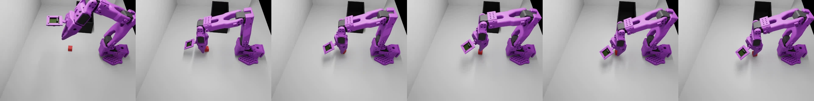

# T1 Sim-to-Real 재제작 리포트 (report2) — 반면교사: 데이터 문제 규명 → 재수집

> v1 데이터(sim 75ep)로 학습한 GR00T N1.6의 한계를 분석하고, **원인을 데이터에서 찾아** 개선된
> 데이터셋(v2)을 재제작·재학습하는 기록. 1차 결과: [report.md](report.md) · 전이 시도: [E_sim2real_transfer.md](E_sim2real_transfer.md)

작성: 2026-07-28

**요약**: v1 데이터로 학습 시 sim SR **60%(Eval)/50%(DR)**, 실기 zero-shot은 **파지 전혀 실패**.
실패의 정체는 모델이 아니라 **데이터**였다 — 씬 기하(mat)·카메라 구도·시연 구성의 3가지 결함.

---

## 1. 이전 데이터의 문제 (무엇이 잘못됐나)

sim 실패 영상 분석 결과 **실패는 전부 "파지(pickup)"에 집중** — 접근·인식은 되는데 큐브 근처에서
**맴돌기만 하고 못 집는다**. 아래는 실패 궤적 6프레임(접근→맴돎→못 집음, 큐브가 30초 내내 바닥에):

이 "맴돎"의 근본 원인 3가지:

### 1-A. mat이 로봇과 겹치고 너무 높음 → 그리퍼 하강 여유 부족 ⭐
- 로봇 base는 z=0, 그런데 **mat(충돌 평면) top=0.035**가 로봇 base 위를 덮음(겹침) + 물체가 그 위(0.045)에 안착.
- 원본 vials(80% 성공)는 물체가 **~0.026**에 안착했는데, 블록은 **~1cm 높고** 전면 충돌 평면까지 깔려
  **그리퍼가 큐브까지 끝까지 못 내려가** 파지가 얕거나 실패 → 시연 자체가 어려웠고 정책도 못 배움.

### 1-B. top(external) 카메라가 너무 멀어 큐브 위치 추정 부정확
- 위에서 내려다보는 external_D455 시점에서 **큐브가 작게** 잡혀 위치 단서가 흐림.

### 1-C. 교정(recovery) 시연 부재 → 빗나가면 복구 못 하고 "맴돎"
- 시연은 대부분 **한 번에 깔끔히 성공**만 담김. 파지가 살짝 빗나간 상태는 데이터에 거의 없음.
- 배포에서 파지가 조금만 어긋나면 → **분포 밖(covariate shift)** → 정책이 재시도를 못 하고 그 자리서 맴돎.

---

## 2. 추론에서 나타난 문제 (동영상)

### 2-A. sim 추론 — 파지 실패로 timeout
정책이 큐브에 접근하지만 집지 못하고 900프레임(30초) timeout. (성공은 조기 종료, 실패는 끝까지)
- 실패 영상: [ep01_fail.mp4](assets/eval_run10/ep01_fail.mp4) · [ep05_fail.mp4](assets/eval_run10/ep05_fail.mp4) ·
  [ep06_fail.mp4](assets/eval_run10/ep06_fail.mp4) · [ep10_fail.mp4](assets/eval_run10/ep10_fail.mp4)
- (위 §1 몽타주가 이 영상들의 프레임 요약)

### 2-B. 실기 zero-shot 추론 — 파지 전혀 못 함
- 블록 **인식·접근은 정상**, 그러나 **그리퍼가 블록 위에서 멈춰** 하강·파지 실패 (sim과 동일한 파지 실패가
  실기에선 더 심함). 상세·해결 시도: [E_sim2real_transfer.md](E_sim2real_transfer.md) §3.
- 배포 자체는 부드럽게 동작(서버·모션 문제 해결 완료) → **남은 실패는 순수 데이터/구도 gap**임이 확정.

> 즉 sim·real 양쪽에서 **같은 파지 실패**가 나왔고, 그 뿌리는 §1의 데이터 결함이다.

---

## 3. 해결 — 새 데이터셋(v2) 제작 & 계획

**결정**: 위 3결함을 고친 씬에서 **교정 시연 포함 100ep 재수집** → 재학습. (진행 중)

### 반영한 개선
| 결함 | 조치 (v2) |
|---|---|
| 1-A mat 높음/겹침 | mat·물체 **top 0.026으로 낮춤**(원본 작동높이) → 그리퍼 하강 여유 확보 → **파지 개선 확인** |
| 1-B 카메라 | (당겨봤다가 원복 — 실기 top 카메라를 원 시점에 맞추기로) |
| 1-C 교정 부재 | **교정 시연 ~30% 포함**(빗나감→재접근→성공) → 재시도 학습 |

### 앞으로의 계획 (간단)
1. **재수집** 100ep = 정상 ~70 + 교정 ~30 (5지점 그리드, 성공 종결만). 세션별 폴더(`sim_so101_blocktask_v2*`)
2. **전처리**: 세션 폴더 합침 → v2.1 변환 + modality + stats
3. **재학습**: GR00T N1.6 8-bit (하이퍼파라미터 동일, 데이터만 교체)
4. **sim 재평가**: SR 측정 → v1의 60% 대비 개선 확인 (목표 80~90%)
5. **실기 재전이**: 개선되면 zero-shot 재측정, 부족하면 **실기 co-training**(Phase F, 도구 준비 완료)

> 핵심 교훈: **모델·하이퍼파라미터가 아니라 데이터(씬 기하·카메라·시연 구성)가 성능을 갈랐다.**
> v2는 "파지가 물리적으로 쉽고, 빗나가도 복구를 배우는" 데이터를 목표로 한다.
